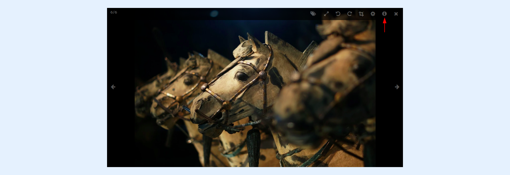
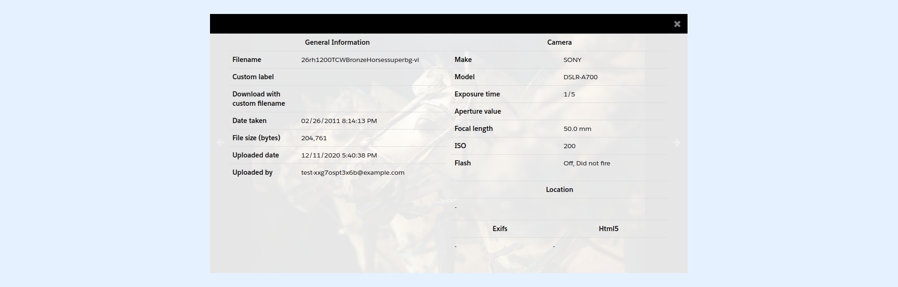
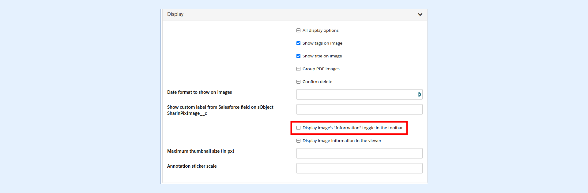

---
layout:
  width: default
  title:
    visible: true
  description:
    visible: true
  tableOfContents:
    visible: true
  outline:
    visible: true
  pagination:
    visible: true
  metadata:
    visible: false
  tags:
    visible: true
---

# Large View: Toolbar – Information

## Large View

* Access the large view of an image by clicking on its thumbnail.

## Information

* Click on the **Information** icon to access all the metadata provided by the image EXIF data.

* After clicking, the image metadata is displayed.

* Geolocation (Location) information can be also stored by SharinPix to enhance those already present in the EXIF:
  * **Exifs** - location data already present in the image EXIF
  * **Browser-based** location data


**Tip:**

To disable the information you should create a SharinPix Permission and uncheck the **Display image's "Information" toggle** in the toolbar ability as depicted below.

The SharinPix Permission should then be assigned to your album component. For more information on how to create and assign SharinPix Permissions, refer to this article: [SharinPix Permission object](../../access-and-security/sharinpix-permission-object-how-to-create-and-assign-custom-permission.md)


All those data can be synchronized with Salesforce using the **SharinPix Image Sync** or the **SharinPix API.**
