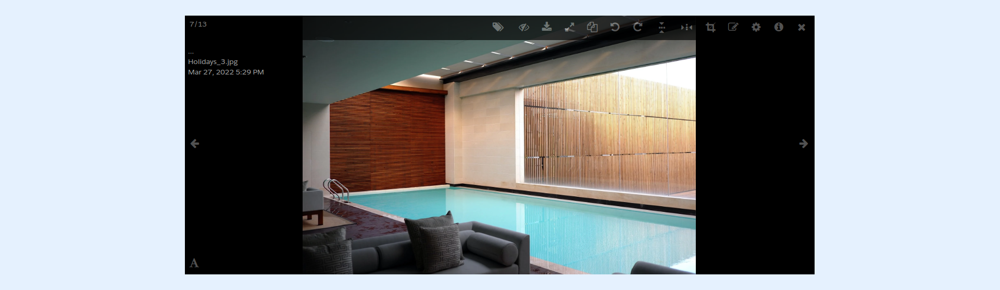

---
layout:
  width: default
  title:
    visible: true
  description:
    visible: true
  tableOfContents:
    visible: true
  outline:
    visible: true
  pagination:
    visible: true
  metadata:
    visible: false
  tags:
    visible: true
---

# Large View: Toolbar – New Annotation Toolbar

This article demonstrates and explains the new annotation toolbar's features.


## Large View: Access the annotation feature

To access the large view of an image, simply click on the image thumbnail.




## Activate the Annotation Mode

To activate the annotation mode, simply open the image in the large view, then click on the annotate icon.

.png)

## Annotation Tools

The annotation includes the following features:

1. **Free sketch (Path):** Used for freehand drawing.
2. **Text addition:** Used for addition of text on the image.
3. **Draw rectangle:** Used for addition of rectangles on the image.
4. **Draw circle**: Used for addition of circles on the image.
5. **Draw line**: Used for addition of lines on the image.
6. **Erase annotation (Trash):** Used to erase annotations on the image.
7. **Draw arrow:** Used to draw arrows on the image.
8. **Draw double-arrow:** Used to draw double-arrows on the image.
9. **Sticker addition**: Used to ad stickers on the image.
10. **Color outline and fill**: Used to color and fill the selected shape.
11. **Shape thickness adjustment:** Used to increase and decrease the thickness of the selected shape.

.png)


**Tip:**


For more details on the tools available inside the **annotation** mode, please refer to the following chapters:

* [Stickers](large-view-annotation-stickers.md)
* [Text](large-view-annotation-text.md)
* [Color Selection](large-view-annotation-color-selection.md)
* [Edit](large-view-annotation-edit.md)
* [Move](large-view-annotation-move.md)
* [Tools](large-view-annotation-tools.md)
* [Comment with Chatter](large-view-annotation-comment-with-chatter.md)


## Annotation Auto-Save

To auto-save your annotations as you draw, you can activate the auto-save option. To do so, set `annotation_auto_save` parameter to `true` at the root of your token or organization's configuration as shown below:

```json
{
  "annotation_auto_save": true,
  "abilities": {
    "Id": {
      "Access": {…}
    }
  }
}
```
