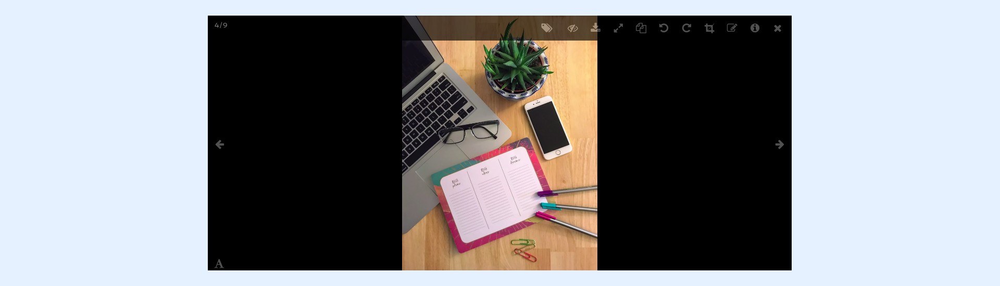
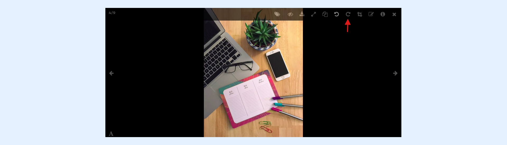
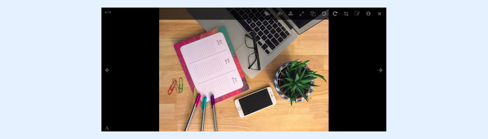
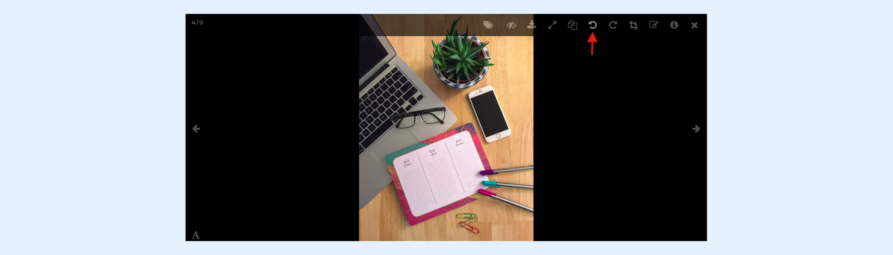
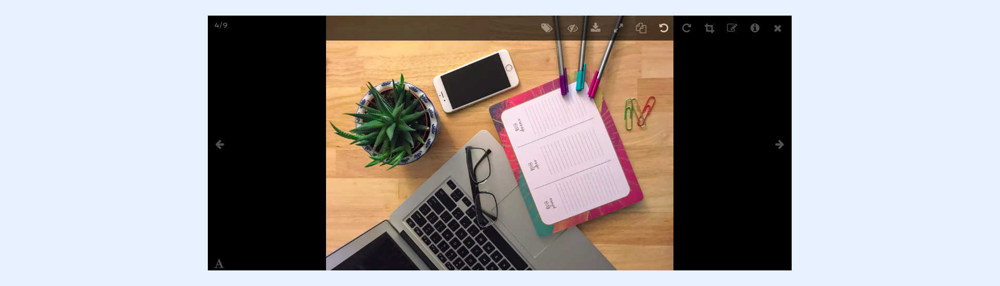

---
layout:
  width: default
  title:
    visible: true
  description:
    visible: true
  tableOfContents:
    visible: true
  outline:
    visible: true
  pagination:
    visible: true
  metadata:
    visible: false
  tags:
    visible: true
---

# Large View: Toolbar – Rotate

## Large View

* Access the large view of an image by clicking on its thumbnail.

## Rotate 90° clockwise

* Click on the **rotate** icon to rotate the current image in a clockwise direction.

* The new transformation is immediately applied and the image is automatically saved.

## Rotate 90° anti-clockwise

* Click on the **rotate** icon to rotate the current image in an anti-clockwise direction.

* The new transformation is automatically applied and the image is automatically saved.

