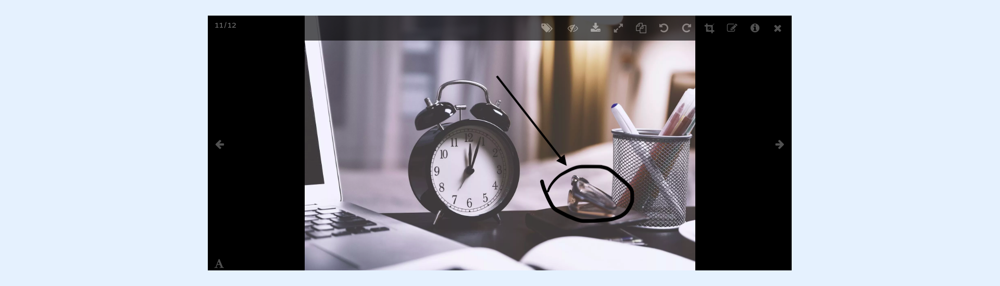
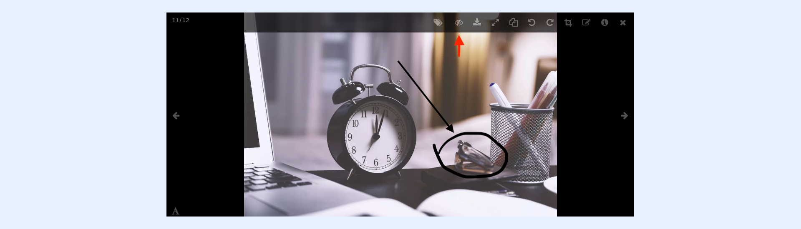

---
layout:
  width: default
  title:
    visible: true
  description:
    visible: true
  tableOfContents:
    visible: true
  outline:
    visible: true
  pagination:
    visible: true
  metadata:
    visible: false
  tags:
    visible: true
---

# Large View: Toolbar – Show/Hide Annotation

## Large View

* Access the large view of an image with annotation by clicking on its thumbnail.

## Show/Hide Annotation

* Click on the Show/Hide Annotation icon to remove the display of annotations

* Click back show the annotation again


Removing the Annotation display makes the right click to "Save Image As" option available. But this save a resized version of the image and not the original one.

