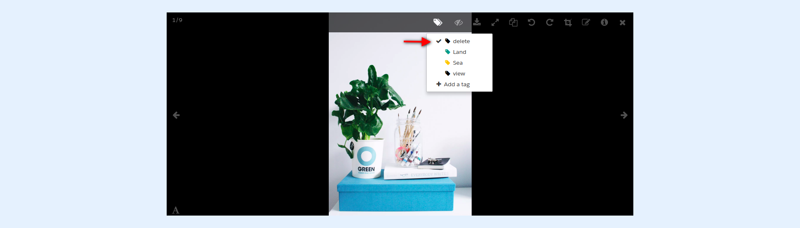
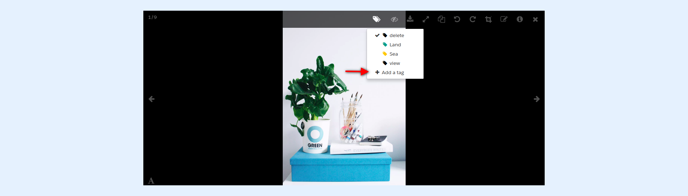

---
layout:
  width: default
  title:
    visible: true
  description:
    visible: true
  tableOfContents:
    visible: true
  outline:
    visible: true
  pagination:
    visible: true
  metadata:
    visible: false
  tags:
    visible: true
---

# Large View: Toolbar – Tags

* [Open large view](large-view-toolbar-tags.md#open-large-view)
* [Apply tag](large-view-toolbar-tags.md#apply-tag)
* [Remove tag](large-view-toolbar-tags.md#remove-tag)
* [Add new tag](large-view-toolbar-tags.md#add-new-tag)

## Open large view

* Access the large view of an image by clicking on it.

.png>)

* The **Tags** icon permits a quick access to the tag menu that corresponds to the current image.

## Apply tag

* Click on a label to add the tag to the current image.

## Remove tag

* A **tick-shaped** icon next to a tag label indicates that the current image is already tagged with the label. You can remove the tag by clicking on it.

## Add new tag

If your album has the **create tag** capability, the **Add a tag** menu command is visible.

* **You can either** :
  * select a tag label which is already present on the organization.

* **Or** :
  * Enter the label for a new tag

