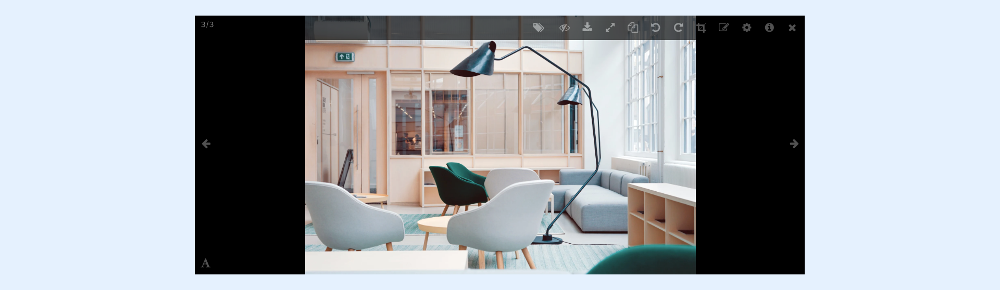
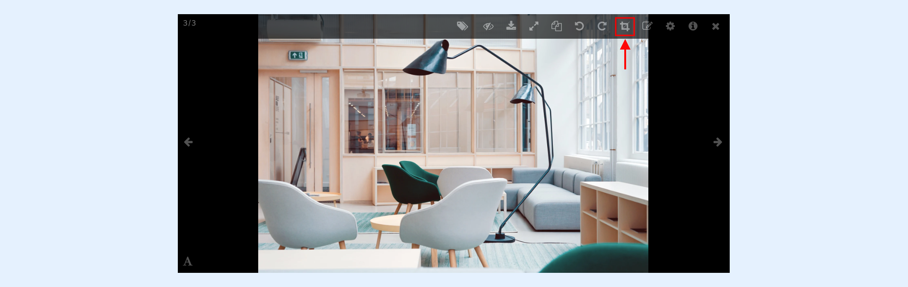
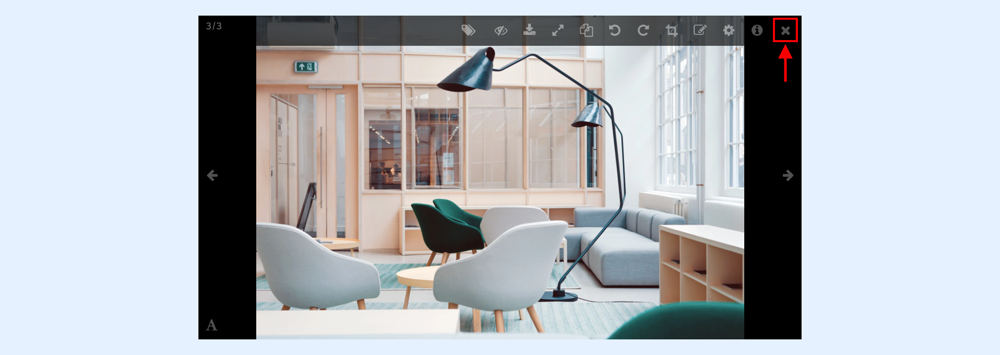

---
layout:
  width: default
  title:
    visible: true
  description:
    visible: true
  tableOfContents:
    visible: true
  outline:
    visible: true
  pagination:
    visible: true
  metadata:
    visible: false
  tags:
    visible: true
---

# Large View: Toolbar

The toolbar becomes accessible when an image is opened in large view. It has 3 modes, namely:

* [The standard mode](large-view-toolbar.md#standard-mode)
* [The editing mode](large-view-toolbar.md#editing-mode)
* [The annotation mode](large-view-toolbar.md#annotation-mode)
* [Exit any mode](large-view-toolbar.md#exit-any-mode)

## Standard Mode

To access the Standard mode, simply click on one image available from a SharinPix album. The Standard mode's layout is shown below:

## Editing Mode

To activate the Editing mode, click on the **Crop** option as shown below:

The example below depicts the Editing mode when activated:

## Annotation Mode

To access the Annotation mode, click on the annotation button as shown below:

.png)

The example below depicts the Annotation mode when activated:

## Exit Any Mode

To exit any of the modes, simply click on the **Close** icon as shown below:

