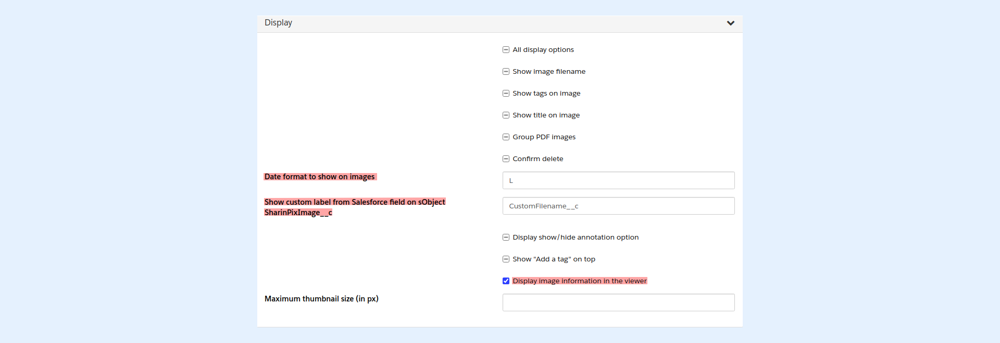

---
layout:
  width: default
  title:
    visible: true
  description:
    visible: true
  tableOfContents:
    visible: true
  outline:
    visible: true
  pagination:
    visible: true
  metadata:
    visible: false
  tags:
    visible: true
---

# Large View: Viewer infos

Multiple information can be displayed on an image when opened in large view:

* Date
* Tags
* Filename
* Custom Label

 (3).png>)

To display the infos on image viewer, set <mark style="color:$danger;">`viewer_infos`</mark> to <mark style="color:$danger;">`true`</mark>.

<table><thead><tr><th>Value</th><th width="374">Description</th></tr></thead><tbody><tr><td>Date</td><td><p>Displays the date corresponding to the album's sort option. To learn more about the sort options, <a href="thumbnail-view-sort.md">click here</a>.</p><p>The <a href="/broken/spaces/VeS2KFLWXcoY15x9kHdt/pages/bPkucKIzfNREoczL4gdX">date format</a> can be changed. For example, <mark style="color:red;"><code>date: 'L'</code></mark></p></td></tr><tr><td>Tags</td><td>Displays the tags applied on the image. To see how to tag images, <a href="../working-with-tags/">click here</a>.</td></tr><tr><td>Filename</td><td>Displays the filename of the image.</td></tr><tr><td>Custom Label</td><td><p>This parameter allows the display of a custom label. The value of the custom label should be stored in a Salesforce field on the sObject <strong>SharinPixImage__c</strong>. </p><p>The <strong>Salesforce field API name</strong> should then be used as the value for the parameter <strong>custom_label</strong> , for example: <mark style="color:red;"><code>custom_label: 'CustomFilename__c'</code></mark>, where <em>CustomFilename__c</em> refers to the API name of the Salesforce field storing the value for the custom label.</p></td></tr></tbody></table>

## SharinPix Permission

SharinPix Permissions can be used to activate the abilities corresponding to the above-mentioned options.



## Apex Class & VF Page Implementations

```apex
public class ViewerInfos {
    private Map<String, Object> params;

    public ViewerInfos(ApexPages.StandardController stdCtrl) {
        String albumId = (Id)stdCtrl.getId();
        params = new Map<String, Object>{
            'path' => '/pagelayout/' + albumId,
            'abilities' => new Map<String, Object> {
                albumId => New Map<String, Object> {
                    'Access' => new Map<String, Object> {
                        'see' => true,
                        'image_list' => true,
                        'image_upload' => true
                    },
                    'Display' => new Map<String, Object> {
                      'date' => 'L'
                    }
                }
            },
            'viewer_infos' => true
        };
    }

    public String getParameters() {
        return JSON.serialize(params); 
    }
}
```

```apex
<apex:page docType="html-5.0" cache="false"
  showHeader="false"
  sidebar="false"
  standardStylesheets="false"
  standardController="Account"
  extensions="ViewerInfos"
  applyHtmlTag="false"
  applyBodyTag="false">
  <sharinpix:sharinpix parameters="{!parameters}" ></sharinpix:sharinpix>
</apex:page>
```
