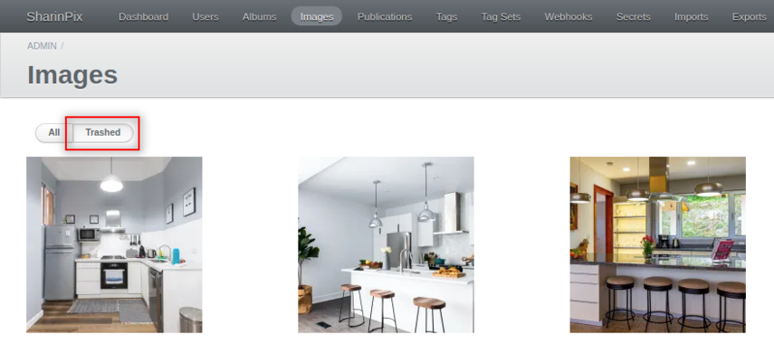
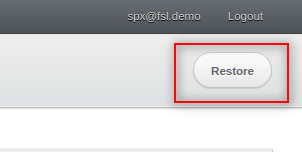

---
layout:
  width: default
  title:
    visible: true
  description:
    visible: true
  tableOfContents:
    visible: true
  outline:
    visible: true
  pagination:
    visible: true
  metadata:
    visible: false
  tags:
    visible: true
---

# Thumbnail View – Trash Bin

The **Trash bin** is a SharinPix ability that temporarily stores the images deleted from a SharinPix album.

If images are deleted accidentally and need to be recovered, retrieved or undeleted, the **Trash bin** can be used to restore those images.

Images deleted within the last 30 days can be restored from the **Trash bin**.

Trash bin can be added to a SharinPix album using the following methods:

* [By using a SharinPix Permission record](thumbnail-view-trash-bin.md#using-sharinpix-permission)
* [By enabling the Trash bin ability at an organisation level using the SharinPix Global Settings](thumbnail-view-trash-bin.md#using-sharinpix-global-settings)
* [By including the Trash bin ability in the list of parameters in an Apex class (developer-oriented)](thumbnail-view-trash-bin.md#using-an-apex-class)

## Using SharinPix Permission

The Trash bin ability can be enabled using a **SharinPix Permission** record. To do so follow the steps below:

* Create/modify a SharinPix Permission record
* On editing the record, enable the Trash bin ability by checking the **Trash** option from the **Standard album function** section as demonstrated below:

.png>)

* Enable the other required abilities/features
* Click **Save** when done
* Add the SharinPix Permission to the desired album


For more information about the SharinPix Permission object and how it is used, please refer to the following article:

[SharinPix Permission object](../../access-and-security/sharinpix-permission-object-how-to-create-and-assign-custom-permission.md)


The image below demonstrates a SharinPix album with the Trash bin ability enabled:

.png>)

## Using SharinPix Global Settings

Trash bin can also be enabled at an organisation level using the SharinPix Global Settings. Using this method, the Trash bin will be made available on all SharinPix albums by default. To do so:

* Open the SharinPix Administration Dashboard
* Click on **Settings** from the top menu bar
* Click on the button **Edit Organization** located on the top right
* From the section **Standard album function**, check the option **Trash (trash)**
* Click on **Update Organization** to save the changes

## Using an Apex class

In case you are using an Apex class embedding SharinPix parameters, you will have to set the **trash** parameter to **true** in the SharinPix abilities as demonstrated in the code snippet below:

```apex
 Map<String, Object> params =new Map<String, Object> { 
            'abilities' => new Map<String, Object> { 
                'album_id' => new Map<String, Object> { 
                    'Access' => new Map<String, Object> { 
                        'see' => true,
                        'trash' => true
                    }
                }
            },
            'Id' => 'album_id'
};
```

## Restore a deleted image

Deleted images can be restored form the Trash bin within 30 days. Images can be restored in two ways:

**1. From the Trash bin available for the album**&#x20;

To do so:

* Click on the **Trash bin** icon
* Click on the **Restore** icon on the desired image to restore it

.png>)

**2.From the SharinPix Global Settings**

To do so:

* Open the SharinPix Administration Dashboard
* Click on **Images** on the top menu bar
* Then, click on the **Trashed** button



* Next, click on the image you want to restore
* Click on the **Restore** button located on the top right




After restoring an image, the latter can be accessed on the SharinPix album on which it was previously uploaded.

