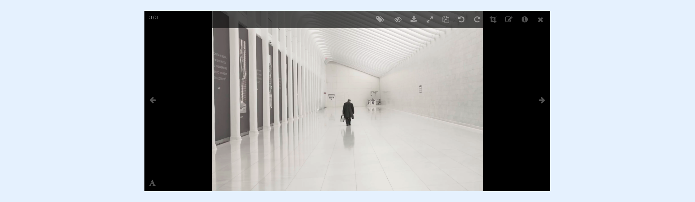
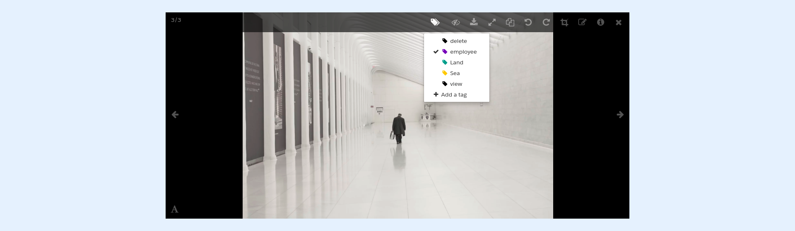
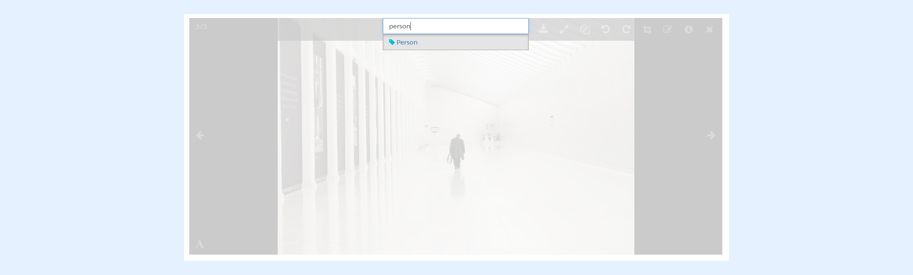

---
layout:
  width: default
  title:
    visible: true
  description:
    visible: true
  tableOfContents:
    visible: true
  outline:
    visible: true
  pagination:
    visible: true
  metadata:
    visible: false
  tags:
    visible: true
---

# Create Tag

There are three ways to create a new tag, mainly through:

* [Command Menu](create-tag.md#command-menu)
* [Full View](create-tag.md#full-view)
* [Admin Dashboard](create-tag.md#admin-dashboard)

## Command Menu

Follow the ensuing steps to create a new Tag from the **Command Menu.**

* Select an image.

 (5).png>)

* Click on the **Command Menu.**

 (4).png>)

* Select **Add a tag.**
* Enter the name of the new tag.
* Click on the "**+** " sign create the tag.

 (4).png>)

* The newly-created tag is automatically assigned to the previously-selected image.

 (5).png>)

## Full View

* Access the **Full View** of an image by clicking on its thumbnail.

* Click on the **Tag** icon.

* Select **+ Add a tag.**
* &#x20;Enter the  name of the new ta&#x67;**.**
* Then, select the **"+"** sig&#x6E;**.**

* The newly-created tag is automatically assigned to the previously-selected image.

 (6).png>)

## Admin Dashboard

* Access the admin dashboard and click on the "Tag" tab.

<figure><figcaption></figcaption></figure>

* Click on "Create a Tag"

<figure><figcaption></figcaption></figure>

* Enter the details of the Tag and click on "Create Tag"

<figure><figcaption></figcaption></figure>
