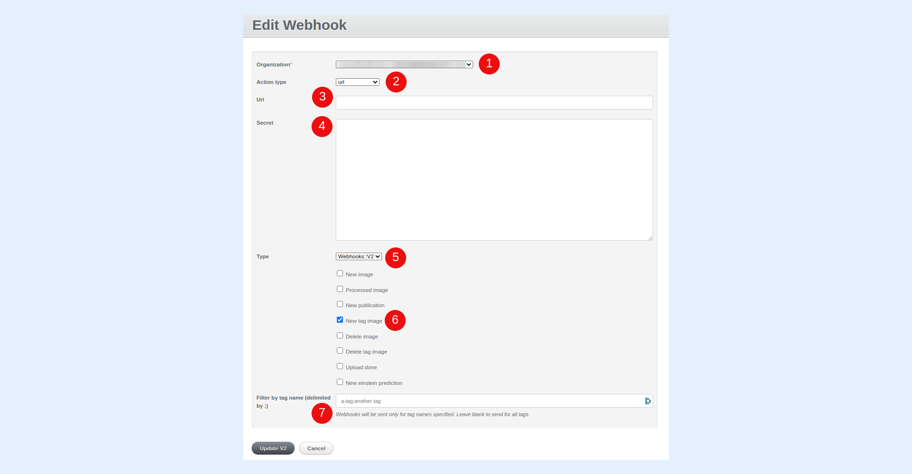

---
layout:
  width: default
  title:
    visible: true
  description:
    visible: true
  tableOfContents:
    visible: true
  outline:
    visible: true
  pagination:
    visible: true
  metadata:
    visible: false
  tags:
    visible: true
---

# Server Side notification – new\_tag\_image (Webhook)

This article demonstrates how to create a webhook that will make requests to a predefined end-point whenever the event **new\_tag\_image** is emitted. This event is caused whenever a tag is applied to one or multiple images.


**Note:**

* To create a webhook, you will need access to the Administration Dashboard.
*   To use webhooks, you should ensure that you have granted API access to SharinPix on your organization. To verify this, go to the **SharinPix Settings** tab and check if the second row, that is, **Sharinpix -> Salesforce full API access**, is highlighted in green.

    In case the row, **Sharinpix -> Salesforce full API access** is still highlighted in red, simply click on the **Grant** button to grant API access.

    For more detailed information on how to grant API access, please refer the the following article:

[Basic Setup - Step 2 - Register your Salesforce organization to SharinPix](../../getting-started-with-sharinpix/basic-setup/basic-setup-step-2-register-your-salesforce-organization-to-sharinpix.md)


## Create webhook

There are 2 types of web-hooks:

* [Call to a specific end-point URL](server-side-notification-new-tag-image-webhook.md#call-to-a-specific-end-point-url)
* [Call to a static method from an Apex Class](server-side-notification-new-tag-image-webhook.md#call-to-a-static-method-from-an-apex-class)
* Access the **Administration Dashboard**.
* Select the **Webhooks** menu item from the navigation bar.
* Click on the **New Webhook** button.

## Call to a specific end-point URL

Configure the web-hook by filling the following values:

1. Select the relevant Organization
2. Select **url** as the **Action Type.**
3. Inside the **Url** field enter the required endpoint.&#x20;
4. The value inside the **secret** field corresponds to the SharinPix Secret Header inside the POST request.
5. The **Type** should be **Webhooks::V2.**
6. In this case, the event to be detected should be **New tag image**.
7. If you intend to emit the **New tag image** event when a specific tag is applied, enter the name of tag inside the **Filter by tag name** field.

* Click on **V2** when you are done.

## Call to a static method from an Apex Class

Configure the web-hook by filling the following values:

1. Select the relevant Organization
2. Select **apex\_method** as the **Action Type.**
3. Inside the **Class name** field enter the required Apex Class.
4. Inside the **Method name** field enter the method to be invoked.
5. The **Type** should be **Webhooks::V2.**
6. In this case, the event to be detected should be **New tag image**.
7. If you intend to emit the **New tag image** event when a specific tag is applied, enter the name of the tag inside the **Filter by tag name** field.

* Click on **V2** when you are done.

.png)
