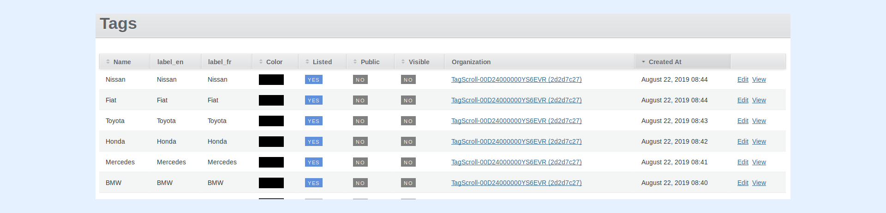
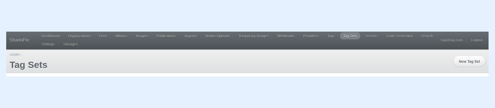
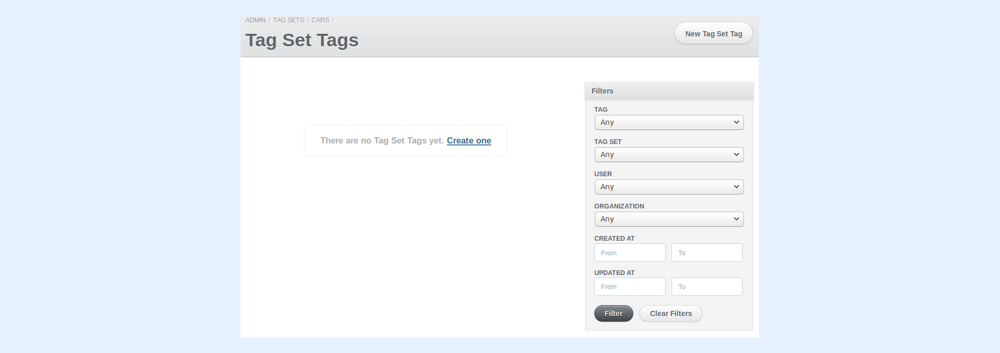
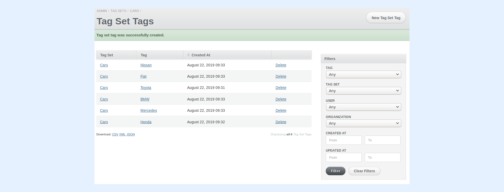
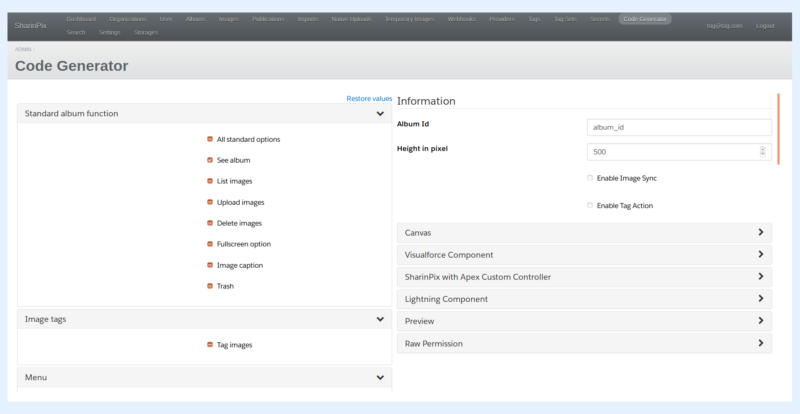
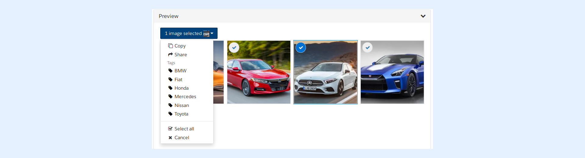

---
layout:
  width: default
  title:
    visible: true
  description:
    visible: true
  tableOfContents:
    visible: true
  outline:
    visible: true
  pagination:
    visible: true
  metadata:
    visible: false
  tags:
    visible: true
---

# Tag Sets

* [What is a Tag Set?](tag-sets.md#what-is-a-tag-set)
* [Defining a Tag Set](tag-sets.md#defining-a-tag-set)
* [Using Tag Set](tag-sets.md#using-tag-set)

## What is a Tag Set?

A **Tag Set** is feature in SharinPix that can be used to group several **Tags** together into a set. It is useful in use cases whereby instead of loading all the tags the user possess for image tagging, only a subset of those tags, defined in a tag set, will be loaded.

## Defining a Tag Set

Follow the ensuing steps to create a new Tag Set.

* Predefine **Tags** for your organization by accessing **Tags** from the top navigation bar of the Administration DashBoard.

* Access **Tag Set** from the top navigation bar of the Administration DashBoard.
* Click on **New Tag Set.**

You will be presented with the input fields as illustrated below:

* Select your organization.
* Enter the name of the new Tag Set.
* Click on **"Create Tag Set"** to create the new Tag Set.

You will be presented with the newly created Tag Set.

* Click on **"Tags in Tag Set"** to view the collection of **Tags** in the current **Tag Set.**

* Click on **"New Tag Set Tag"** to add a new Tag in the Tag Set.
* Next, select a Tag from a list of predefined Tags.

* Click on **"Create Tag set tag"** to add the selected Tag in the selected Tag Set.
* Repeat the steps above to add more Tags in the Tag Set.

You will be presented with the collection of Tags in the current Tag Set.

## Using Tag Set

* Access **Code Generator** from the top navigation bar of the Administration DashBoard.

* Enable "**Tag Images**", "**View Tags"** and **"Show tags on image"** options in the Code Generator.
* Upload Images in the **Preview component**.

* Select one or more images.
* Click on the **Command Menu** as shown below.

<mark style="color:$danger;">Note that no tags are available since a tag set has not been added yet.</mark>

* Enter the name of the **Tag Set** that you previously created in the **Tag Set field** located under **Tags  component.**

* Select one or more images.
* Click on the **Command Menu** as shown below

The **Tags** grouped by the **Tag Set** can now be accessed and the images can be tagged.

