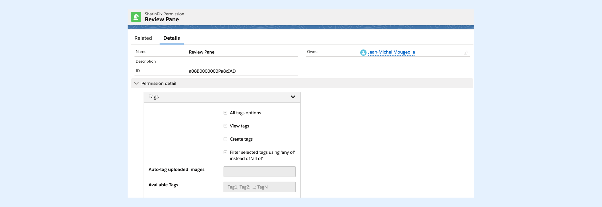

---
layout:
  width: default
  title:
    visible: true
  description:
    visible: true
  tableOfContents:
    visible: true
  outline:
    visible: true
  pagination:
    visible: true
  metadata:
    visible: false
  tags:
    visible: true
---

# Tags available for a specific album

It is possible to make certain tags only available for a specific album through three main methods:

* [Define tag within SharinPix Permission object (for Lightning Only)](tags-available-for-a-specific-album.md#define-tag-within-sharinpix-permission-object-for-lightning-only)
* [Define tag within SharinPix Parameters (with Apex Controller)](tags-available-for-a-specific-album.md#define-tag-within-the-sharinpix-parameters)
* [Define tag within SharinPix Parameters (without Apex Controller)](tags-available-for-a-specific-album.md#define-tags-within-sharinpix-parameters-without-apex-controller)

## Define tag within SharinPix Permission object (for Lightning only)

Under Lightning you can use the **SharinPix Permission object** to set abilities for a SharinPix Lightning Component.

This is fully described here: [SharinPix Permission object.](../../access-and-security/sharinpix-permission-object-how-to-create-and-assign-custom-permission.md)

Within the SharinPix Permission object, you can use the "**Available Tags**" field to list all the tags that you would like to be always available in the tag menu.

Please remember that you have to use the Tag Name (not the label) and separate multiple values by a ; (semi-colomn).



### Define tag within the SharinPix Parameters (with Apex Controller) <a href="#define-tag-within-the-sharinpix-parameters" id="define-tag-within-the-sharinpix-parameters"></a>

* It is possible to define the tags available for a specific through the **SharinPix Parameters.**


To know more about **SharinPix Parameters** , refer to this article: [SharinPix permission](../../access-and-security/sharinpix-permission.md)


* The code snippet illustrates a set of **SharinPix Parameters** that contains a tag named **work.**

```apex
Map<String, Object> params = new Map<String, Object> {
    'Id' => albumId,
    'abilities' => new Map<String, Object> {
        albumId => new Map<String, Object> {
            'Access' => new Map<String, Boolean> {
                'see' => true,
                'image_list' => true
            },
            'Tags' => new Map<String, Object> {
                'work' => new Map<String, String> {
                    'en' => 'work',
                    'fr' => 'travail'
                }
            }
        }
    }
};
```

## Define tags within SharinPix Parameters (without Apex Controller)

* The code snippet below illustrates a set of **SharinPix Parameters** defined inline within a Visualforce Page that contains a tag named **work.** This code represents  a method that defines a tag within SharinPix Parameters without the use of an Apex Controller.

```html
<apex:page> 
 <sharinpix:SharinPix height="500px" 
    parameters="{
         'Id': '{!CASESAFEID($CurrentPage.parameters.Id)}', 
         'abilities':{'{!CASESAFEID($CurrentPage.parameters.Id)}':
            {'Access': {
                'image_delete':false,
                'image_upload':true,
                'image_list':true,
                'see':true }
            }
        }
    }" 
    /> 
</apex:page>
```
