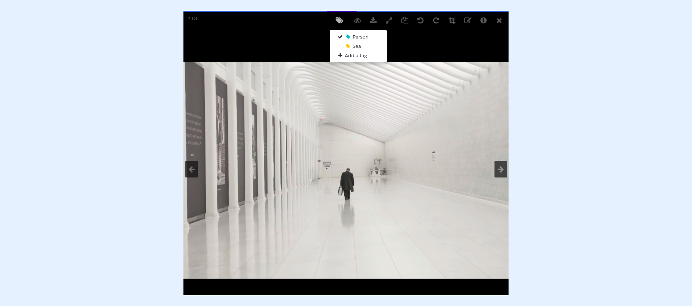

---
layout:
  width: default
  title:
    visible: true
  description:
    visible: true
  tableOfContents:
    visible: true
  outline:
    visible: true
  pagination:
    visible: true
  metadata:
    visible: false
  tags:
    visible: true
---

# Tags Command in SharinPix menu

* [Thumbnail View](tags-command-in-sharinpix-menu.md#thumbnail-view)
  * [Create Tag](tags-command-in-sharinpix-menu.md#create-tag-thumbnail-view)
  * [Tag an image](tags-command-in-sharinpix-menu.md#tag-an-image)
  * [Select Tag](tags-command-in-sharinpix-menu.md#select-tag-thumbnail-view)
  * [Remove Tag](tags-command-in-sharinpix-menu.md#remove-tag-thumbnail-view)
* [Large View](tags-command-in-sharinpix-menu.md#large-view)
  * [Select/Deselect a Tag](tags-command-in-sharinpix-menu.md#select-deselect-a-tag-large-view)
  * [Remove Tag](tags-command-in-sharinpix-menu.md#remove-tag-large-view)


Note: The **Thumbnail View** refers to the display of SharinPix images in a grid list view while the **Large View** is the display of single image. For more information, refer to the following articles below:

* **Thumbnail View** : [Thumbnail View](../user-interface/thumbnail-view.md)
* **Large View:** [Large View](../user-interface/large-view.md)


## Thumbnail View

### Create Tag (Thumbnail View)

* It is possible to create a new tag and apply it automatically to one or more images. Refer to this article to know how: [Create Tag from the Command Menu](create-tag.md#command-menu)

 (6).png>)

### Tag an image

By default, if a tag is applied to all selected images, the images remain selected after the operation.

 (4).png>)

In the previous SharinPix package versions (before version 1.180), the behaviour was that when a tag was applied on all selected images, the images were deselected by default after the operation.&#x20;

There are two ways to revert to the previous version:

1\. By either activating the option in Sharinpix Permission

2\. Or by activating the option in SharinPix Global Settings

 (4).png>)


**Tips:**

* For more information on how the SharinPix Permission object, refer to the following article:\
  [SharinPix Permission object](../../access-and-security/sharinpix-permission-object-how-to-create-and-assign-custom-permission.md)
* For more infomation about the SharinPix Global Settings, refer to the following:\
  [Extended Setup - Customizing your SharinPix Global Settings](../../getting-started-with-sharinpix/advanced-setup/advanced-configuration-customizing-your-sharinpix-components-with-sharinpix-permissions.md)


### Select Tag (Thumbnail View)

It is possible to select a specific tag from the Command Menu and apply it to one or more selected images. Refer to the following article to know how to: [Fixed Tags from the menu](fixed-tags-from-the-menu.md)

 (5).png>)

### Remove tag (Thumbnail View)

It is possible to remove a tag from an image from the **thumbnail view** by referring to the following article: [Remove Tag in (Thumbnail View)](remove-tag.md#thumbnail-view)

<figure><figcaption></figcaption></figure>

## Large View

### Select/Deselect a Tag (Large View)

* Tags can be selected and deselected from a specific image from the Large View. Refer to the following articles for more details: [Select/Deselect a Tag](create-tag.md#full-view)

### Remove tag (Large View)

* It is possible to remove a tag from an image inside the **Large View**. Refer to the following article to understand how to: [Remove tag in Large View](remove-tag.md#large-view)

