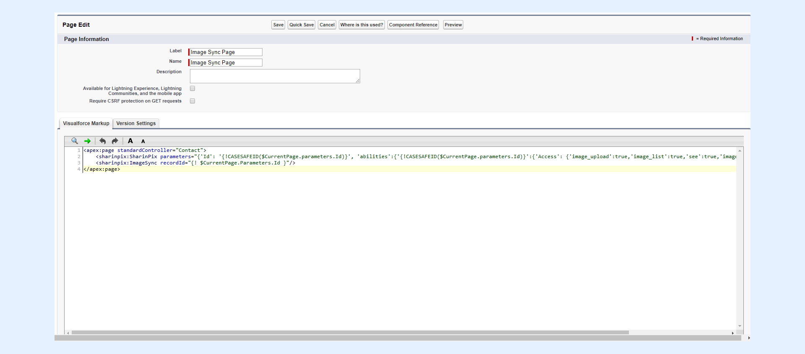
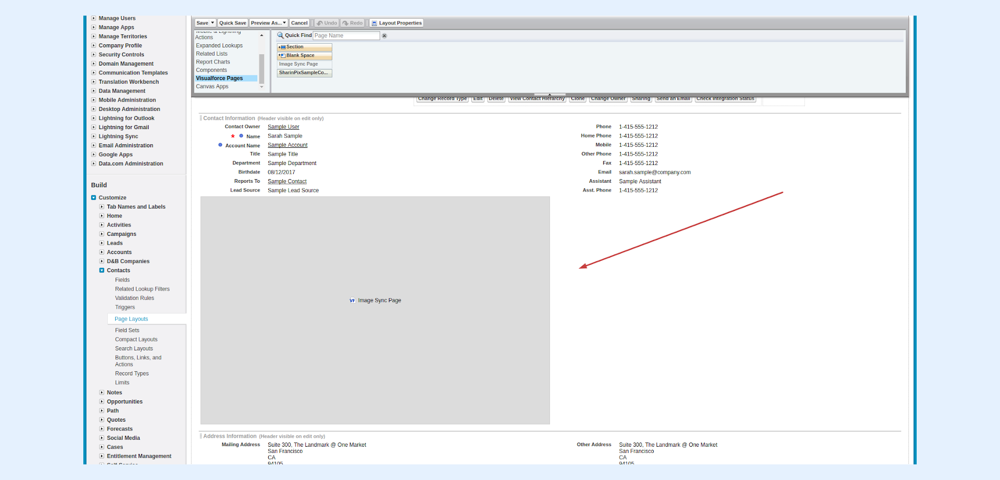
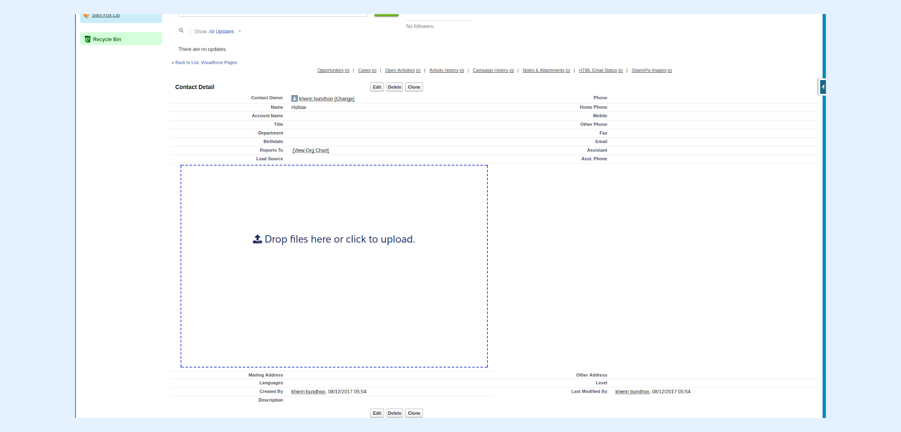
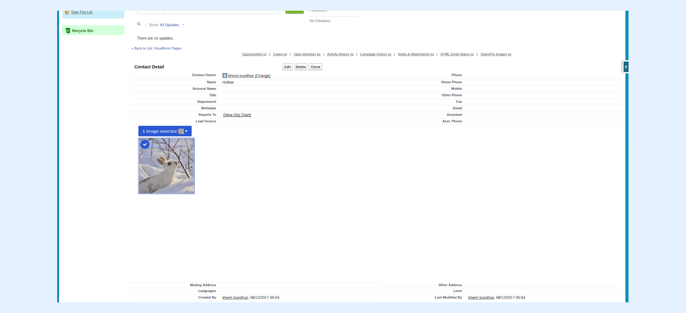
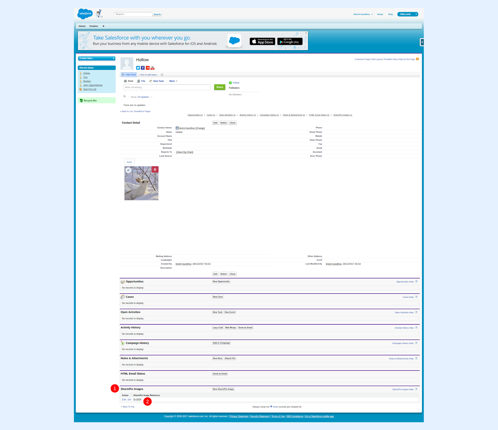
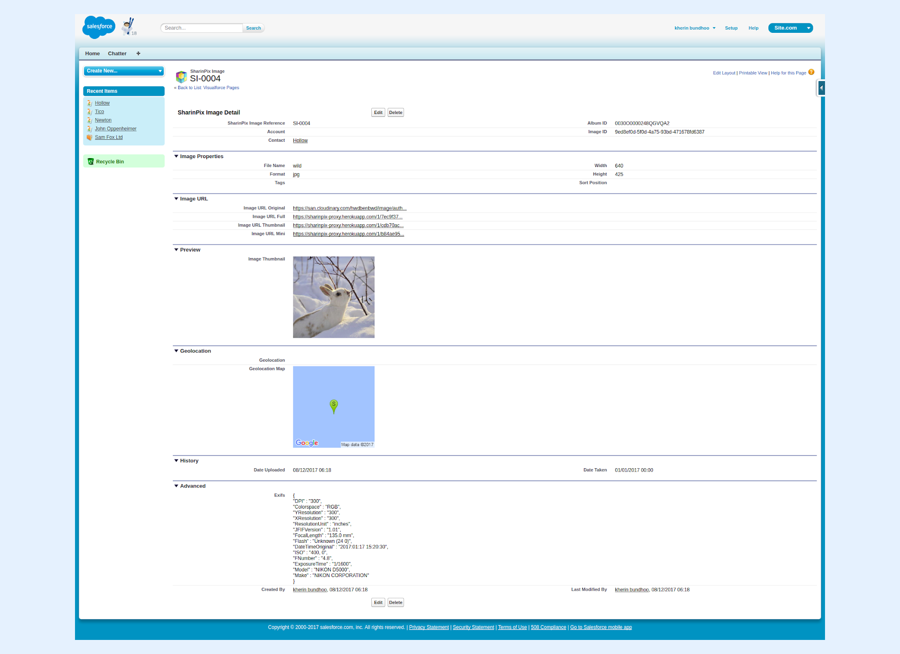

---
layout:
  width: default
  title:
    visible: true
  description:
    visible: true
  tableOfContents:
    visible: true
  outline:
    visible: true
  pagination:
    visible: true
  metadata:
    visible: false
  tags:
    visible: true
---

# Enable Image Sync for Classic

In order to enable SharinPix Image Sync in the Salesforce Classic Experience, you need to add a line in your visual force page.

```html
<sharinpix:ImageSync recordId="{! $CurrentPage.Parameters.Id }"/>
```

The resulting visual force page will be then be composed at least by :

1. [The SharinPix Image Sync component](enable-image-sync-for-classic.md#the-sharinpix-image-sync-component)
2. [The SharinPix Visualforce component](enable-image-sync-for-classic.md#the-sharinpix-visualforce-component)

## The SharinPix Image Sync Component

The syntax of the SharinPix Image Sync is as follows:

```html
<sharinpix:ImageSync recordId="{! $CurrentPage.Parameters.Id }"/>
```

The Image Sync component contains one parameter, namely **recordId**. The recordId uses the following syntax to refer to the current Visualforce page with its corresponding parameters.

```javascript
{! $CurrentPage.Parameters.Id }
```


For more information about how to use the SharinPix Image Sync, you can refer to the articles below:

* [What is SharinPix Image Sync?](what-is-sharinpix-image-sync.md)
* [What are the uses of Image Sync ?](what-are-the-uses-of-image-sync.md)
* [Setup SharinPix Image Sync](setup-sharinpix-image-sync.md)


### The SharinPix Visualforce Component <a href="#the-sharinpix-visualforce-component" id="the-sharinpix-visualforce-component"></a>

The syntax of the SharinPix Visualforce component is as follows:

```html
<sharinpix:SharinPix parameters="{'Id': '{!CASESAFEID($CurrentPage.parameters.Id)}', 'abilities':{'{!CASESAFEID($CurrentPage.parameters.Id)}':{'Access': {'image_upload':true,'image_list':true,'see':true,'image_delete':true}}}}" height="600px"/>
```

The following parameters are used inside the SharinPix Visualforce component:

1. **height** : refers to the height of the SharinPix Album in pixel units. Here it is set to **600px**.
2. **parameters** : refers to the set of SharinPix Abilities enabled or disabled in the SharinPix Album.

The **parameters** parameter contains:

* An **Album Id** corresponding to the record Id containing the Visualforce page. This value is passed through the formula function **CASESAFEID()** which makes sure than the value corresponds to a 18-character record I&#x64;**.** The Album Id syntax is as follows:

```apex
'{!CASESAFEID($CurrentPage.Parameters.Id)}'
```


**Tip:**\
\
**CASESAFEID()** is a formula function  that replaces the 15 character ID (case sensitive) with a 18 character ID (case insensitive).&#x20;


* A set of **abilities** referring to the abilities allowed on the SharinPix Album.

```
'Access': {
  'image_upload':true,
  'image_list':true,
  'see':true,
  'image_delete':true
}
```


For more information about the SharinPix abilities, refer to the following article: [SharinPix abilities](../access-and-security/sharinpix-abilities.md)


### Creation of the Visualforce Page <a href="#creation-of-the-visualforce-page" id="creation-of-the-visualforce-page"></a>

Follow the subsequent steps to create and add the Visualforce page:

* Create a Visualforce page using the code snippet below.

```apex
    <apex:page standardController="Contact">   
        <sharinpix:SharinPix parameters="{'Id': '{!CASESAFEID($CurrentPage.parameters.Id)}', 'abilities':{'{!CASESAFEID($CurrentPage.parameters.Id)}':{'Access': {'image_upload':true,'image_list':true,'see':true,'image_delete':true}}}}" height="600px"/>    
        <sharinpix:ImageSync recordId="{! $CurrentPage.Parameters.Id }"/>
    </apex:page>
```

* Save the Visualforce page when done.



* Add the newly-created Visualforce Page to the layout of the **Contact** object.






* Add an image.



* Refresh the current web page. Go to the **SharinPix Images(1)** section. You should see a new entr&#x79;**(2).**



* Click on the new entry. You will be directed to the SharinPix Image Record of the newly-uploaded image. You should see the details of the image as displayed in the figure below.


