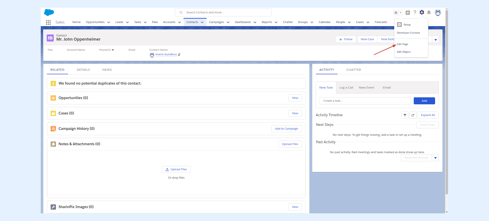
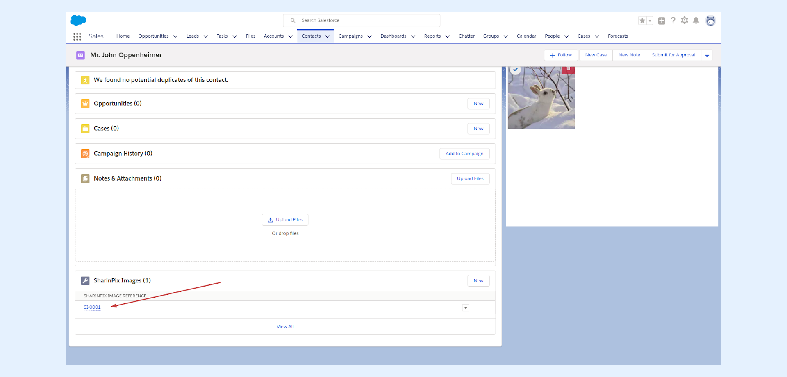

---
layout:
  width: default
  title:
    visible: true
  description:
    visible: true
  tableOfContents:
    visible: true
  outline:
    visible: true
  pagination:
    visible: true
  metadata:
    visible: false
  tags:
    visible: true
---

# Enable Image Sync for Lightning


This article demonstrates how to enable the Image Sync on an album in Lightning.



**Note:**

This article assumes that the Image Sync has already been enabled on your object.

If the Image Sync has not been enabled on the object or if you are not sure, refer to this article for steps to configure/verify the Image Sync configuration for an object: [Setup SharinPix Image Sync](setup-sharinpix-image-sync.md)


To enable or verify if the Image Sync has been enabled on the SharinPix Album component added to a lightning page record proceed as follows:

* From the record page, open the Lightning App Builder.

* Next, click on the SharinPix Album component or drag and drop the component to the page if not done already.
* In the component's list of parameters, ensure that the **Enable Image Sync** checkbox is set to true.

<figure><figcaption></figcaption></figure>


**Note:**&#x20;

When the SharinPix Album component is added to the page record, the **Enable Image Sync** checkbox is checked by default on the component. Additional steps are required to get this feature fully working on your Salesforce object. Please refer to this article to complete the Image Sync setup: [Setup SharinPix Image Sync](setup-sharinpix-image-sync.md)


* Configure the other parameters as desired. You will find the detailed description of all parameters here: [https://docs.sharinpix.com/m/documentation/l/1249599-sharinpix-album#lightning-component-parameters](../lightning-web-component/sharinpix-album-lwc.md#lightning-web-component-parameters)
* Save the page once done.

To test if the Image Sync is working as expected for your user:

* Upload an image to the album component as depicted below.

<figure><figcaption></figcaption></figure>

* Once the image is uploaded, verify if a related _SharinPix Image record_ has been created for the newly uploaded image. You may need to refresh the page to verify this.

