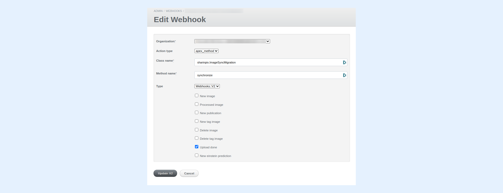
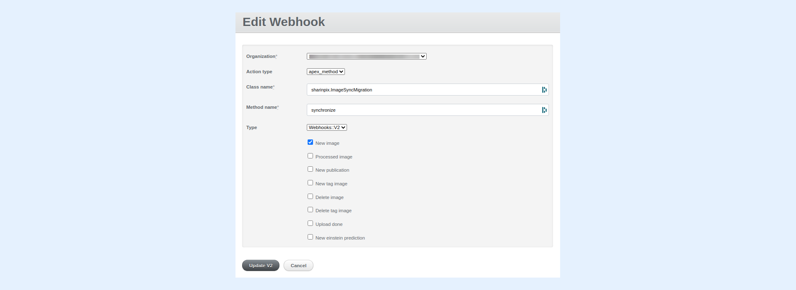
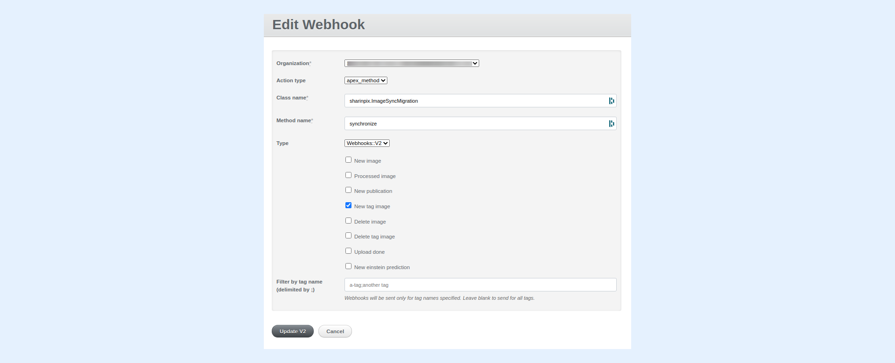

---
layout:
  width: default
  title:
    visible: true
  description:
    visible: true
  tableOfContents:
    visible: true
  outline:
    visible: true
  pagination:
    visible: true
  metadata:
    visible: false
  tags:
    visible: true
---

# Image Sync for pictures uploaded via SharinPix Mobile App


The current article assumes that you are familiar with the usage of the **SharinPix Mobile App.** If this is not the case, please refer to the following article: [SharinPix Mobile App](../#mobile-app)


## Overview


* [Objective](image-sync-for-pictures-uploaded-via-sharinpix-mobile-app.md#objective)
* [How does SharinPix Webhook work?](image-sync-for-pictures-uploaded-via-sharinpix-mobile-app.md#how-is-it-possible)
* [How to configure the Webhook?](image-sync-for-pictures-uploaded-via-sharinpix-mobile-app.md#how-to-configure-the-webhook)


## Objective

In the present article, we will learn how to initiate the execution of Image Sync when uploading images using the SharinPix Mobile App. For each newly uploaded image, a corresponding **SharinPix Image** record will be created.

.png)


Learn more about **SharinPix Image Sync** in this article: [What is SharinPix Image Sync?](what-is-sharinpix-image-sync.md)


The process of syncing the uploaded images takes place in **2** major steps:

1\. A SharinPix Webhook detects image upload events

2\. The SharinPix Webhook executes a particular Apex method to perform an Image Sync


**Note:**

1\. In order to use SharinPix Webhooks, you should ensure that you have granted API access to SharinPix in your organization. To verify this, go to the **SharinPix Settings** tab and check if the second row, that is, **Sharinpix -> Salesforce full API access**, is highlighted in green.

In case the row, **Sharinpix -> Salesforce full API access** is still highlighted in red, simply click on the **Grant** button to grant API access.

For more details on how to grant API access, please refer to the following article:

[Basic Setup - Step 2 - Register your Salesforce organization to SharinPix](../getting-started-with-sharinpix/basic-setup/basic-setup-step-2-register-your-salesforce-organization-to-sharinpix.md)

2\. All Webhooks of type **apex\_method** make use of Salesforce API and should be used only when needed.


### 1. How does SharinPix Webhook work? 

#### Step 1: SharinPix Webhook detects an upload 

A SharinPix Webhook can be **created** and **configured** in such a way as to detect when an image is uploaded to **SharinPix**.&#x20;

An upload process triggers three main types of events that can be detected by webhooks:

* **image\_new:** This event is triggered for **every** **single** image during an upload to SharinPix
* **upload\_done:** This event is triggered once all images have been uploaded to SharinPix
* **new\_tag\_image:** This event is triggered when a new tag is applied to an image

In the upcoming sections, we will see how it is possible to configure a SharinPix Webhook to detect these events.


**Note:**

* For the **upload\_done** event, if more than 50 images are uploaded at once, multiple events will be sent, each having at most 50 images.&#x20;
* The **processed\_image** event is triggered after upload when the _exits_ have been extracted from the uploaded image.



For more information about **SharinPix Events,** head over to the following chapte&#x72;**:**  [SharinPix integration - events](../#integrations)


### Step 2: SharinPix Webhook performs Image Sync via an Apex method

Once an upload event is detected, the next step is to initiate the Image Sync process. This can be accomplished by invoking a SharinPix Event Handler method named **synchronize** which is available in the SharinPix package.

## How to configure the Webhook?

To configure a Webhook, follow the steps below:

* From **App Launcher** , search and click on **SharinPix Settings**
* On the SharinPix Settings tab, click on the button labeled as **Go to administration dashboard** (Enter your organization's credentials if asked)

* Once on the administration dashboard, select **Webhooks** from the top menu bar
* Click on the button **New Webhook**
* Then, configure the SharinPix Webhook as follows:
  * **Action Type**: apex\_method
  * **Class name:**  sharinpix.ImageSyncMigration
  * **Method name:**  synchronize
  * Next, select the required checkbox (example: **Upload done**, **New image**, **Delete image**, **New tag image** or **Delete tag image**)
* Click on **Update V2** when done

The following example demonstrates a SharinPix Webhook configuration to perform an **Image Sync on Upload Done**:


**Information:**

* If you intend to perform an Image Sync for each and every image during an upload, select the checkbox **New Image**
* To perform an Image Sync for each and every image being tagged, then choose **New tag image**
* To perform an Image Sync for each and every image deleted, select **Delete image**
* To perform Image Sync when a tag is removed, use **Delete tag image**
* If you intend to perform an Image Sync once and only after all images have been uploaded, then select the checkbox labeled **Upload done**



**Tip**: &#x20;

For more information about how to create and setup SharinPix Webhooks, refer to the following article: [Configure Server-side Events](../integrations/events/configure-server-side-events.md)



**Alert:**\
\
The following sections make use of the deprecated way of setting up a SharinPix Webhook. Though these configurations still work, you are advised to use the new configuration, that is making use of the method **synchronize** as explained in the above section for a better performance.


## Perform an Image Sync on Upload Done

If you intend to perform an Image Sync once and only after all images have been uploaded, configure a SharinPix Webhook using the following values:

* **Action Type**: apex\_method
* **Class name:**  sharinpix.ImageSyncMigration
* **Method name:**  synchronize
* Checkbox **Upload done:** checked

### Perform an Image Sync on Image New 

If you intend to perform an Image Sync for each and every image during an upload, configure a SharinPix Webhook using the following values:

* **Action Type**: apex\_method
* **Class name:**  sharinpix.ImageSyncMigration
* **Method name:**  newImage
* Checkbox **New Image:** checked

### Perform an Image Sync on New Tag 

If you intend to perform an Image Sync for each and every image being tagged, configure a SharinPix Webhook using the following values:

* **Action Type**: apex\_method
* **Class name:**  sharinpix.ImageSyncMigration
* **Method name:**  tagImage
* Checkbox **New tag image:** checked

