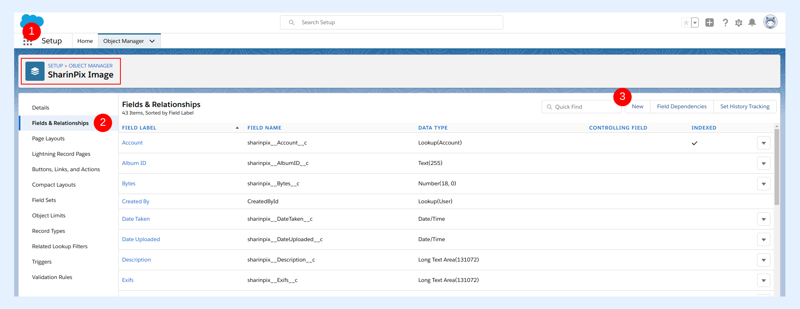

---
layout:
  width: default
  title:
    visible: true
  description:
    visible: true
  tableOfContents:
    visible: true
  outline:
    visible: true
  pagination:
    visible: true
  metadata:
    visible: false
  tags:
    visible: true
---

# Setup SharinPix Image Sync


In this article, we will demonstrate how to setup the SharinPix Image Sync. To do so we will:

1. [Create a lookup relationship field on the SharinPix Image object](setup-sharinpix-image-sync.md#creation-of-a-lookup-relationship-field)
2. [Configure the SharinPix Image Sync custom metadata](setup-sharinpix-image-sync.md#configure-the-custom-metadata)
3. [Assign the SharinPix Image Sync Permission Set to the users](setup-sharinpix-image-sync.md#assign-sharinpix-image-sync-permission-set)


## Creation of a lookup relationship field

Depending on the Object you want to use SharinPix Image Sync on, you must create a lookup relationship field on the SharinPix Image Object which links to the parent object. This demo will make use of the Contact object.&#x20;

Follow the steps below:

* Go to **Setup** then access **Object Manager**
* Type image in the search bar, press Enter and click **SharinPix Image**&#x20;
* On the left menu, click on **Fields and Relationships** and then click on **New**

For the new field:

* Select **Lookup Relationship** as **Data Type** then click **Next**
* For the field **Related To**, select **Contact** then click **Next**
* You will be directed to the page below:

<figure><figcaption></figcaption></figure>

* The field **Field Label** will be auto-populated
* Click anywhere outside the text box for the field **Field Name** to auto-populated it (in case it is not auto-populated already)
* Leave the other fields as default

<figure><figcaption></figcaption></figure>

* Proceed to the next steps and finally save the new relationship.

When you take a look back at the **Fields & Relationships** section, you should see the new relationship displayed as shown in the figure below.

<figure><figcaption></figcaption></figure>

* Copy the field name: **Contact\_\_c** as we will need this in our next step.


**Note:**&#x20;

Ensure to provide at least read access to the lookup field (Contact\_\_c in this case) for all users viewing/creating SharinPix Image records.


## Configure the custom metadata

This section demonstrates how to configure the SharinPix Image Sync custom metadata.&#x20;

To do so, follow the steps below:

* Go to **Setup** and type metadata, then click on **Custom Metadata Types**
* Select the **Manage Records** action next to the label **SharinPix Sync Setting**

<figure><figcaption></figcaption></figure>

* Click on the button **New** to create a new record. You will be directed to the page below:

<figure><figcaption></figcaption></figure>

* For the field **Label**, enter **Image Sync on Contact**&#x20;
* The field **SharinPix Sync Setting Name** is an auto-populated field. Click anywhere outside its corresponding text box to auto-populate it.
* For the field **Parent Object Name**, enter the **object API name** in our case it is **Contact**
* For the field **Parent Field Name**, enter the field name of the lookup relationship field created in the previous section, that is **Contact\_\_c** (Remember the field name we asked you to copy? You can now paste it here)
* Click **Save** when done.

<figure><figcaption></figcaption></figure>


**Note:**

You should be careful when entering values for the fields **Parent Object Name** and **Parent Field Name**.

* The field **Parent Object Name** refers to the object's API Name. If you are using a custom object, ensure the API name is entered correctly. For example, if you are using a custom object named **My Custom Object**, the value to be entered for the field **Parent Object Name** will be **My\_Custom\_Object\_\_c**.
* The field **Parent Field Name** on the other hand refers to the field name of the lookup relationship. You should ensure that the value entered for the field **Parent Field Name** matches the corresponding field name value in the lookup relationship.&#x20;


### Assign SharinPix Image Sync Permission Set 

Last but not least, to be sure your users have the right to create, edit, delete the SharinPix Image record through SharinPix Image Sync, you should assign them the "**SharinPix Image Sync Permission**" from Permission Sets in the Setup.


**Tip:**

To be able to use SharinPix Image Sync on a SharinPix component, you should activate the Image Sync on the same component. In case you haven't performed this step yet, you can refer to the following articles to do so:

* [Enable Image Sync for Lightning](enable-image-sync-for-lightning.md)
* [Enable Image Sync for Classic](enable-image-sync-for-classic.md)



**Note:**\
\
Image Sync is checked by default for all components using this feature.&#x20;

