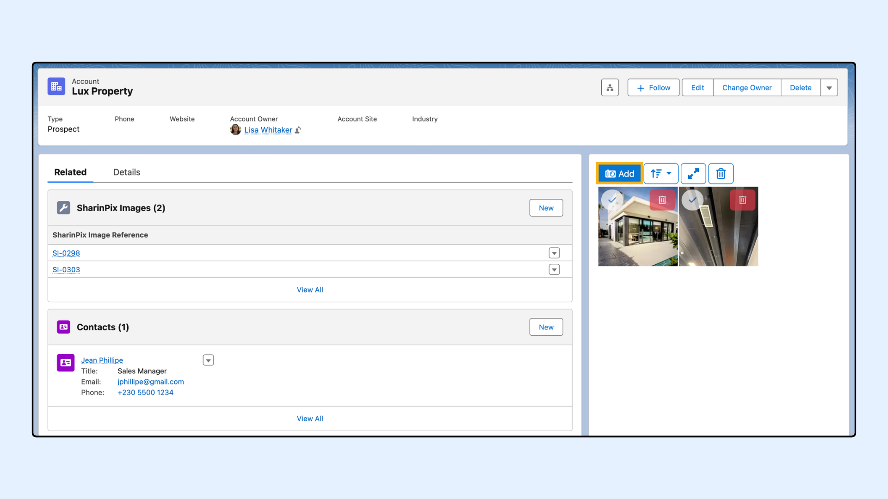
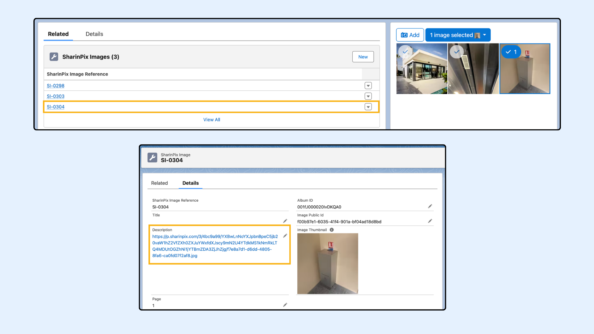

---
layout:
  width: default
  title:
    visible: true
  description:
    visible: true
  tableOfContents:
    visible: true
  outline:
    visible: true
  pagination:
    visible: true
  metadata:
    visible: false
  tags:
    visible: true
---

# SharinPix Image Transformation using a Flow (Admin-Oriented)

## Overview

`Sharinpix__TransformImage` is an invocable Apex action that lets you apply SharinPix image transformations (such as resize, crop, or format) and automatically save the resulting image URL into a field on a record. Use it when you need a transformed version of an image stored in Salesforce for display, reporting, or integrations.

## Input Parameters 

Below are the inputs required when using the `TransformImage` invocable method in a Salesforce Flow.&#x20;

<table><thead><tr><th>Parameter</th><th width="324.46875">Description</th><th>Required/Optional</th></tr></thead><tbody><tr><td>fieldApiName</td><td>The API name of the field in which the transformed URL should be saved.</td><td>Required</td></tr><tr><td>transformationJson</td><td>The transformations to apply in JSON format.</td><td>Required</td></tr><tr><td>imageId</td><td>The public ID of the image to be transformed.</td><td>Required</td></tr><tr><td>recordId</td><td>The ID of the record in which the transformed URL should be saved. If blank, it uses the SharinPix Image record itself.</td><td>Optional</td></tr></tbody></table>

## Transformation JSON 

The Transformation JSON input parameter accepts an array of objects. Each object represents one transformation. Since SharinPix leverages Cloudinary for image transformations, the JSON supports Cloudinary transformation parameters. For the full list of supported parameters and syntax, refer to the Cloudinary documentation on [Image Transformations](https://cloudinary.com/documentation/image_transformations).

Typical uses of the Transformation JSON include:

* resizing or cropping the main image,
* adding an image overlay such as a watermark,
* adding a text overlay,
* adjusting opacity,
* changing the output format or quality,
* rotating or repositioning elements.

Common parameters include:

<table><thead><tr><th width="132.73828125">Parameter</th><th width="406.8125">Description</th><th>Example</th></tr></thead><tbody><tr><td>width</td><td>Sets the width of the image in pixels or decimal.</td><td><code>{"width": 300}</code></td></tr><tr><td>height</td><td>Sets the height of the image.</td><td><code>{"height": 200}</code></td></tr><tr><td>crop</td><td>fill: Resizes to fill dimensions (may crop). fit: Fits inside dimensions (no cropping). scale: Stretches to exact dimensions. thumb: Optimized for face-detection thumbnails.</td><td><code>{"crop": "fill"}</code></td></tr><tr><td>gravity</td><td>Determines which part of the image to keep when cropping (north, center, face, etc.).</td><td><code>{"gravity": "face"}</code></td></tr><tr><td>quality</td><td>Adjusts compression level (1 to 100 or auto).</td><td><code>{"quality": "auto"}</code></td></tr><tr><td>format</td><td>Forces a specific file format (e.g., jpg, png, webp).</td><td><code>{"format": "jpg"}</code></td></tr><tr><td>overlay</td><td>Adds a watermark or text layer. Requires an image_id or text object.</td><td><code>{"overlay": "logo_id"}</code></td></tr><tr><td>opacity</td><td>Sets the transparency of the image or overlay (0-100).</td><td><code>{"opacity": 50}</code></td></tr><tr><td>angle</td><td>Rotates the image by a specified degree.</td><td><code>{"angle": 90}</code></td></tr></tbody></table>

**Example JSON Strings:**

*   **Simple Resize (Fill 200x200):**

    `[{"width": 200, "height": 200, "crop": "fill"}]`
*   **Watermark + Resize:**

    `[{"width": 800, "crop": "scale"}, {"overlay": "my_logo", "gravity": "south_east", "x": 10, "y": 10, "opacity": 60}]`
*   **Convert to JPG with Auto Quality:**

    `[{"format": "jpg", "quality": "auto"}]`

## Flow Configuration Guide 

This section shows how to generate a transformed image URL in a Flow using the Transform Image action (sharinpix\_\_TransformImage). The example uses a **record-triggered flow** that runs when a `SharinPixImage__c` record is created and updates the `Description__c` field on that record with the transformed image URL.

### Step 1: Configure Record-Triggered Flow

1. Go to **Setup** > **Flows** > Click **New Flow**
2. Choose **Start From Scratch** and click **Next**
3. Choose **Record-Triggered Flow** and click **Create**
4. Set the following values:

| Setting               | Value                       |
| --------------------- | --------------------------- |
| Object                | SharinPix Image\*           |
| Trigger               | A record is created         |
| Set Entry Conditions  | None                        |
| Optimize the Flow for | Actions and Related Records |
| Add Asynchronous Path | On                          |

\*Please note that the _Object_ Setting can be configured as desired.


**Alert:**

Starting with the Salesforce **Winter ’26 release**, Apex Actions can no longer be executed directly in the **Run Immediately** path of a record-triggered flow. Instead, they must be placed in an **asynchronous path**, as the synchronous execution option is no longer supported.

For more details, please refer to the documentation here:\
[Unable to save a flow with an Apex Action after the Salesforce Winter ’26 release – What should I do?](https://app.gitbook.com/s/i8tH1o5AHthxksYgF6ij/i-am-unable-to-save-a-flow-with-an-apex-action-after-the-salesforce-winter-26-release-what-should-i)


<figure><figcaption></figcaption></figure>

<figure><figcaption></figcaption></figure>

### Step 2: Create New Resource to store watermark image

In this example, an image overlay will be added to the image being transformed. To make this possible, create a new Flow resource of type **Variable** to store the watermark image public ID.

Below is the image that will be used as the watermark.

<figure><figcaption></figcaption></figure>

<figure><figcaption></figcaption></figure>

Next, add an **Assignment** element to the Flow to set the value of variable `watermarkImage`. Assign to `watermarkImage` the public ID of the image that will be used as the watermark.

<figure><figcaption></figcaption></figure>

Once assigned, the variable can be referenced in the Transformation JSON using Flow merge syntax: `{!watermarkImage}`

### Step 3: Add the Apex Action to Transform Image

1. Add an **Action** element
2. Search for `sharinpix__TransformImage`
3. On the **Action** modal for `sharinpix__TransformImage`, populate the fields with the example values indicated below:

<table><thead><tr><th width="328.28125">Field</th><th width="407.1875">Example Value</th></tr></thead><tbody><tr><td>Field Api Name</td><td>sharinpix__Description__c</td></tr><tr><td>Image Public ID</td><td>Triggering SharinPixImage__c > ImagePublic Id</td></tr><tr><td>Transformation JSON</td><td>
[ { "width": 1200, "height": 800, "crop": "fill", "gravity": "center" }, { "color": "#19354d", "overlay": "<code>{!watermarkImage}</code>", "width": 500, "gravity": "south" }, 

{ "color": "#ffffff", "overlay": { "font_size": 65, "font_family": "Arial", "font_weight": "normal", "text": "Custom Text" }, "gravity": "center", "opacity": 30 } ]
</td></tr><tr><td>Record ID</td><td>Blank*</td></tr></tbody></table>

The example JSON applies two transformations: the first adds an **image overlay** positioned at the bottom of the image, and the second adds a **semi-transparent text overlay** centered on the image.

\*Note: For this example, you can leave **Record ID** blank, since the transformed image URL is stored directly on the `SharinPixImage__c` object itself.

<figure><figcaption></figcaption></figure>


To change the format of the transformed image to JPG, add <mark style="color:red;">`{"format": "jpg"}`</mark> at the end of the transformation JSON.

Example: <mark style="color:red;">`[{ "color": "#ffffff", "overlay": { "font_size": 65, "font_family": "Arial", "font_weight": "normal", "text": "Custom Text" }, "gravity": "center", "opacity": 30 },{ "format": "jpg"}]`</mark>.

**Note:** Only the JPG format is supported.


**Save** the Flow and click **Activate**.

<figure><figcaption></figcaption></figure>

## **Demo**

To test the flow, let's go to an Account record page, and add an image to the SharinPix album for that record. This will create a `SharinPixImage__c` record.

<figure><figcaption></figcaption></figure>

Then, open that record and verify that the `Description__c` field is populated with the URL of the transformed image, as configured in the flow above. Click the URL to view the transformed image.

<figure><figcaption></figcaption></figure>

Below, you can see a comparison between the original image and the image after the transformations have been applied.

<figure><figcaption></figcaption></figure>
