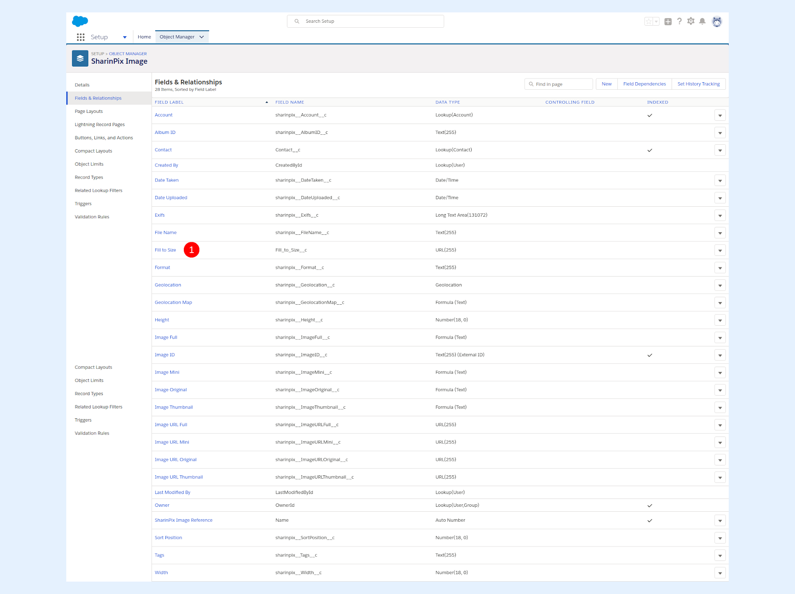
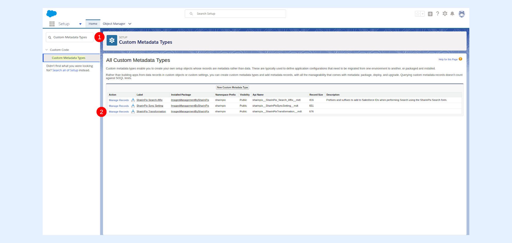
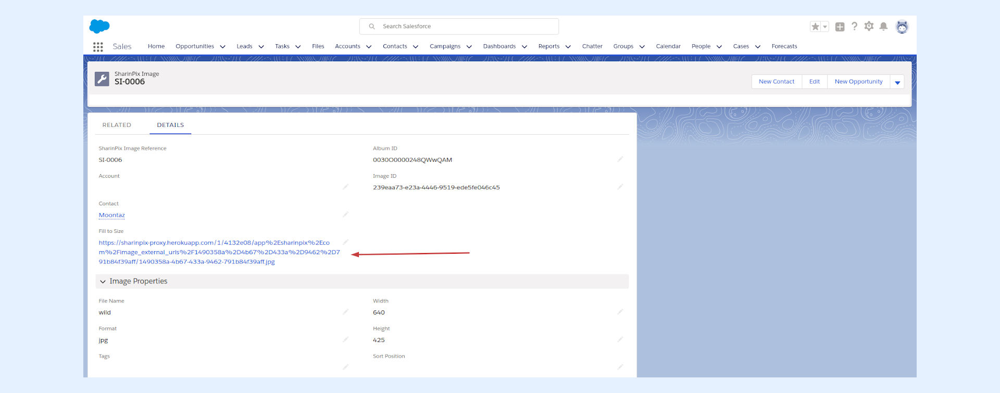
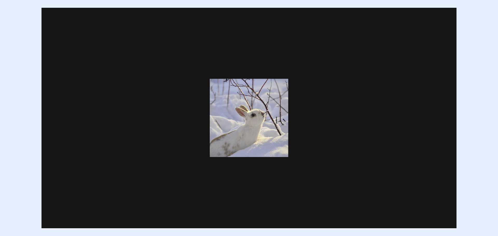
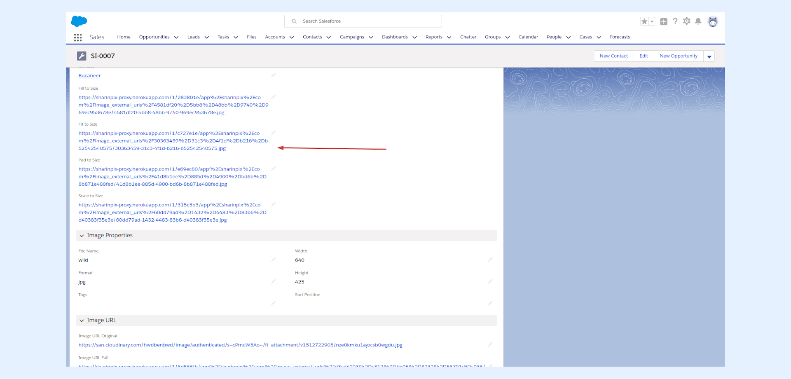
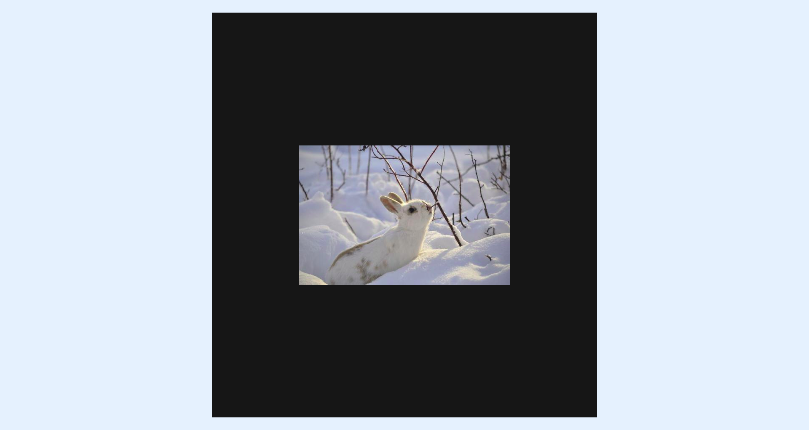
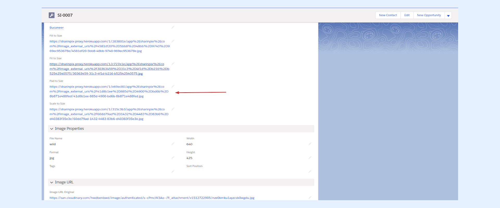
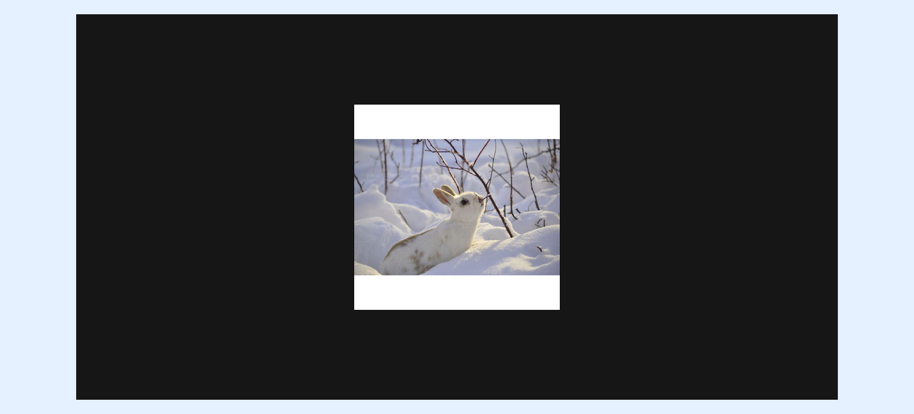
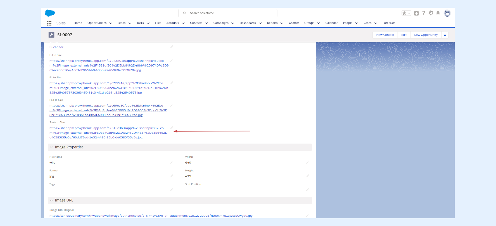
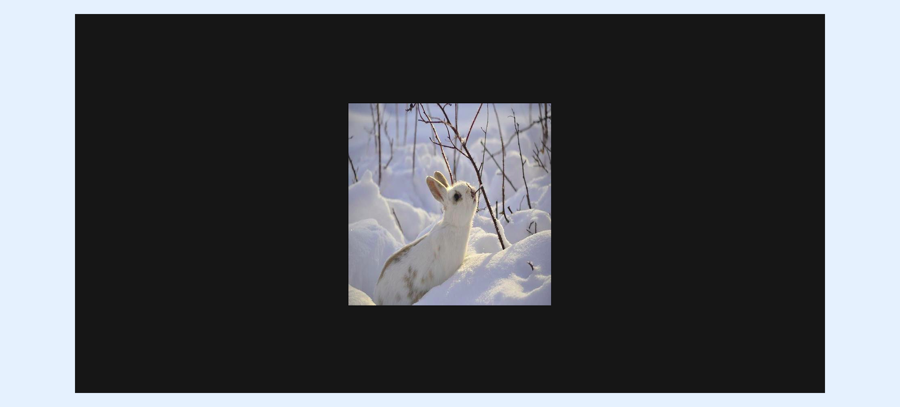

---
layout:
  width: default
  title:
    visible: true
  description:
    visible: true
  tableOfContents:
    visible: true
  outline:
    visible: true
  pagination:
    visible: true
  metadata:
    visible: false
  tags:
    visible: true
---

# SharinPix Transformation - get your images automatically resized!


**Note:**&#x20;

This article assumes that the **SharinPix Image Sync** feature has been activated. For more information on how to activate the SharinPix Image Sync feature, refer to the following article: [Setup SharinPix Image Sync](setup-sharinpix-image-sync.md)


### Examples 

The following examples will show to activate SharinPix Transformations and then perform an automatic resizing of your images !

* **Fill to size**

Create an image with the exact given width and height while retaining the original aspect ratio.&#x20;

(height = width = 250 pixels) - for that example value was set to "250"

<figure><figcaption></figcaption></figure>

* **Fit to Size**

The image is resized so that it takes up as much space as possible within a bounding box defined by the given width and height values. All of the original image remains visible after the resizing.

(height = width = 250 pixels) - for that example value was set to "250"

<figure><figcaption></figcaption></figure>

* **Pad to Size**

Resize the image to fill the given width and height while retaining the original aspect ratio and with all of the original image visible.

(height = width = 250 pixels) - for that example value was set to "150"

<figure><figcaption></figcaption></figure>

* **Scale to size**

Change the size of the image exactly to the given width and height without necessarily retaining the original aspect ratio. (height = width = 150 pixels)

<figure><figcaption></figcaption></figure>

* **Limit to size**

Set the limit size of the image to the specified width and height. If the image dimensions exceed the specified value(s), the image is down scaled to match the same. Else the image dimensions are retained. In the example below, the **Limit to size** value has been set to 250 pixels (height=width = 250 pixels) and the original image size is 300x300. Therefore, the image has been down scaled to a height and width of 250 pixels.

<figure><figcaption></figcaption></figure>

* **Crop to size**

The crop cropping mode extracts a specific region or a detected object from the original image while maintaining its original scale. Since no resizing is applied, specifying dimensions can lead to varying results when applied to the same image at different resolutions. The format is **width**x**height** x**coord\_x** x**coord\_y**

**Sample: 0.5x0.2x0.1x0.2**

<figure><figcaption></figcaption></figure>

### Setup SharinPix Transformation 

1. The first step is to create a new field on the SharinPix Image Object, that will contain the URL towards the image that has been transformed/manipulated.

* Go to the Object Manager inside **Setup,** and select the **SharinPix Image** object.
* Select **Fields & Relationships.** Click on **New.**&#x20;
* Select the field type of **URL**.
* Enter the field name of your choice and proceed to the next steps. The field label should ideally reflect the Image Transformation carried out on the image.
* Finally click on **Save.**

## Transformations

## Transformation: Fill to Size

Follow the above steps to create a field on the SharinPix Image Object. In this example, a field with label **Fill to Size** has been created on the SharinPix Image Object(1).

* Go to **Setup,** type **Custom Metadata Types** in the **Quick Find Box** (1). Select **Manage Records** right next to the **SharinPix Transformation** label(2). &#x20;

* Click on the **New** button.

.png>)

Fill in the values:

* In the **Field name** text input, enter the **field API** **name** that was created above in the SharinPix Image Object(1).
* Select SharinPix Sync Setting item that was previously selected in the _SharinPix Image Sync_ Section above (2).
* Choose the **Transformation** of your choice(3).
* Enter the Value, that corresponds to the width/height parameters, in pixels,  relative to which the image will be transformed(4). You can see the example and syntax for values to enter in this field [here.](sharinpix-transformation-get-your-images-automatically-resized.md#syntax-for-value-1)

.png>)

Go to **Contacts** and select an existing record or create a new one.

* Upload a new image.
* Refresh the current browser page.
* Select the new entry in the SharinPix Image section.
* You should see that a URL has been added to the field **Fill to Size** (or, in your case, the field you defined for the SharinPix Object).

When you follow the URL, you will be directed to the new transformed image. In the figure below, the image has been subjected to a Fill to Size transformation with a value of 350 pixels.

The following screenshots illustrate the other types of transformations. To reproduce the results, the steps are identical to those evoked above.

* Transformation: **Fit to Size**. Value: **500**.

* Transformation: **Pad to Size.** Value: **500**

* Transformation: **Scale to Size.** Value: **500.**

### Syntax for Value 

The Value field can be filled with:

\- a single value which stands for width and eight at the same time

\- a double value, separated by an x which stands for width and then height

Examples of working values

<mark style="color:$success;">**500**</mark>

<mark style="color:$success;">**500x300**</mark>

<mark style="color:$success;">**1000x2000**</mark>

<mark style="color:$success;">**800**</mark>

Examples of non-working values

<mark style="color:red;">500px</mark>

<mark style="color:red;">500-300</mark>

<mark style="color:red;">1000,2000</mark>

<mark style="color:red;">800p</mark>
