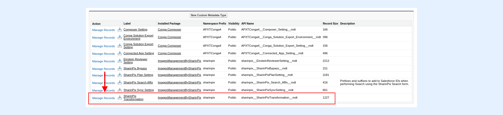
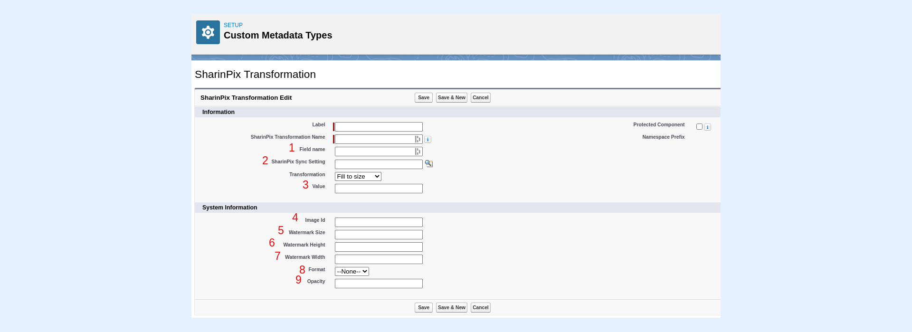
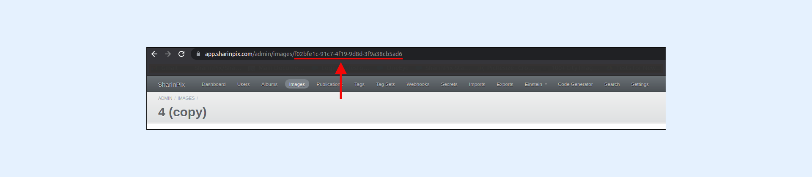

---
layout:
  width: default
  title:
    visible: true
  description:
    visible: true
  tableOfContents:
    visible: true
  outline:
    visible: true
  pagination:
    visible: true
  metadata:
    visible: false
  tags:
    visible: true
---

# SharinPix Transformation - Get your images watermarked


This article demonstrates how to get your image watermarked using the SharinPix Transformation feature.



**Note:**&#x20;

1. This article assumes that the **SharinPix Image Sync** feature has been activated. For more information on how to activate the SharinPix Image Sync feature, refer to the following article: [Setup SharinPix Image Sync](setup-sharinpix-image-sync.md)
2. &#x20;Before going deeper on SharinPix Transformation capabilities, please check the[ basics of SharinPix Transformation (to resize images)](sharinpix-transformation-get-your-images-automatically-resized.md).


## Access the SharinPix Transformation feature

To access the SharinPix Transformation settings, follow the steps below:

* From the _Setup_ page, type **Custom Metadata Types** using the _Quick Find_ box
* Next, click on **Manage Records** next to **SharinPix Transformation**

* Then click on the **New** button

You will then be directed to the page below:

The parameters labeled with **1**, **2** and **3** are described in details in the [SharinPix transformation basics](sharinpix-transformation-get-your-images-automatically-resized.md).

Parameters labeled with **4**, **5**, **6**, **7**, **8** and **9** are dedicated to the watermark.

## Specify the image to use as watermark - Image ID parameter


**Note:**

SharinPix watermarks work along Image Sync transformation and is based on SharinPix image used as static resource.


To retrieve the watermark's **Image ID**, follow the steps below:

* Upload the watermark image in any SharinPix album using an admin user
* Next, access the uploaded image from the **SharinPix Global Settings** as follows:
  * Using the _App Launcher_, search for the **SharinPix Settings** tab
  * Once on the **SharinPix Settings** page, click on the button **Go to Administration** **Dashboard.** This action will bring you to the SharinPix Global Settings
* Once on the global settings, click on the **Images** menu
* Next, click on your watermark image
* Then from the URL bar, copy the image ID as highlighted below:

For example, if your URL is as follows

<mark style="color:red;">`https://app.sharinpix.com/admin/images/f02bfe1c-91c7-4f19-9d8d-3f9a38cb5ad6`</mark>

your image ID will be the ID after the <mark style="color:red;">`images/`</mark>, that is, <mark style="color:red;">`f02bfe1c-91c7-4f19-9d8d-3f9a38cb5ad6`</mark>

* To finish, paste the image ID in the **Image Id** field of your SharinPix Transformation setting

## Watermark Size and Opacity - Watermark Size parameter

The watermark process takes as parameter a size and an opacity.

The size can be expressed in percentage or pixels.

The opacity is a percentage value between 0 and 100.

This should be setup in the Watermark Size parameter from the SharinPix Transformation.

it should respect the following pattern :

Examples:

<mark style="color:red;">`100x100;px;40`</mark> : Watermark with width 100px and height 100px with opacity 40.

<mark style="color:red;">`30;%;60`</mark> : Watermark with size 30% of backdrop image with opacity 60.

<mark style="color:red;">`30x20;%;60`</mark> : Watermark with width 30% and height 20% of backdrop image with opacity 60.
