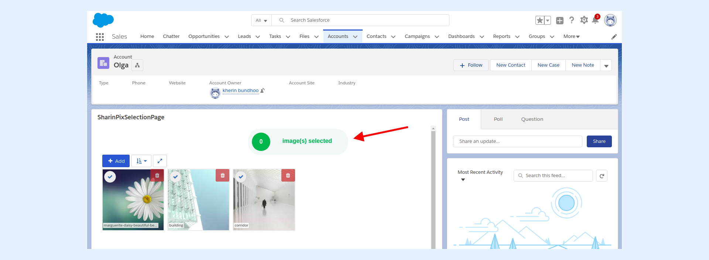
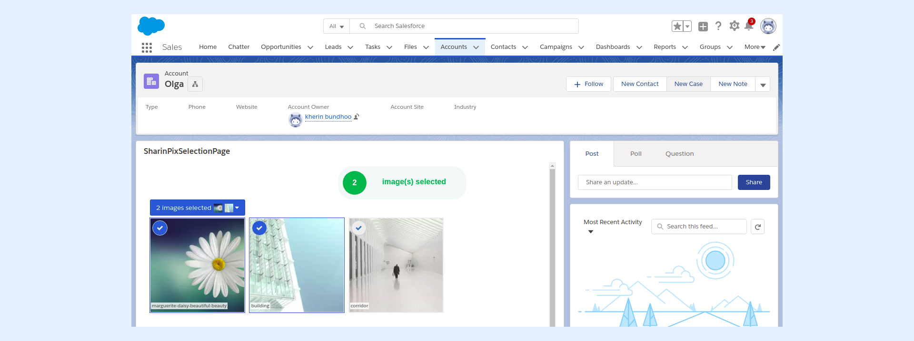
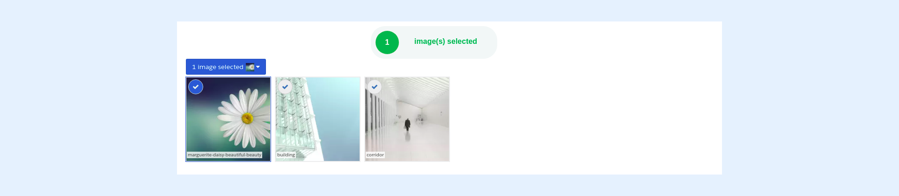

---
layout:
  width: default
  title:
    visible: true
  description:
    visible: true
  tableOfContents:
    visible: true
  outline:
    visible: true
  pagination:
    visible: true
  metadata:
    visible: false
  tags:
    visible: true
---

# Capturing SharinPix Selection Event

The present article shows how to detect whether one or more images have been selected in the SharinPix Album.

## Selection event

Whenever an action is performed on a SharinPix Album, a corresponding JavaScript event is emitted. In this case, whenever one or more images are selected , the `images-selected` event is emitted.


**IMPORTANT:**

The `images-selected` event is also emitted whenever one or more images are **deselected**.


## Capturing SharinPix Event

```javascript
    var eventMethod = window.addEventListener ? "addEventListener" : "attachEvent";
    var eventer = window[eventMethod];
    var messageEvent = eventMethod == "attachEvent" ? "onmessage" : "message";
    eventer(messageEvent, function(e) {
        if(e.origin !== "https://app.sharinpix.com") return;
        if(e.data.name === 'images-selected') {
            console.log('Selection Event detected!');
        }
    });
```

The above code checks if the currently-emitted event is `images-selected` . The event is identified through its attribute `name` which is found in the event data (`e.data.name`).


**Info:**

The event data contains an attribute **payload** (`e.data.payload`) which contains extensive data on the selected image(s).


## Example: Display the number of selected images

This section will show the implementation of a Visualforce Page that will **detect** and **display** the number of images selected in a SharinPix Album. This example only serves as a way to give you a sense of what can be done with SharinPix events.

## Visualforce Page

The code snippet below shows the implementation of the Visualforce Page used in this example.

```html
    <apex:page StandardController="Account" standardStylesheets="false">
      	<div id="counter">0</div>
        <SharinPix:SharinPix height="600px"
                             parameters="{
                             	'Id': '{!CASESAFEID($CurrentPage.parameters.Id)}',
                                'abilities':{'{!CASESAFEID($CurrentPage.parameters.Id)}':{
                                'Access': {
                                    'image_delete':true,
                                	'image_upload':true,
                                    'image_list':true,
                                    'see':true
                                    }
                                  }
                                }
    						 }"
    	/>
        <script>
        	var eventMethod = window.addEventListener ? "addEventListener" : "attachEvent";
        	var eventer = window[eventMethod];
        	var messageEvent = eventMethod == "attachEvent" ? "onmessage" : "message";
        	eventer(messageEvent, function(e) {
                if(e.origin !== "https://app.sharinpix.com") return;
                if(e.data.name === 'images-selected') {
                	document.getElementById('counter').innerHTML = e.data.payload.images.length;
                }
            });
        </script>
    </apex:page>
```

* The Visualforce Page is added to the record page of the **Account** object. Since no images have been selected from the SharinPix Album, the counter (indicated in the screenshot below) displays a **"0".**

<figure><figcaption></figcaption></figure>

* When one or more images are selected, the counter displays the corresponding value.

<figure><figcaption></figcaption></figure>

* When an image is deselected, the counter reacts accordingly.

<figure><figcaption></figcaption></figure>
