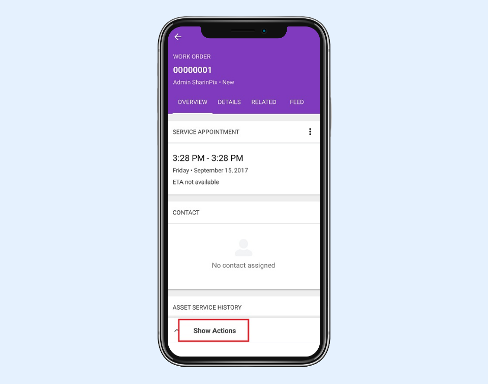
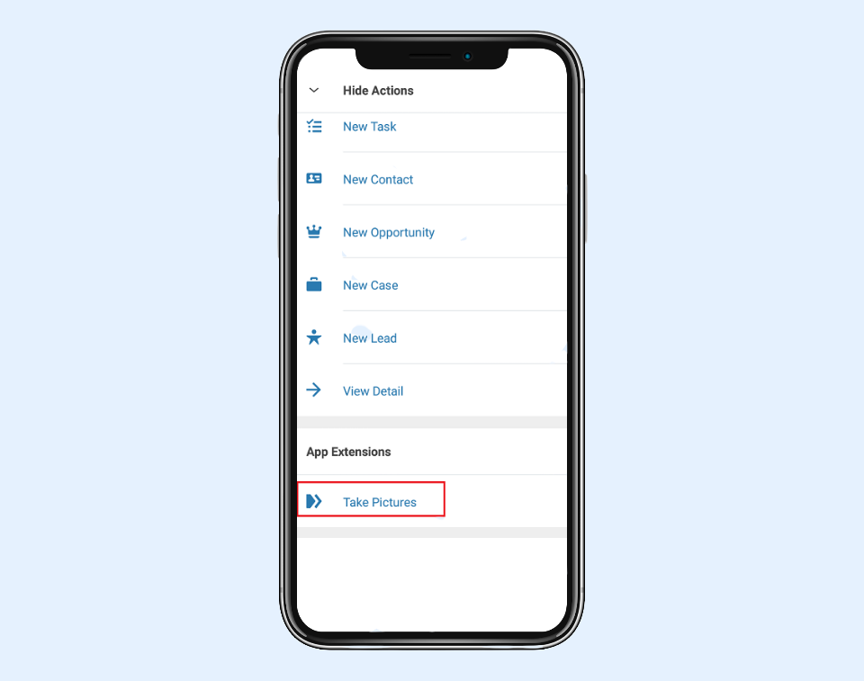
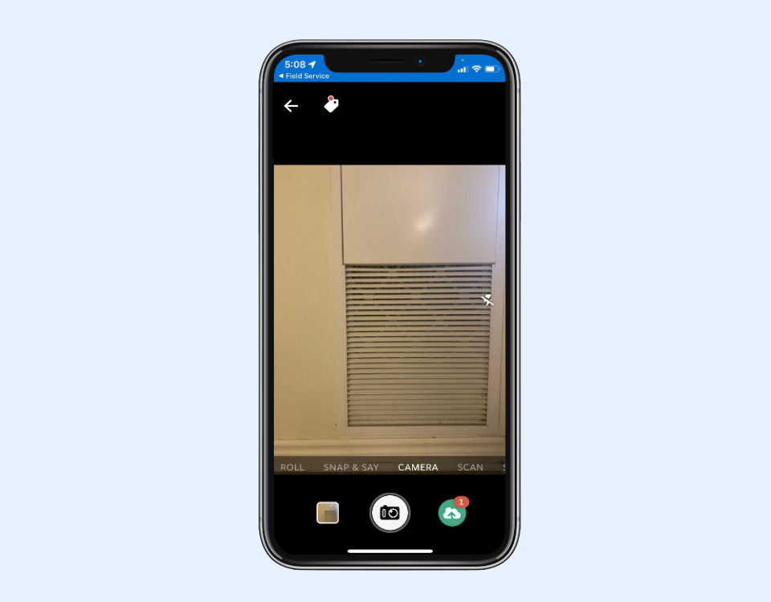

---
layout:
  width: default
  title:
    visible: true
  description:
    visible: true
  tableOfContents:
    visible: true
  outline:
    visible: true
  pagination:
    visible: true
  metadata:
    visible: false
  tags:
    visible: true
---

# Integration of SharinPix App with SFS (FSL) App using App Extension


**Information:**

Salesforce Field Service (SFS) was formerly known as Field Service Lightning (FSL).



**Assumptions:**

* The **Work Order** object will be used throughout this article.
* The WorkOrder object has a custom field named **SharinPix\_Token\_\_c** that holds a token. If you haven't implemented this yet, refer to the article [SharinPix automatic token generation](../../mobile-app/sharinpix-automatic-mobile-upload-token-generation-admin-friendly.md) to generate the token.


One method used to launch the SharinPix App from the SFS App is by creating an **App Extension**. The latter can be used to embed a deeplink URL referring to a location on the SharinPix App where the images will be uploaded.

In this article, you will learn how the SharinPix deeplink URL is integrated in the SFS mobile App using the SFS App Extension.

## Creation of the App Extension

An App Extension permits the user to quickly access the SharinPix app. In this section, we will create an App Extension that will launch the SharinPix app from the SFS app.

* Go to Setup then type Field Service Mobile Settings in the Quick Find box. Click on **Field Service Mobile Settings**.
* Click on the **Field Service Mobile Settings** item (Or any settings relevant to your Organization).

<figure><figcaption></figcaption></figure>

* Scroll down towards App Extensions Section.
* Click on **Add**. You will be prompted with the screen below:

<figure><figcaption></figcaption></figure>

* For the **Field Service Mobile Settings**, select the relevant record to your Organization. In our case it is **Field Service Mobile Settings**.
* For the **Type**, select **Android** if you intent to use the App Extension on Android platforms or select **iOS** if you intent to use on iOS platforms.
* For the **Launch Value**, enter the following SharinPix Deeplink URL for **Android platforms**:

```
sharinpix://upload?token={!SharinPix_Token__c}
```

Or use the following SharinPix Deeplink URL if you intent to use the App Extension on **iOS platforms**:

```
sharinpix://upload?token={!$SharinPix_Token__c}
```

* For the field **Label**, enter **Take Pictures**
* For the field **Name**, enter **SharinPix Native Url**
* For the field **Scoped To Object Types**, enter **WorkOrder**
* Click on **Save**


**Working around Salesforce App Extension limitations**

Since there is a restriction on the number of characters an App Extension can have, a custom field can be added with the value containing all other mobile app parameters. The Deeplink URL will then be as follows:

<mark style="color:$danger;">`sharinpix://upload?token={!SharinPix_Token__c}&{!Your__Custom_Field__c}`</mark>

On **iOS,** since the Deeplink is encoded by Salesforce Field Service (SFS), the deeplink URL should then be written as follows:

<mark style="color:$danger;">`sharinpix://upload?token={!SharinPix_Token__c}&sp_params={!Your_Custom_Field__c}`</mark>

For example **Your\_Custom\_Field\_\_c** can have the following value:

<mark style="color:$danger;">`checklist=Bedroom;Kitchen&mode=systemcam`</mark>



**Note:**

* An App Extension is only visible on the record page of its associated object. You should always ensure that you entered the correct object API name when creating the App Extension. \
  \
  For example, suppose you are creating an App Extension for the Work Order object, the API name entered in the field **Scoped To Object Types** should be **WorkOrder**.\
  \
  If you are using a custom object named MyVisitObject, having MyVisitObject\_\_c as  API name you should enter **MyVisitObject\_\_c** in the **Scoped To Object Types** field.&#x20;
* For the following test, ensure that you have installed the SharinPix mobile app on your device.\
  \
  You will find more information on where to find the SharinPix app in the article below:\
  [Where to find the SharinPix mobile app](../../mobile-app/where-to-find-the-sharinpix-mobile-app.md)



**Tips:**

**sharinpix://upload** refers to the URL that will launch the SharinPix Mobile App. **SharinPix\_Token\_\_c** refers to the custom field containing the SharinPix token value defined in the previous sections.&#x20;

You can also use the **sharinpix://view** to launch the SharinPix Mobile App in order to view all the pictures already taken by this device and check the status of the upload.

Make sure you are using the right URL for the right action you want to achieve.&#x20;

**sharinpix://upload** is meant to upload images while **sharinpix://view** is only meant to view the images of an album.

For more information about the URL syntax, refer to the article that follows:

[SharinPix mobile App : deeplink syntax](../../mobile-app/sharinpix-mobile-app-deeplink-syntax.md)

For an example of using **sharinpix://view** check this [chapter below](integration-of-sharinpix-app-with-sfs-fsl-app-using-app-extension.md#using-an-app-extension-to-view-pictures)


## Creation of an App Extension embedding a Field Service Mobile Flow

You can also use App Extensions to launch **Field Service Mobile Flows** from the SFS app.

To do so, you simply need to select \*\*Flow \*\*as the **Type and use the Flow's API name as the Launch Value** in the App Extension detail page as demonstrated below:


**Tip:**

To learn how to integrate the SharinPix App with SFS using Flows, refer to the following article:

[Integration of SharinPix App with SFS (FSL) App using Flows](integration-of-sharinpix-app-with-sfs-fsl-app-using-flows.md)


## Launching the SharinPix app


**Note:**

App Extensions are cached on the Salesforce Field Service mobile app. Therefore, it may happen that changes made to App Extensions are not applied instantly on devices. To ensure that the changes are applied, you can clear the cache on the SFS app as follows:

On the SFS app, go to **Profile** → **Settings** → **Advanced Settings** → **Clear Cached Metadata**

If the changes made to the App Extension are still unavailable after clearing the cache, try logging out and back in the SFS app to force a refresh.


You can now launch the SharinPix app from SFS.

* Open the SFS app.
* Choose the Service Appointment record of a WorkOrder record.
* Select **Show Actions.**

<figure><figcaption></figcaption></figure>

* Select **Take Pictures**. This option refers to the newly-created App Extension.

<figure><figcaption></figcaption></figure>

* You will then be directed to the SharinPix app.

<figure><figcaption></figcaption></figure>

## Using an App Extension to view pictures

Using the same steps, you can also setup an App Extension to view pictures taken on this device for a specific record.&#x20;

Those pictures are held a few days (depending on the configuration) on the mobile App after it has been uploaded to Salesforce.

You can create for this a "View Pictures" App Extension with the current values:

* For the **Type**, select **Android** if you intent to use the App Extension on Android platforms or select **iOS** if you intent to use iOS platforms.
* For the **Launch Value**, enter the following SharinPix View Images Deeplink URL for **Android platforms**:

```
sharinpix://view_album?album_id={!Id}
```

* For the **Launch Value**, enter the following SharinPix View Images Deeplink URL for **iOS platforms**:

```
sharinpix://view_album?album_id={!$Id}
```

Using this you will have a View Pictures command in the bolt menu to access all the pictures taken for a specific record from FSL.

## Using an App Extension to view pictures in Salesforce mobile app

If you need to access to images stored in a record by another user, you should rely on a deeplink URL to Salesforce mobile App and add an App Extension to open it on a specific record.&#x20;

You can create for this a "View ONLINE Pictures" App Extension with the current values:

* For the **Type**, select **Android** if you intent to use the App Extension on Android platforms or select **iOS** if you intent to use iOS platforms.
* For the **Launch Value**, enter the following SharinPix View Images Deeplink URL for **Android platforms**:

```
salesforce1://sObject/{!Id}/view
```

* For the **Launch Value**, enter the following SharinPix View Images Deeplink URL for **iOS platforms**:

```
salesforce1://sObject/{!$Id}/view
```


**Tips:**

* For more information about deeplink on Saleforce mobile App you can check this Salesforce documentation:\
  [https://resources.docs.salesforce.com/sfdc/pdf/salesforce1\_url\_schemes.pdf ](https://resources.docs.salesforce.com/sfdc/pdf/salesforce1_url_schemes.pdf)                              &#x20;
* SharinPix Images can also be added to SFS Service Reports. How more information about how this is done, please refer to the following article:\
  [Display Images in Service Report (Salesforce Field Service / FSL)](https://docs.sharinpix.com/m/documentation/l/1318534-display-images-in-service-report-salesforce-field-service-fsl)


## Using an App Extension to view pictures online in the SharinPix mobile app

Using the SharinPix app **online mode**, you can also setup an App Extension to access online features in the SharinPix mobile app.

The online mode makes use of a SharinPix URL or deeplink that allows access to online features such as SharinPix images, albums and search within the SharinPix mobile app itself.&#x20;

The SharinPix online mode format for deeplinks is as follows:

**sharinpix://online?token=**_<mark style="color:$danger;">**\<SharinPix Token>**</mark>_**\&host=app.sharinpix.com**

The SharinPix online mode format for universal links is as follows:

**https://app.sharinpix.com/native\_app/online?token=**_<mark style="color:$danger;">**\<SharinPix Token>**</mark>_**\&host=app.sharinpix.com**


**Note:**

* The section _<mark style="color:$danger;">**`<SharinPix Token>`**</mark>_  in the deeplink and universal link formats above should be replaced by the desired SharinPix token.
* For more information about the SharinPix mobile app online mode configuration, refer to the following article:\
  [SharinPix Mobile App: Online mode](../../mobile-app/sharinpix-mobile-app-online-mode.md)


The example below demonstrates how to configure an App Extension that will open a SharinPix album within the SharinPix mobile app:

* For the **Type**, select **Android** if you intent to use the App Extension on Android platforms or select **iOS** if you intent to use on iOS platforms
* For the **Launch Value**, enter the SharinPix deeplink constructed in the previous section, that is, **sharinpix://online?token={! SharinPix\_Token\_\_c }\&host=app.sharinpix.com** in our case
* To complete, fill the other required fields


**Tip:**

For more details on how to configure the above App Extension and how to generate the SharinPix token, refer to the following article:

[View a SharinPix album from the SFS (FSL) app](view-a-sharinpix-album-from-the-sfs-fsl-app.md)

