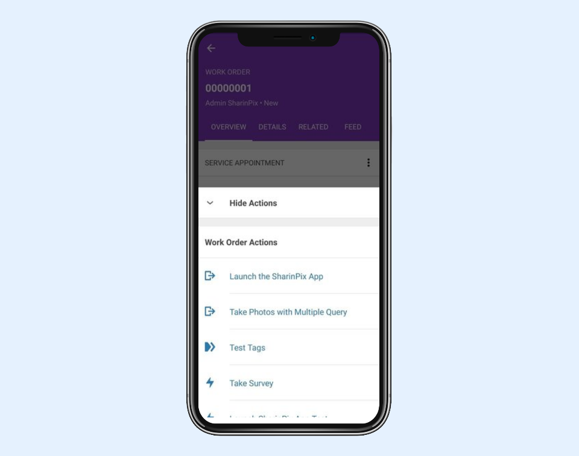
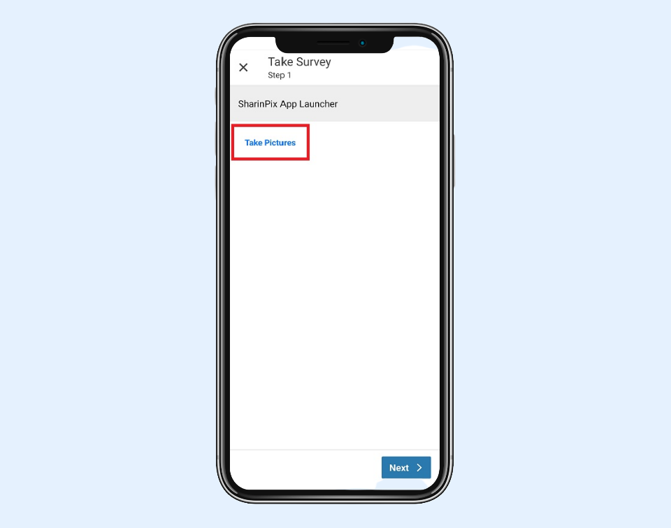

---
layout:
  width: default
  title:
    visible: true
  description:
    visible: true
  tableOfContents:
    visible: true
  outline:
    visible: true
  pagination:
    visible: true
  metadata:
    visible: false
  tags:
    visible: true
---

# Integration of SharinPix App with SFS (FSL) App using Flows


**Information:**

Salesforce Field Service (SFS) was formerly known as Field Service Lightning (FSL).



**Assumptions:**

* The **WorkOrder** object will be used throughout this article.
* The WorkOrder object has a custom field named **SharinPix\_Token\_\_c** that holds a token. If you haven't implemented this yet, refer to the article [SharinPix automatic token generation](../../mobile-app/sharinpix-automatic-mobile-upload-token-generation-admin-friendly.md) to generate the token.


In this article, you will learn how to:

1. [Integrate the SharinPix deeplink URL in a Flow](integration-of-sharinpix-app-with-sfs-fsl-app-using-flows.md#integration-of-the-sharinpix-deeplink-url-in-a-flow)
2. [Add the Flow in an Action](integration-of-sharinpix-app-with-sfs-fsl-app-using-flows.md#adding-flow-in-an-action)
3. [Launching the SharinPix mobile App from the SFS mobile App](integration-of-sharinpix-app-with-sfs-fsl-app-using-flows.md#launching-the-sharinpix-mobile-app-from-the-sfs-mobile-app)

## Integration of the SharinPix deeplink URL in a Flow

Let's suppose you want to use the SFS App alongside the SharinPix App to take surveys, you can do so by creating a Flow that uses a deeplink to launch the SharinPix App.

In this section, you will learn how to create a Flow that will embed the SharinPix deeplink URL.

Please note that the SharinPix deeplink URL is highly customisable and could be dynamically changed depending on the flow context to make different action, upload target or behaviour available for the flow user.

To create the flow, follow the steps below:

* Go to Setup then type Flow in the Quick Find box. Under Process Automation, select **Flows**.
* Click on **New Flow**. You will be directed to the Flow Designer.
* Click on Show More and select **Field Service Mobile Flow**. Then click on **Create**.

<figure><figcaption></figcaption></figure>

* Go on the **Manager** tab and click on **New Resource**.
  * Resource Type: Variable
  * API Name: Id
  * Data Type: Text
  * Default Value: **{!$GlobalConstant.EmptyString}**
  * Availability Outside the Flow: Available for input
  * Click **Done**
* Go on the **Manager** tab again and click on **New Resource**.
  * Resource Type: Variable
  * API Name: **WorkOrderRecord**
  * Data Type: Record
  * Object: Work Order
  * Click **Done**
* Go on the **Elements** tab then drag and drop the **Get Records** element found under the **Data**section onto the blank canvas. For the Get Records element:
  * Label: lookupWorkOrder
  * Object: Work Order
  * Conditions: **Id** (Field) equals (operator) **{!Id}** (newly-created resource named Id)
  * In the **How Many Records to Store**, check the **Only the first record** option
  * In the **Where to Store Field Values**, check the **Together in a record variable** option
  * Then in the **Select Variable to Store Work Order** section, use the **WorkOrderRecord** variable for the **Record** field
  * In the **Select Work Order Fields to Store in Variable** section, click on **Add Field** and select the token field, that is, **SharinPix\_Token\_\_c** for this demo
  * Click **Done**
* Go to the Manager tab and click on New Resource:
  * Resource Type: Variable
  * API Name: **Launch\_SharinPix\_App**
  * Data Type: Text
  * Default Value: **\<a href="sharinpix://upload?token={!WorkOrderRecord.SharinPix\_Token\_\_c}">Take Pictures\</a>**
  * Click **Done**


The deeplink URL in this case is as follows:

**sharinpix://upload?token={!WorkOrderRecord.SharinPix\_Token\_\_c}**

For more detailed information about the **deeplink URL syntax**, you can refer to the following article:

[SharinPix mobile App : deeplink syntax](../../mobile-app/sharinpix-mobile-app-deeplink-syntax.md)


* Go to the **Elements** tab and drag and drop a **Screen** element next to the Get Records element.
* For the Screen element:
  * Label: **SharinPix App Launcher**
* Drag and drop a **Display Text** component on the screen canvas. For the Display Text:
  * API Name: **Take\_Pictures**
  * In the insert resource search bar, select **Launch\_SharinPix\_App**

<figure><figcaption></figcaption></figure>

* Click **Done**. Connect the Get Records to the Screen as shown below.

<figure><figcaption></figcaption></figure>

* Save the newly-created flow as **SharinPix App Launcher** then activate the flow.

## Adding Flow in an Action

To add the newly-created flow in an Action:

* Go to Setup then on Object Manager. Search and select the **Work Order** object.
* On the left menu, click on **Buttons, Links, and Actions**.
* Click on the **New Action** button.
* For the new action:
  1. In the **Action Type** field, select **Flow**
  2. For the **Flow** select the newly-created flow, that is, **SharinPix App Launcher**
  3. For the **Label** field, enter **Take Survey**
  4. The **Name** field will be auto-populated
* Click **Save** when done.

<figure><figcaption></figcaption></figure>

Now that the action is ready, we should add same on the Work Order's Page Layout. To do so:

* Click on **Page Layouts** on the left menu.
* Then click on **FSL Work Order Layout.**
* Drag and drop the action (that is **Take Survey**) onto the **Salesforce Mobile and Lightning Experience Actions**.
* Click **Save**  when done.


**Tip:**

You can also make use of App Extensions to launch a Field Service Mobile Flows from the SFS app. For more information on how to embed a Field Service Mobile Flow in an App Extension, refer to the following link:

[Creation of an App Extension embedding a Field Service Mobile Flow](integration-of-sharinpix-app-with-sfs-fsl-app-using-app-extension.md)


## Launching the SharinPix mobile App from the SFS mobile App


**Note:**&#x20;

For the following test, ensure that you have installed the SharinPix mobile app on your device.

You will find more information on where to find the SharinPix app in the article below:

[Where to find the SharinPix mobile app](../../mobile-app/where-to-find-the-sharinpix-mobile-app.md)


You can now access your newly created Action on the SFS app.

1. Open the SFS app.
2. Select the Service Appointment record of a Work Order record.
3. Select **Show Actions**.

<figure><figcaption></figcaption></figure>

4\. Select your newly-created Action, that is **Take Survey** as shown below:

<figure><figcaption></figcaption></figure>

5\. You are now inside the Flow. Select **Take Pictures** to launch the SharinPix App.

<figure><figcaption></figcaption></figure>

6\. The SharinPix App is now opened.

<figure><figcaption></figcaption></figure>


**Tip:**

SharinPix Images can also be added to FSL Service Reports. How more information about how this is done, please refer to the following article:

[Display Images in Service Report (Salesforce Field Service / FSL)](display-images-in-service-report-salesforce-field-service-fsl.md)

