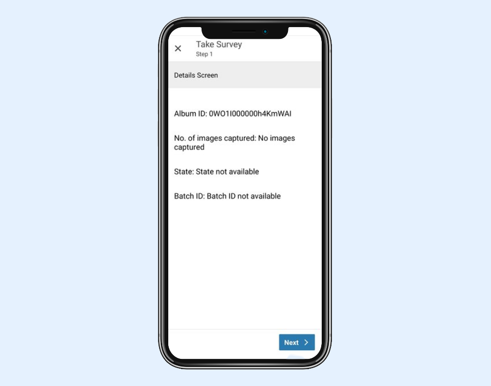
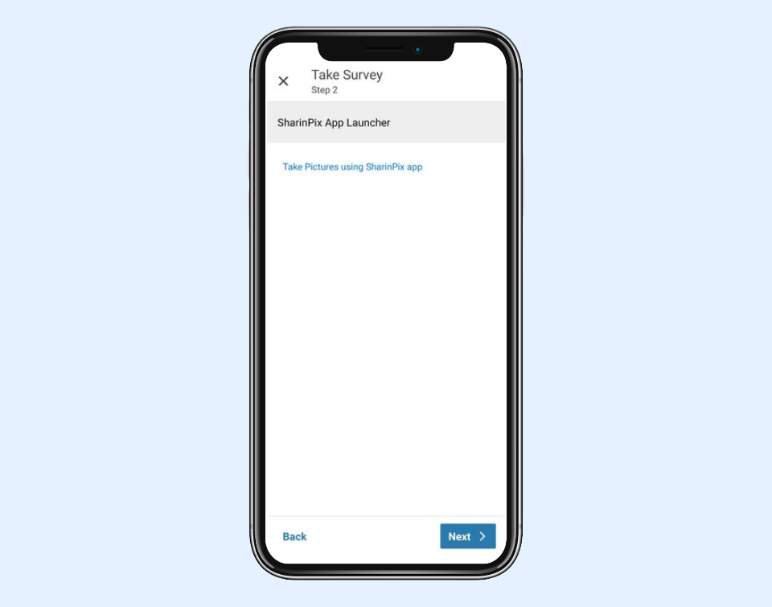
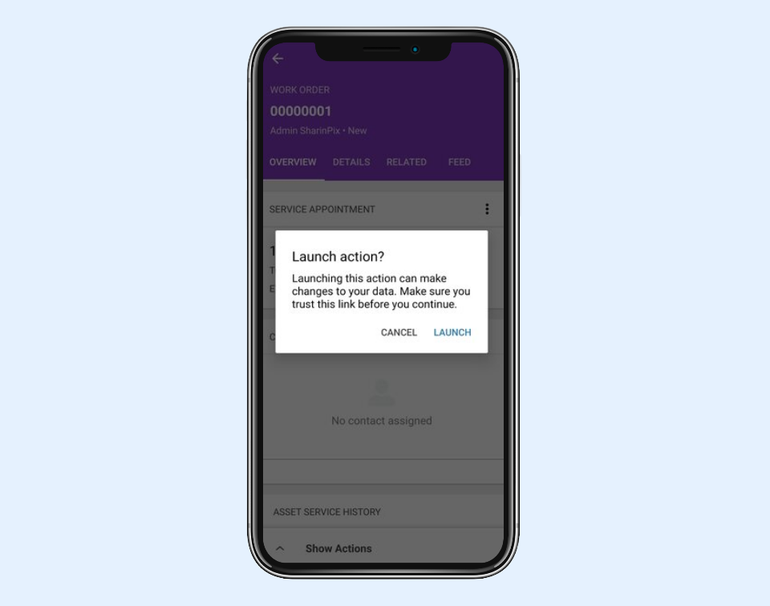
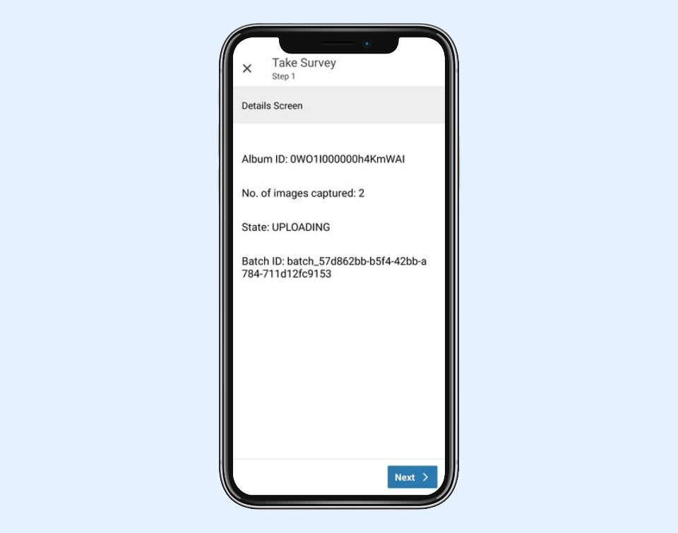

---
layout:
  width: default
  title:
    visible: true
  description:
    visible: true
  tableOfContents:
    visible: true
  outline:
    visible: true
  pagination:
    visible: true
  metadata:
    visible: false
  tags:
    visible: true
  actions:
    visible: true
---

# Using deeplink to return to SFS (FSL) Flow with additional image information

SharinPix includes parameters that can be used in **encoded** return URLs to provide additional information regarding the images captured using the SharinPix mobile app within the SFS app. The return URL can be used to redirect to the SFS Flow along with the parameter values passed in the return URL.&#x20;

The available parameters are:

*   **spMediaCount**: which returns the number of images captured.&#x20;

    **Note:** The spMediaCount stores the number of media files captured, not the number of uploads completed. The files still need to be uploaded to appear online. In exceptional cases where the user uninstalled the SharinPix app before uploads are complete, this count will not equal the number of uploads completed.
* **spBatchState**: provides details on the state. The values available for the state are **SUBMITTED**, **UPLOADING** and **UPLOADED**
* **spBatchId**: provides the batch ID
* **spAlbumId**: provides the album ID
* **spChecklistState**: provides details on whether the checklist has been completed or not. Values will be either **OK** or **KO**.
* **spCompletedTaskCount**: provides the number of tasks completed in the checklist.
* **spIncompleteTaskCount**: provides the number of tasks left incomplete in the checklist.

**spChecklistState**, **spCompletedTaskCount** and **spIncompleteTaskCount** will only be filled if the SharinPix app was opened in checklist mode; **spMediaCount**, **spBatchState** and **spBatchId** will not be filled in checklist mode.

The following sections demonstrate how to set up a **Field Service Mobile Flow** that can be used to launch the SharinPix mobile app from the SFS app to capture images using a deeplink embedding the above parameters in encoded URL to provide additional information once images are submitted on the SFS Flow.


**Assumptions:**

* The **WorkOrder** object will be used throughout this article.
* The WorkOrder object has a custom field named **SharinPix\_Token\_\_c** that holds a token. If you haven't implemented this yet, refer to the article [SharinPix automatic token generation](../../mobile-app/sharinpix-automatic-mobile-upload-token-generation-admin-friendly.md) to generate the token.


## Setting up a Flow that makes use of the parameters

In this section, you will learn how to create a Flow that embeds the return deeplink URL.

Please note that the SharinPix deeplink URL is highly customisable and could be dynamically changed depending on the flow context to make different action, upload target or behaviour available for the flow user.

To create the flow, follow the steps below:

* Go to Setup then type Flow in the Quick Find box. Under Process Automation, select **Flows**.
* Click on New Flow. You will be directed to the Flow Designer.
* Click on Show More and select **Field Service Mobile Flow**. Then click on **Create**.
* Go on the **Manager** tab and click on **New Resource**:
  * Resource Type: Variable
  * API Name: Id
  * Data Type: Text
  * Default Value: **{!$GlobalConstant.EmptyString}**
  * Availability Outside the Flow: Available for input
* Go on the **Manager** tab again and click on **New Resource**.
  * Resource Type: Variable
  * API Name: **WorkOrderRecord**
  * Data Type: Record
  * Object: Work Order
  * Click **Done**
* Go on the **Elements** tab then drag and drop the **Get Records** element found under the **Data** section onto the blank canvas. For the Get Records element:
  * Label: **lookupWorkOrder**
  * Object: **Work Order**
  * Conditions: **Id** (Field) equals (operator) **{!Id}** (newly-created resource named Id)
  * In the **How Many Records to Store**, check the **Only the first record** option
  * In the **Where to Store Field Values**, check the **Together in a record variable** option
  * Then in the **Select Variable to Store Work Order** section, use the **WorkOrderRecord** variable for the **Record** field
  * In the **Select Work Order Fields to Store in Variable** section, click on **Add Field** and select the token field, that is, **SharinPix\_Token\_\_c** for this demo
  * Click on **Done**
* Now create variables to store the returned parameters.&#x20;
  * Go to the **Manager** tab and click on **New Resource**:
    * Resource Type: Variable
    * API Name: **imgCount**
    * Data Type: Text
    * Default Value: No images captured
    * Availability Outside the Flow: Check both **Available for Input** and **Available for Output**
  * Click on New Reource again:
    * Resource Type: Variable
    * API Name: **state**
    * Data Type: Text
    * Default Value: State not available
    * Availability Outside the Flow: Check both **Available for Input** and **Available for Output**
  * Click on New Reource again:
    * Resource Type: Variable
    * API Name: **batchId**
    * Data Type: Text
    * Default Value: Batch ID not available
    * Availability Outside the Flow: Check both **Available for Input** and **Available for Output**
  * Click on New Reource again:
    * Resource Type: Variable
    * API Name: **albumId**
    * Data Type: Text
    * Default Value: {!Id}
    * Availability Outside the Flow: Check both **Available for Input** and **Available for Output**
* Click on New Resource again:
  * Resource Type: Variable
  * API Name: **Launch\_SharinPix\_App**
  * Data Type: Text
  * Default Value: \
    **\<a href="sharinpix://upload?token={!WorkOrderRecord.SharinPix\_Token\_\_c}\&ret\_url=com.**\
    **salesforce.fieldservice%3A%2F%2Fv1%2FsObject%2FspAlbumId%2Fflow%2FTake%20Survey%3FimgCount%3DspMediaCount%26state%3DspBatchState%26batchId%3DspBatchId%26albumId%3DspAlbumId">Take Pictures using SharinPix app\</a>** 
* Click **Done**



* The deeplink URL in this case is:\
  **sharinpix://upload?token={!WorkOrderRecord.SharinPix\_Token\_\_c}\&ret\_url=com.salesforce**\
  **.fieldservice%3A%2F%2Fv1%2FsObject%2FspAlbumId%2Fflow%2FTake%20Survey%3Fimg**\
  **Count%3DspMediaCount%26state%3DspBatchState%26batchId%3DspBatchId%26albumId**\
  **%3DspAlbumId**\
  \
  For more detailed information about the **deeplink URL syntax**, you can refer to the following article: [SharinPix mobile App : deeplink syntax](../../mobile-app/sharinpix-mobile-app-deeplink-syntax.md)

* You should ensure that the return URL is encoded and assigned to the **ret\_url** parameter when used in the deeplink. You will find more details regarding the **ret\_url** parameter [here](../../mobile-app/sharinpix-mobile-app-deeplink-syntax.md#ret_url).\
  \
  Here is an example of an encoded return URL:\
  **com.salesforce.fieldservice%3A%2F%2Fv1%2FsObject%2FspAlbumId%2Fflow%2FTakeSu**\
  **rvey%3FimgCount%3DspMediaCount%26state%3DspBatchState%26batchId%3DspBatchI**\
  **d%26albumId%3DspAlbumId**\
  \
  Here is the corresponding decoded return URL:\
  **com.salesforce.fieldservice://v1/sObject/spAlbumId/flow/TakeSurvey?imgCount=spMediaCount\&state=spBatchState\&batchId=spBatchId\&albumId=spAlbumId**\
  \
  In the above URL, you will notice that the Flow name is **TakeSurvey**. This value should correspond to the **App Extension of type Flow** that will be used to launch the Field Service Mobile Flow within the SFS app. We will explain how to configure this App Extension later on. For now, just keep in mind that the Flow name used in the return URL should match the actual App Extension Name.\
  \
  For more detailed information about the deeplink schema for the Field Service Mobile App, refer to the following article:\
  [Deep Linking Schema for the Field Service Mobile App](https://developer.salesforce.com/docs/atlas.en-us.field_service_dev.meta/field_service_dev/fsl_dev_mobile_deep_linking_schema.htm)

 


* Go to the **Elements** tab and drag and drop a **Screen** element next to the Get Records element.
* For the Screen Element:
  * Label: **Details Screen**
* Drag and drop a **Display Text** component on the screen canvas. For the Display Text:
  * API Name: **Details**
  * In the insert resource search bar, enter the following:\
    \
    Album ID: {!albumId}\
    \
    No. of images captured: {!imgCount}\
    \
    State: {!state}\
    \
    Batch ID: {!batchId}
* Click **Done**

<figure><figcaption></figcaption></figure>

* Click **Done**. Connect the Get Records to the Screen.
* Go to the **Elements** tab and drag and drop another **Screen** element next to the Get Records element.
* For the Screen Element:
  * Label: **SharinPix App Launcher**
* Drag and drop a **Display Text** component on the screen canvas. For the Display Text:
  * API Name: **Take\_Pictures**
  * In the insert resource search bar, select **Launch\_SharinPix\_App**

<figure><figcaption></figcaption></figure>

* Click **Done**. Connect the previously created Screen to this one.

This is how your Flow should be connected at this point:

<figure><figcaption></figcaption></figure>

* Save the newly-created flow as **SharinPix App Launcher** then activate the flow.
* Next, integrate the newly-created Flow with the SFS app using an App Extension as shown below:

<figure><figcaption></figcaption></figure>


**Note:**

* The App Extension should be of type **Flow.**
* For this demo, make sure that you insert **TakeSurvey** as the **name**. As mentioned earlier, the return URL includes the App Extension's name, therefore, both values should match:\
  \
  com.salesforce.fieldservice://v1/sObject/spAlbumId/flow/**TakeSurvey**?imgCount=spMediaCount\&state=spBatchState\&batchId=spBatchId\&albumId=spAlbumId



**Tip:**

For more information on how to embed a Field Service Flow in an App Extension, refer to the following link:

[Creation of an App Extension embedding a Field Service Mobile Flow](integration-of-sharinpix-app-with-sfs-fsl-app-using-app-extension.md)


* Once done, go ahead an test your new Flow on the SFS app.

## DEMO

You can now access your newly created Action on the SFS app.

* Open the SFS app.
* Select the Service Appointment record of a Work Order record.
* Select **Show Actions**.

<figure><figcaption></figcaption></figure>

* Select your newly-created Action, in this case action is labelled as **Take Survey**:

<figure><figcaption></figcaption></figure>

* The action will launch the Flow created in the previous section. Below, you can see the details added to the first screen:

<figure><figcaption></figcaption></figure>

* Click on **Next** to launch to access the second screen
* Clcik on **Take Pictures using SharinPix app** to launch the SharinPix app:

<figure><figcaption></figcaption></figure>

* Take some pictures using the SharinPix app then select the upload button when done:

<figure><figcaption></figcaption></figure>

* You will then be directed back to the FSL app. Click on **LAUNCH** to access the Flow again:

<figure><figcaption></figcaption></figure>

* Once on the Flow again, you will see the details about the album ID, number of images uploaded, state and batch ID on the first screen as demonstrated below:

<figure><figcaption></figcaption></figure>
