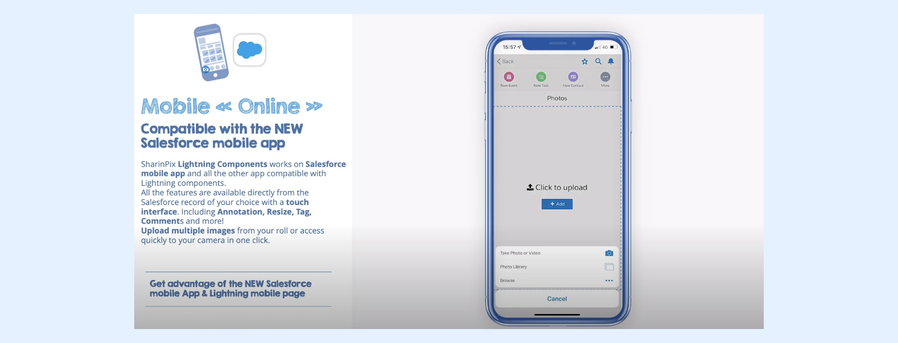
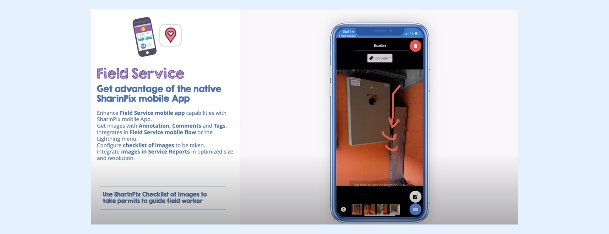
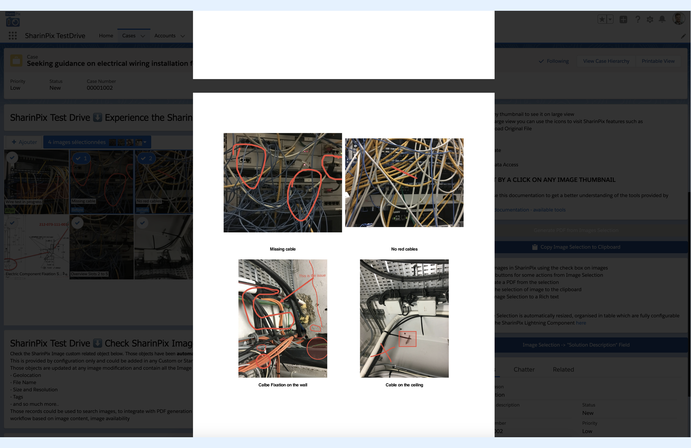

---
layout:
  width: default
  title:
    visible: true
  description:
    visible: true
  tableOfContents:
    visible: true
  outline:
    visible: true
  pagination:
    visible: true
  metadata:
    visible: false
  tags:
    visible: true
---

# Test Drive information

SharinPix usage on mobile can be integrated with any Salesforce mobile App: [Learn more about it in SharinPix Documentation](../features/main-integration/using-on-salesforce-mobile-apps.md)

Use SharinPix integrated in Salesforce mobile App :

[Documentation](https://app.gitbook.com/s/2putv2B9RAZpym8daOH2/basic-setup/basic-setup-step-3c-for-new-salesforce-mobile-app-users-setup-sharinpix-for-mobile-lightning-experie)

[Demo Video](https://youtu.be/7_BAfiEorY4)

https://youtu.be/7\_BAfiEorY4?t=8

Use SharinPix integrated in Field Service mobile App :

[Documentation](../features/main-integration/using-on-salesforce-field-service-app-field-service-lightning.md)

[Video](https://youtu.be/7_BAfiEorY4?t=133)

https://youtu.be/7\_BAfiEorY4?t=133

SharinPix PDF

