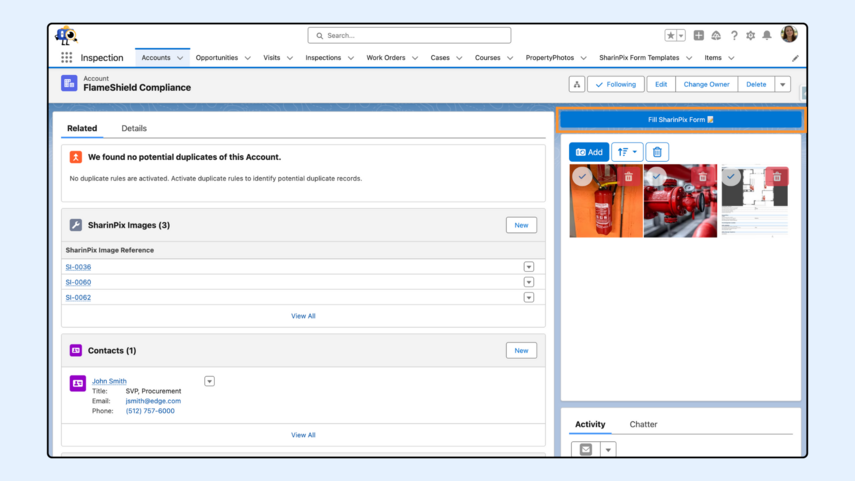
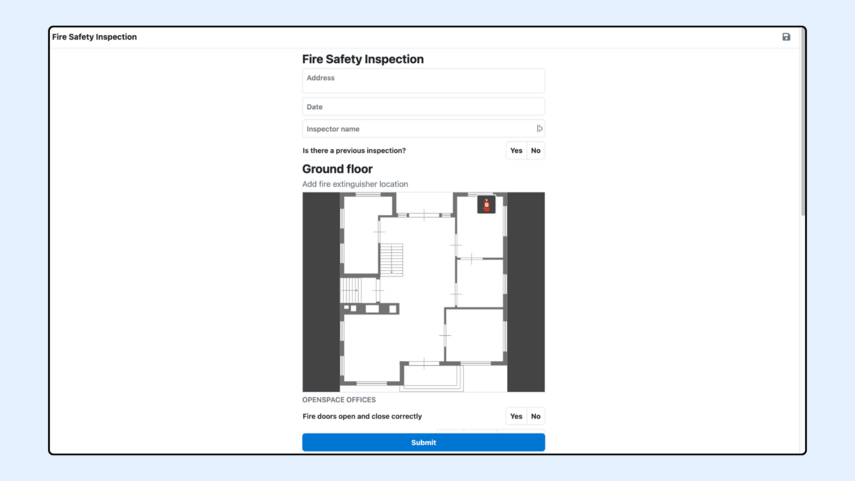

---
layout:
  width: default
  title:
    visible: true
  description:
    visible: true
  tableOfContents:
    visible: true
  outline:
    visible: true
  pagination:
    visible: true
  metadata:
    visible: false
  tags:
    visible: true
  actions:
    visible: true
---

# SharinPix Form Launcher

## Overview

The **SharinPix Form Launcher** component provides a simple way to open a SharinPix Form directly from Salesforce, whether on **mobile devices via the SharinPix Mobile App** or on a **web browser via Online mode**. It bridges your pre-built SharinPix Form Templates (created using the Form Template Editor) with both the mobile and desktop experiences, enabling users to quickly access and complete forms in the way that best suits their environment.

 (1) (1) (2).png>)


**Info**

This feature is only available on Lightning. It can be used:

* On Community Builder
* On Page Builder
* On Desktop
* On Mobile
* In your own Lightning Component development
* In Flows (but not in Field Service Mobile Flow)

**Note:** The SharinPix Form Launcher component is not available in Salesforce Field Service (FSL). However, you can still launch the SharinPix mobile app from a Field Service Mobile Flow. To do so, refer to the following articles:

[_Integration of SharinPix App with SFS (FSL) App using App Extension_](../integrations/salesforce-field-service/integration-of-sharinpix-app-with-sfs-fsl-app-using-app-extension.md)

[_Integration of SharinPix App with SFS (FSL) App using Flows_](../integrations/salesforce-field-service/integration-of-sharinpix-app-with-sfs-fsl-app-using-flows.md)



**Prerequisites**

* **Permissions:**\
  Users must have the **SharinPix Forms** **Admin** or **SharinPix Forms User** permission set assigned. For more information on these two permission sets, check [_SharinPix Permission Sets_](../access-and-security/sharinpix-permission-sets.md).
* **Package Version:**\
  Ensure that SharinPix Package Version 1.331 (or later) is installed.
* **Mobile App:**\
  The SharinPix mobile app must be installed on your mobile device to test and use the form launcher functionality on mobile. For more information on how to install the SharinPix mobile app, click [_here_](../mobile-app/where-to-find-the-sharinpix-mobile-app.md).
* **Form Template:**\
  A form template must be created beforehand using the [**SharinPix Form Template Editor**](../sharinpix-form/sharinpix-form-template-editor.md).


## Getting Started

To use the SharinPix Form Launcher component, you simply need to drag and drop the component from the Lightning App Builder onto your page layout.

.jpg>)

### Lightning Component Parameters

.jpg>)

| Parameter                    | Description                                                                                                                                                                                                                                                                                                                                                                    | Default/Notes                                                                                  |
| ---------------------------- | ------------------------------------------------------------------------------------------------------------------------------------------------------------------------------------------------------------------------------------------------------------------------------------------------------------------------------------------------------------------------------ | ---------------------------------------------------------------------------------------------- |
| Button Label                 | The text displayed on the launcher button that users will click to open the SharinPix form.                                                                                                                                                                                                                                                                                    | Default value: _Fill SharinPix Form 📝_                                                        |
| SharinPix Form Template Name | Specifies the Main Form Template to launch. Enter the Main Form Template name directly, or enclose in braces the API name of a record field that contains it (for example, {Inspection\_Template\_\_c}). The template must exist in the [SharinPix Form Template Editor](../sharinpix-form/sharinpix-form-template-editor.md).                                                 | Must match an existing Main Form Template name. The component always opens its active version. |
| Name field API name          | Specifies the Job name when launching the Form in SharinPix Mobile App. You can use any other fields in the record from which the Form is being launched.                                                                                                                                                                                                                      | Default value: _Record name_                                                                   |
| Initial Form Response        | Responses from a previously completed form can be displayed on the new form for reference. This is beneficial in cases such as initial and follow-up inspections or entry and exit checks. You can use answers from the most recent Form Response submitted for the current object by setting the field to <mark style="color:$danger;">`Use the latest form response`</mark>. | Default value: _None_                                                                          |
| Custom parameters            | Used to specify additional user-defined parameters to be appended to the SharinPix Form launcher URL. Example "userId=005Ec00000MAzP2MAI".                                                                                                                                                                                                                                     | Default value: _None_                                                                          |
| Online Mode                  | If checked, launches the form **in the browser** instead of the SharinPix mobile app. Users can **fill in and submit** the [form online](sharinpix-form-launcher.md#example-online-mode).                                                                                                                                                                                      | Default: _Unchecked_                                                                           |
| Deeplink format              | If checked, generates a deeplink instead of a universal link.                                                                                                                                                                                                                                                                                                                  | Default: _Unchecked_                                                                           |
| **Record ID** \*             | (**Required in Flow Screens and Community Pages**) The Salesforce record ID of the record page.                                                                                                                                                                                                                                                                                | Auto-populated in some contexts; required otherwise.                                           |

### Demo and Behavior

#### Example – Mobile Mode


**Prerequisites:**

The SharinPix Form Launcher also works alongside the SharinPix mobile app.

**Kindly ensure that the SharinPix mobile app is installed on your devices before testing the component on mobile.**

For more information on how to install the SharinPix mobile app, click [_here_](../mobile-app/where-to-find-the-sharinpix-mobile-app.md).


The image below shows the SharinPix Form Launcher component in the Salesforce mobile app. Select the **Fill SharinPix Form** button to launch the form in the **SharinPix Mobile App**.

The image below shows the SharinPix Form after it is launched and completed in the mobile app:

 (2) (2).png>)

#### Example – Online Mode

When the **Online Mode** checkbox is **selected**, clicking the button opens the form **in the user’s mobile or desktop browser,** where it can be filled and submitted without requiring the mobile app.

The image below demonstrates the SharinPix Form when it is launched and filled out via a browser:

Step 1: Tick: Select the Online Mode&#x20;

.jpg>)

Step 2: Select the Form Launcher button.

Step 3: The form opens in a new browser window.


**Info:**

The SharinPix Form Launcher component uses tokens when you capture and upload images. These tokens are valid for 30 days by default. Once a token expires, it can no longer be used to submit or upload any form responses.

If you need a longer token duration, you can change it by overriding the **MobileTokenExpiryDays** custom label in the SharinPix package. Simply set this label to the number of days you want the tokens to remain valid for the Form Launcher component.

**Note:** This option is available starting with package version **1.200**.

