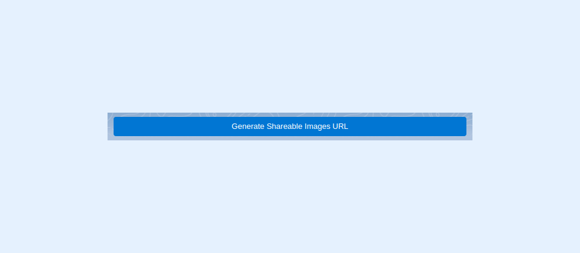

---
layout:
  width: default
  title:
    visible: true
  description:
    visible: true
  tableOfContents:
    visible: true
  outline:
    visible: true
  pagination:
    visible: true
  metadata:
    visible: false
  tags:
    visible: true
---

# SharinPix Share Selection


SharinPix Share Selection Component allows you to share images that have been selected on SharinPix components, such as SharinPix Album, SharinPix Search and SharinPIx Related Search.


<figure><figcaption></figcaption></figure>


**Information:**

This feature is only available on Lightning. It can be used:

* Community Builder
* Page Builder
* Desktop
* Mobile


## Getting Started

To use the SharinPix Album component, you simply need to drag and drop the component from the Lightning App Builder onto your page layout.

<figure><figcaption></figcaption></figure>

### Lightning Component Parameters

<figure><figcaption></figcaption></figure>

**Generate Token Button Label:** Used to specify the button's label. The default value is **Generate Shareable Images URL**.


The button SharinPix Share Selection will only be enabled when one or more images have been selected.


## Demo

### Copy Generated Token and URL

The component provides 2 buttons **Copy Shearable URL** and **Copy Token.**

* **Copy Shearable URL** will copy the generated token with the SharinPix base URL.
* **Copy Token** will copy only the token which has been generated.

The generated token has an expiry date of **90 days** after being generated.

<figure><figcaption></figcaption></figure>


The generated token has an expiry date of **90 days** after being generated.


### Limitations


Only a maximum of 125 images can be shared.


<figure><figcaption></figcaption></figure>
