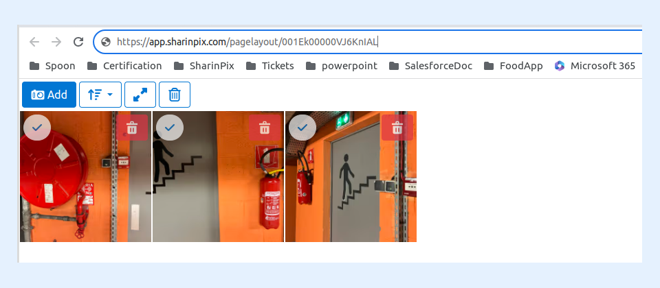

---
layout:
  width: default
  title:
    visible: true
  description:
    visible: true
  tableOfContents:
    visible: true
  outline:
    visible: true
  pagination:
    visible: true
  metadata:
    visible: false
  tags:
    visible: true
---

# SharinPix Share

The **SharinPix Share Component** permits users to generate and share a URL for either selected images from an album or the whole album. The generated URL is accessible across any platform or device, enabling end users to modify the album (upload, delete, add tags, etc.).

 (1) (1).png>)


**Information:**

This feature is only available on Lightning. It can be used:

* On Page Builder
* On Desktop



**Note:**

1. **Ensure that the user performing the Share has been assigned the** [**SharinPix Share Permission**](../access-and-security/sharinpix-permission-sets.md)**.**
2. The SharinPix Share component is compatible with the **SharinPix Album Component** and **SharinPix Search Component** for now.


## Getting Started

To use the **SharinPix Share** component, simply need to drag and drop the component from the Lightning App Builder onto your page layout.

.png>)

## Lightning Component Parameters

.png>)

* **Button Label:** Used to specify the button's label. The default value is **Share.**
* **Custom Permission Id or Name: Name or ID of a SharinPix Permission object (used to control rights for the SharinPix component). Note:** For more information on how to create/edit the custom permission, refer to this article: [_SharinPix Permission object - How to create and assign custom permission?_](../access-and-security/sharinpix-permission-object-how-to-create-and-assign-custom-permission.md)
* **Allow sharing on a selection of images only:** If checked, sharing will be available on a selection of one or more images only. If not checked, sharing will be available on the album as well. Consider what you want users to share before setting this parameter.
* **Maintain selection order:** If checked, the selection order of the images will be maintained on the shared link. This will override the sort value in the SharinPix Permission specified in the Custom Permission Id or Name parameter or the organization default.
* **Component ID:** Component ID to be matched by SharinPix components on the page. This is any text that will be common between this component and the SharinPix album component. It allows for matching components to communicate in case some components need to be repeated on the same record page. Example: Set 'sharinpix-1' as the Target Component ID here and also on the SharinPix Album component's Component ID parameter.


**Warning:**

We advise caution when configuring a SharinPix Permission. If upload, edit or delete permissions are present, the viewers of the shared URL will be able to make changes to your images that will reflect on your Salesforce.

Alternatively, if you desire for example the custom filename feature for downloads, you will need to include it in the SharinPix Permission.



Currently, when files are uploaded via a shared link, SharinPix does not store any user information for those files. As a result, the uploader is treated as anonymous.


## Demo

The picture below depicts a SharinPix Share and a SharinPix Album component with images. The checkbox “Allow Sharing on a Selection of Images only” is checked in the parameters of the SharinPix Share component and that’s why the button is disabled when no image is selected.

.png>)

Start by selecting the images to be shared. The SharinPix Share button is enabled after the selection as shown below.

.png>)

Click on the **Share** button to start the share process.

The shareable URL is opened in a modal as shown in the picture below.

 (1) (1).png>)

In the screenshot below, you can see the images that have been shared are in the order it has been selected.


**Tip:**

Please follow the instructions in the article below for automatic generation of URL for the Shareable album: [Generate SharinPix Shareable album links Automatically](../cookbook/generate-sharinpix-shareable-album-links-automatically.md)


## Activate/Deactivate a SharinPix Share

When the _SharinPix Share_ button is clicked, a **SharinPix Share** record is created with the corresponding permission, shareable link, and Active checkbox set to _true_, as shown below:

 (1) (1).png>)

To deactivate the SharinPix Share session, uncheck the **Active**(Active\_\_c) checkbox. This will launch an Apex Trigger to deactivate the share link, and prevent access to the album as depicted below:

 (1) (1).png>)

The album cannot be accessed anymore using the shareable link.

 (1) (1).png>)


**Note:**

The SharinPix Share session can be reactivated by checking the **Active**(Active\_\_c) checkbox.


### Disable the SharinPix Share Apex Trigger

To disable the execution of the SharinPix Share Apex Trigger, proceed as follows:

* Go to the **Setup**
* Go for **Custom Metadata Types** using the **Quick Find** box
* Click on **Manage Records** next to **SharinPix Bypass** :

 (1) (1).png>)

Edit the entry, **BypassShareTrigger** , and check the **Active** checkbox to stop the execution of the SharinPix Share Apex Trigger:

 (1) (1).png>)
