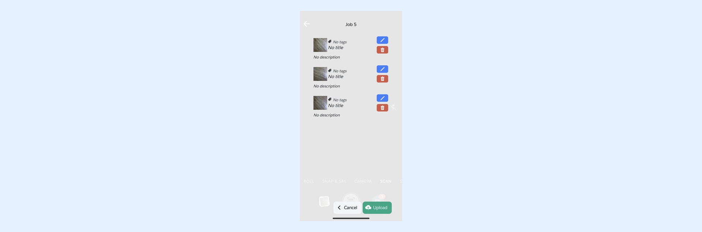
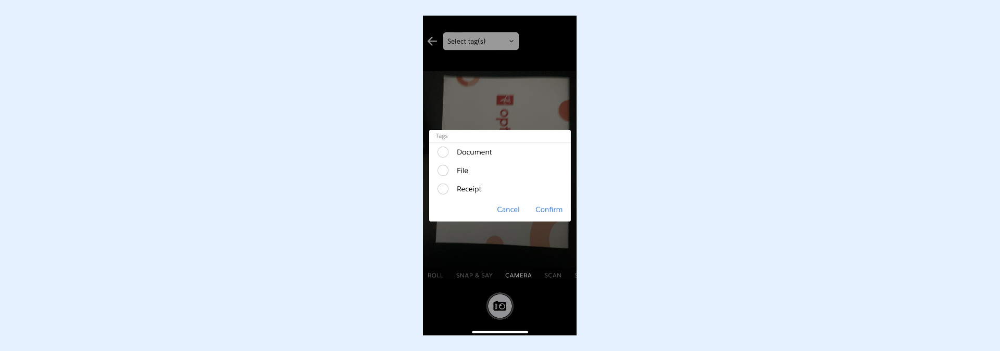
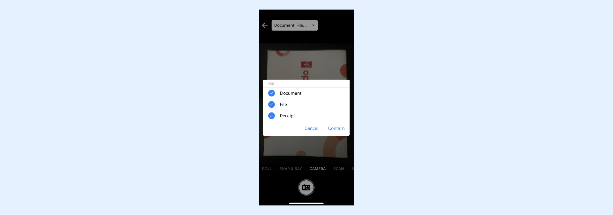
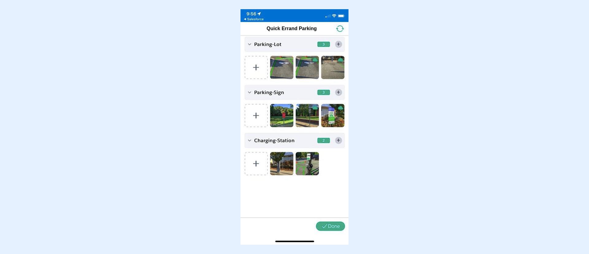
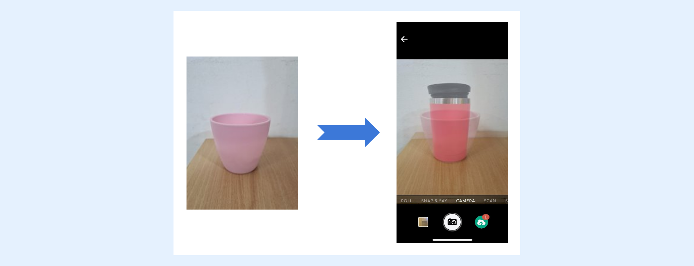
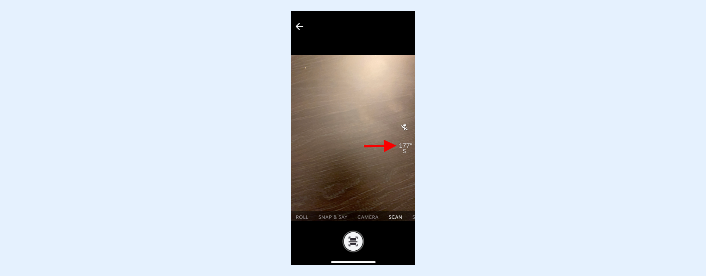

---
layout:
  width: default
  title:
    visible: true
  description:
    visible: true
  tableOfContents:
    visible: true
  outline:
    visible: true
  pagination:
    visible: true
  metadata:
    visible: false
  tags:
    visible: true
  actions:
    visible: true
---

# SharinPix Mobile App : Deeplink syntax

## Deeplink

SharinPix uses deeplink to launch the SharinPix mobile app from other apps, including the Salesforce mobile app, Field Service Lightning app, or any of your apps.

Our deeplink URL starts with **sharinpix://** instead of https:// and opens our mobile app when installed properly on the device system.


**Note:**

[Links that launch the SharinPix Mobile App.](navigation-with-sharinpix-deep-link-and-universal-link.md)



Some features work with Urls but not with the Deeplink URL, such as Url buttons in Salesforce. You may then have an error like can't reach the server.


## Syntax

The general form of the deeplink URL is:

**sharinpix://\<verb>?\<parameter1>=\<value1>&\<parameter2>=\<value2>&....**

The URL support two verbs:

[**Upload** : to run the SharinPix Mobile App in order to take/choose pictures to upload](sharinpix-mobile-app-deeplink-syntax.md#upload)

[**View** : to run the SharinPix Mobile App in order to access to images already taken on that device](sharinpix-mobile-app-deeplink-syntax.md#view_album)

## Upload

To upload images, you should use **upload** as a verb.

In that case the URL will have the following syntax:

**sharinpix://upload?token=\<valuetoken>&\<parameter1>=\<value1>&\<parameter2>=\<value2>&....**

The token provides SharinPix with the target of the upload. You can read here to learn more about how to generate a token via [Flow](sharinpix-automatic-mobile-upload-token-generation-admin-friendly.md) or [Apex code](../cookbook/utils-methods.md#generatemobileappurl).

## Deeplink URL Parameters

This section lists the different parameters that can be used in the Deeplink URL.

### mode

The **mode** parameter will launch the SharinPix Mobile app on the specified mode by default.

The parameter **mode** takes these values:

* **camera** - this mode opens the camera when the SharinPix mobile app is launched. The **mode** option is set to camera by default.
* **roll** - this mode opens the roll/gallery of the mobile device when the SharinPix mobile app is launched.
* **systemcam** - this mode opens the system camera when the SharinPix mobile app is launched.
* **scan** - this mode opens the document scanner when the SharinPix mobile app is launched.
* **snapsay** - this mode opens the [Snap & Say](sharinpix-mobile-app-deeplink-syntax.md#snapsay) when the SharinPix mobile app is launched.
* **video** -this mode opens the video recorder when the SharinPix mobile app is launched.
* **roomplan** - this mode opens the roomplan mode directly when the SharinPix mobile app is launched.

Example:

<mark style="color:red;">`sharinpix://upload?token=.....&mode=roll`</mark>

### Visibility for the Modes

#### **roll**

The **roll** option allows you to choose photos from roll/gallery of the mobile device.

The parameter **roll** takes two values:

* **true** - When set to true, the roll option is kept in the list of modes available in the scrollable horizontal list when opening the SharinPix mobile app. The **roll** option is set to true by default.
* **false** - Setting the value to false will remove the roll option from the scrollable horizontal list of modes on the camera view when launching the SharinPix mobile app.

Example:

<mark style="color:red;">`sharinpix://upload?token=.....&roll=false`</mark>

#### **systemcam**

The **systemcam** option allows you to take photos from the system camera easily and conveniently.

The parameter **systemcam** takes two values:

* **true** - When set to true, the systemcam option is kept in the list of modes available in the scrollable horizontal list when opening the SharinPix mobile app. The **systemcam** option is set to true by default.
* **false** - Setting the value to false will remove the systemcam option from the scrollable horizontal list of modes on the camera view when launching the SharinPix mobile app.

Example:

<mark style="color:red;">`sharinpix://upload?token=.....&systemcam=false`</mark>

#### **scan**

The **scan** option allows you to snap/scan documents/paperwork easily and conveniently.

The parameter scan takes two values:

* **true** - When set to true, the scan option is kept in the list of modes available in the scrollable horizontal list when opening the SharinPix mobile app. The **scan** option is set to true by default.
* **false** - Setting the value to false will remove the scan option from the scrollable horizontal list of modes on the camera view when launching the SharinPix mobile app.

Example:

<mark style="color:red;">`sharinpix://upload?token=.....&scan=false`</mark>


**Tips** :

* For more information about the scan option, click on the following URL:
  * [Smart Document Scanning](sharinpix-mobile-app-smart-document-scanning.md)
  * [Text Recognition on Scan](sharinpix-mobile-app-text-recognition-on-scan-ocr.md)


#### **snapsay**

The **Snap & Say** option allows you to snap photos easily, and instead of writing a description, you can use the voice recorder to record it. The recording will then be saved as the description of the image.

The parameter **snapsay** takes two values:

* **true** - When set to true, the snapsay option is kept in the list of modes available in the scrollable horizontal list when opening the SharinPix mobile app. The **snapsay** option is set to true by default.
* **false** - Setting the value to false will remove the scapsay option from the scrollable horizontal list of modes on the camera view when launching the SharinPix mobile app.

Example:

<mark style="color:red;">`sharinpix://upload?token=.....&snapsay=false`</mark>

#### **video**

The **Video** option allows you to record videos.

The parameter **video** takes two values:

* **true** - When set to true, the video option is kept in the list of modes available in the scrollable horizontal list when opening the SharinPix mobile app. The **video** option is set to true by default.
* **false** - Setting the value to false will remove the video option from the scrollable horizontal list of modes on the camera view when launching the SharinPix mobile app.

Example:

<mark style="color:red;">`sharinpix://upload?token=.....&video=false`</mark>

#### **roomplan**

The **roomplan** mode allows you to create detailed 3D models of rooms and buildings for various applications, such as interior design and furniture placement.

The parameter **roomplan** takes two values:

* **true** - When set to true, the roomplan option is kept in the list of modes available in the scrollable horizontal list on the camera view. The **roomplan** option is set to true by default.
* **false** - Setting the value to false will remove the **roomplan** option from the scrollable horizontal list of modes on the camera view when launching the SharinPix mobile app.

Example:

<mark style="color:red;">`sharinpix://upload?token=.....&roomplan=false`</mark>


For more information about the RoomPlan feature, refer to the following article: [**SharinPix Mobile App: RoomPlan**](sharinpix-mobile-app-roomplan.md)



Note:

The RoomPlan feature is currently available **only** on devices with a LiDAR scanner, including:

* iPhone 12 Pro and later models
* iPad Pro (3rd generation) and later models


### confirmation

The parameter **confirmation** takes two values:

* **true** - this value previews the image on the display before uploading it.
* **false** - this value DOES NOT preview an image on the display before uploading it.

#### confirm




The confirm parameter can also be configured at the organization level. For more information on how to perform this configuration, refer to the following article:

[Mobile App Global Configuration](sharinpix-mobile-app-global-configuration.md)


The **confirm** parameter enables a "slow mode" where, after each image is captured, a preview is displayed. This allows you to review, edit, or validate the images before proceeding with your next task. This is added to the deeplink URL like: **sharinpix://upload?token=... \&confirm=batch.**

### tags

The **tags** parameter takes a label as value(s) which will be then made available for selection in a menu. The user can then access the tag(s) from the menu to tag an image when using the SharinPix Mobile App URL Launcher. This tagging action is also available when clicking on a thumbnail.

* The values are separated by the semicolon symbol “;”.
* If tags takes only one value, the semicolon can be omitted.
* The figure below illustrates the result while accessing the Select Tags feature inside the SharinPix App.




**Note:**

Spaces in **tags** values should be replaced by the **%20** characters as demonstrated below:

<mark style="color:red;">`sharinpix://upload?token=...&tags=Fisrt%20Tag`</mark>


### auto\_tags

The **auto\_tags** parameter takes as value(s) a label that will be automatically assigned to all images in the SharinPix Album when the SharinPix Mobile App URL Launcher is used.

* The values are separated by semicolon symbol “;”.
* If auto\_tags takes only one value, the semicolon can be omitted.


**Note:**

Spaces in **auto\_tags** values should be replaced by the **%20** characters as demonstrated below:

<mark style="color:red;">`sharinpix://upload?token=...&auto_tags=First%20Tag`</mark>


### default\_tags

As depicted in the above figure, the tag **Back** is selected by default.

Characteristics of parameter default\_tags:

* Tags are selected by default.
* More than one tag can be selected by default.
* Tags can be selected/deselected by the user.



The **default\_tags** parameter takes as value(s) a label that will be selected by default when the SharinPix URL Launcher is used.

* The values are separated by semicolon symbol “;”.
* If default\_tags takes only one value, the semicolon can be omitted.
* The figure below illustrates the result obtained inside the SharinPix App when using the default\_tags parameters in the Deeplink URL.


**IMPORTANT** : If tag values contain special characters (i.e characters that are not on this list: [https://www.w3schools.com/charsets/ref\_html\_ascii.asp](https://www.w3schools.com/charsets/ref_html_ascii.asp)), you need to URL Encode those special characters. URL encoding means converting special characters into a format that can be transmitted over the Internet.

**EXAMPLE** : If you want to use "éssai" as a tag value, you need to URL encode it first as it contains the special character, "é". There is a handy tool that can be used to perform this: [https://www.urlencoder.org/](https://www.urlencoder.org/).



**Note:**

The semicolon symbol ";" is to be used to separate the tag values.



**Note:**

Spaces in **default\_tags** values should be replaced by the **%20** characters as demonstrated below:

<mark style="color:red;">`sharinpix://upload?token=...&default_tags=Fisrt%20Tag`</mark>


### checklist

The **checklist** option provides a list of tags ready to be filled with pictures. If a tag is associated with at least one picture, the associated tag turns from red to green.

The checklist parameter takes a label as value(s) which represents all the tags that need to be filled with images.

* The values are separated by the semicolon symbol “;”.
* If the checklist is launched on a job for which some images have been provided already, the corresponding tags should reflect the existing images.

The **checklist** parameter can also be used alongside the [**checklist\_ref**](sharinpix-mobile-app-deeplink-syntax.md#checklist_ref) parameter. The **resulting** list of tags will be a **combination** of the tags configured on the **mobile app global configuration** for the **checklist\_ref** used and the tags specified for the **checklist** parameter.


Note:

The **tags** key for a **checklist\_ref** on the **mobile app global configuration** can be **omitted** if the **checklist** parameter is used alongside the **checklist\_ref** parameter.



You will find more information about the different checklist configurations available in the following article:\
[SharinPix Mobile App: Checklist](sharinpix-mobile-app-checklist.md)


#### checklist\_ref <a href="#checklist_ref" id="checklist_ref"></a>

The **checklist\_ref**  parameter will load a checklist configured on the m**obile app global configuration**. The loaded checklist will either be a [**checklist with form features**](sharinpix-mobile-app-checklist-with-form-features.md) if **form fields** are configured or a [**normal checklist**](sharinpix-mobile-app-checklist.md) otherwise.

Example:

<mark style="color:red;">`sharinpix://upload?token=...&`</mark><mark style="color:red;">**`checklist_ref=building-inspection`**</mark>

<figure><figcaption></figcaption></figure>

### checklist\_order

The different sections on the checklist page are by default sorted with sections having no images at the top of the page and sections with images moving to the bottom of the page. The **checklist\_order** parameter allows you to override this behavior. The order of the sections is preserved and it does not depend on whether the section contains images or not.

The example below demonstrates how to configure the **checklist\_order** parameter to preserve the orders of the different sections:

<mark style="color:red;">`sharinpix://upload?token=...&checklist=Before;After&checklist_order=preserve`</mark>


The **checklist\_order** parameter can also be configured at the organization level. For more information on how to perform this configuration, refer to the following article:

[Configure the checklist order parameter](sharinpix-mobile-app-global-configuration.md#configure-the-checklist_order-parameter)


### enforce\_min\_count

If a **checklist** is submitted with **less images** than the **minimum count specified** for **any tag** , a **warning message** is displayed to the user. However, the user **will still be able to proceed** by confirming the submission. To override this behaviour and **prevent** the user from submitting the checklist, the **enforce\_min\_count** parameter can be used. Set the parameter to **checklist**.

Examples:

* With **checklist** parameter

<mark style="color:red;">`sharinpix://upload?token=...&checklist=Before;After&`</mark><mark style="color:red;">**`enforce_min_count=checklist`**</mark>

* With **checklist\_ref**

<mark style="color:red;">`sharinpix://upload?token=...&checklist_ref=building-inspection&`</mark><mark style="color:red;">**`enforce_min_count=checklist`**</mark>

<figure><figcaption></figcaption></figure>

### checklist\_reload

This parameter can be used when using a [**checklist with form features**](sharinpix-mobile-app-checklist-with-form-features.md) if [**checklist\_order**](sharinpix-mobile-app-deeplink-syntax.md#checklist_order) is not set to **preserve**. When filling form fields in a checklist with form features, the checklist is not automatically reordered when an item changes from **incomplete** to **complete** or from **complete** to **incomplete**. To reorder the checklist, the user needs to click a **reorder** **button**. To reorder the checklist automatically, set the **checklist\_reload** parameter to **auto**. When set to **auto** the reload button is not displayed anymore.

Example:

<mark style="color:red;">`sharinpix://upload?token=...&checklist_ref=building-inspection&`</mark><mark style="color:red;">**`checklist_reload=auto`**</mark>

<figure><figcaption></figcaption></figure>


The checklist\_reload parameter can also be configured at the organization level. For more information on how to perform this configuration, refer to the following article:

[Mobile App Global Configuration](sharinpix-mobile-app-global-configuration.md)


#### form\_\<form-field-name> <a href="#form_-lt-form-field-name-gt" id="form_-lt-form-field-name-gt"></a>

This parameter can be used when using a [**checklist with form features**](sharinpix-mobile-app-checklist-with-form-features.md). The purpose of this parameter is to **pre-fill** form field values when loading a checklist. For example, if a checklist has a form field named **status** , a **form\_status** parameter can be used. The value for this parameter is a list of form field values separated by a ";".

Example:

Lets assume that the building-inspection **checklist\_ref** has 3 tags.

* Link 1: <mark style="color:red;">`sharinpix://upload?token=...&checklist_ref=building-inspection&form_status=OK;KO;NA`</mark>\
  For link 1, the **status form field** for the first tag will have a value of **OK** , the second will be **KO** and the third will be **NA**.
* Link2: <mark style="color:red;">`sharinpix://upload?token=...&checklist_ref=building-inspection&form_status=OK;KO`</mark> For link 2, the **status form field** for the first tag will have a value of **OK** , the second will be **KO** and the third will have a **default value** or a **value previously filled**.
* Link 3: <mark style="color:red;">`sharinpix://upload?token=...&checklist_ref=building-inspection&form_status=OK;;NA`</mark> For link 3, the **status form field** for the first tag will have a value of **OK** , the second will **unfilled** and the third will be **NA**.

### team

The **team** parameter allows the user to view images already uploaded to the album the checklist relates to. This includes images uploaded live to the same record and checklists by other users.

The parameter team can be:

* **true** - Setting the value to true will allow the user to see the online images on the checklist page.
* **false** (default) - Setting the value to false will show only the images present locally on the device.

**sharinpix://upload?token=\<SharinPix Token>\&team=true**




**Tips:**

* To retrieve the images you should make sure your token has at least the abilities: "**see** ", "**image\_list** " and "**tags >read**".
* The necessary ability is required in the token so that it can access those tag images in the album.
* To configure the team checklist token abilities, you can either:
  * Create a SharinPix Permission with all required team checklist abilities and assign it to your component as explained [here](../access-and-security/sharinpix-permission-for-sharinpix-mobile-launcher-component.md) (admin-friendly method).
  * Programmatically configure the token as demonstrated in the code snippet available [in this article](sharinpix-mobile-app-team-checklist.md) if you are using a custom component (developer-oriented method). _**Note:** For some custom components, you can directly pass a SharinPix Permission ID to provide the correct Team Checklist token abilities._


### flash

The parameter **flash** takes the following values:

* **on** - this value forces the flash to be on
* **torch** - this value forces the torch to be on
* **off** - This value forces the flash to be off


Note: the following values are **deprecated** :

* **true** - this value forces the flash to be on
* **false** - this value forces the flash to be off


### scan\_as

The **scan\_as** option allows you to save the output for the scan files as images or pdf. As the default behaviour, one scan will be saved as an image and multiple scans will be saved as a pdf.

The parameter scan\_as takes two values:

* **image** - Setting the value to image will save the scan files as images on the SharinPix mobile app.
* **pdf** - Setting the value to pdf will save the scan files as images on the SharinPix mobile app.


The **scan\_as** parameter can also be configured at the organization level. For more information on how to perform this configuration, refer to the following article:

[Mobile App Global Configuration](sharinpix-mobile-app-global-configuration.md)


### required

The **required** parameter allows a user to set a field as mandatory on a media record from the SharinPix mobile app. Submission will not be allowed until the user completes the required field(s). For example, the _title_ field can be required on the each image taken on the SharinPix mobile app. The following URL syntax shows how to set the _title_ field as mandatory.

**sharinpix://upload?token=\<valuetoken>\&required=title**

More than one field can be set as required on an image, we can have both _title_ field and _description_ field as required. To set more than one field, the values need to be separated by the semicolon symbol "**;** ". See the following URL syntax.

**sharinpix://upload?token=\<valuetoken>\&required=title;description**&#x20;

The parameter **required** accepts the following values:

* **title**
* **description**

### ret\_url

The **ret\_url** parameter takes as value a return URL. This parameter allows users to return to external apps such as Salesforce mobile app or Salesforce Field Service app or any website URL once images are submitted via the SharinPix app.

The following example demonstrates how to make use of a deeplink to launch the SharinPix app, then return to a specific record within the Salesforce app once are submitted:

**sharinpix://upload?token=\<valuetoken>\&ret\_url=salesforce1://sObject/\<recordID>/view** \
(_see Note about encoding return URLs below)_


**Tip:**

* For more information about the **Salesforce mobile app URL schemes,** refer to the following article: [Salesforce Mobile App URL Schemes](https://resources.docs.salesforce.com/sfdc/pdf/salesforce1_url_schemes.pdf)
* Use the below URLs to return to the mobile app (Salesforce/Field Service) in the previous state where it was left. This is especially useful for iOS, which does not automatically return to Salesforce apps.
  * Salesforce: **salesforce1://**
  * Field Service: **com.salesforce.fieldservice://**


SharinPix also includes some additional parameters that can be used along with the **ret\_url**. These parameters are:

* **spMediaCount:** which returns the number of images captured.\
  **Note:** The spMediaCount stores the number of media files captured, not the number of uploads completed. The files still need to be uploaded to appear online. In exceptional cases where the user uninstalled the SharinPix app before uploads are complete, this count will not equal the number of uploads completed.
* **spBatchState:** which provides details on the state. The values available for this parameter are **SUBMITTED** , **UPLOADING** and **UPLOADED**
* **spBatchId**: which returns the batch ID
* **spAlbumId**: which returns the album ID
* **spChecklistState** : states whether the checklist has been completed or not. Values will be either **OK** or **KO**.
* **spCompletedTaskCount** : which returns the number of tasks completed in the checklist.
* **spIncompleteTaskCount** : which returns the number of tasks left incomplete in the checklist.

**spChecklistState** , **spCompletedTaskCount** and **spIncompleteTaskCount** will only be filled if the SharinPix app was opened in checklist mode; **spMediaCount** , **spBatchState** and **spBatchId** will not be filled in checklist mode.

The following example demonstrates how to make use of the above parameters in a decoded return URL for the SFS app (without newlines or spaces):

**com.salesforce.fieldservice://v1/sObject/spAlbumId/flow/TakeSurvey?imgCount=spMediaCount\&state=spBatchState\&batchId=spBatchId\&albumId=spAlbumId**


**Note:**

The return URL should be **encoded when configured for the SFS mobile app**. Here is an example of an encoded return URL (without newlines or spaces):

**com.salesforce.fieldservice%3A%2F%2Fv1%2FsObject%2FspAlbumId%2Fflow%2FTakeSurvey**

**%3FimgCount%3DspMediaCount%26state%3DspBatchState%26batchId%3DspBatchId%26alb**

**umId%3DspAlbumId**

For more information on how to configure the **ret\_url** for usage within the SFS mobile app, refer to the following article:

[Using deeplink to return to SFS (FSL) Flow with additional image information](../integrations/salesforce-field-service/using-deeplink-to-return-to-sfs-fsl-flow-with-additional-image-information.md)


### await\_upload

The **await\_upload** parameter can be used to show the upload progress after submitting images captured using the SharinPix mobile app or when submitting a **checklist with form features**. The app will not automatically exit until the uploads are complete.

This parameter takes three values:

* **batch**: Used to show the image upload progress and wait for completion before exiting when submitting a batch
* **checklist**: Used to show the image upload progress and wait for completion before exiting when submitting a checklist with form features
* **form**: Used to show the media upload progress and wait for completion before exiting when submitting a form with multiple batches

Example:

<figure><figcaption></figcaption></figure>


The await\_upload parameter can also be configured at the organization level. For more information on how to perform this configuration, refer to the following article:

[Mobile App Global Configuration](sharinpix-mobile-app-global-configuration.md)


### overlay

Use the **overlay** parameter with an image's URL to appear as an overlay image on top of the camera view. This can be handy if you need a guide to find the appropriate position and proportion.

**sharinpix://upload?token=...\&overlay=https%3A%2F%2FimageURL.jpg**



### overlay\_opacity

Control the level of opacity of the overlay image with the **overlay\_opacity** parameter. The value should be a number between 0 and 1. The default value is 0.5.

**sharinpix://upload?token=...\&overlay=https%3A%2F%2FimageURL.jpg\&overlay\_opacity=0.2**


The **confirm** parameter can also be configured at the organization level. For more information on how to perform this configuration, refer to the following article:

[Mobile App Global Configuration](sharinpix-mobile-app-global-configuration.md)


### watermark

The **watermark** parameter is used to set up and display watermarks on images captured from the SharinPix mobile app. This is added to the deeplink URL like: **sharinpix://upload?token=... \&watermark=SharinPixImage.**

**Note:** Spaces in watermark values should be replaced by the **%20** characters as demonstrated below:

<mark style="color:red;">`sharinpix://upload?token=...&watermark=Hello%20World`</mark>

<figure><figcaption></figcaption></figure>

The <mark style="color:red;">`watermark`</mark> parameter can be configured to display additional information on the image, including the date and time, compass data, location of capture, and any tags selected during the image capture. The example below illustrates how a decoded watermark value appears:

**Job-1 taken at \<TIMESTAMP>\<LF>Compass Heading: \<COMPHEADING>, Compass Direction: \<COMPDIRECTION>\<LF>Location: \<LAT>, \<LON>\<LF>Tags: \<TAGS>**

The above example returns a text similar to the one below on the image:

**Job-1 taken at 2025-11-25 12:25:23 +0400**

**Compass Heading: 330.93, Compass Direction: NW**

**Location: -20.224511500260636, 57.53192679173156**

**Tags: Fire Extinguishers, Fire Hose, Fire Inspection**

The date/time, location, compass information and direction, as well as tags, can be configured using the following syntax:

* **< TIMESTAMP>** **:** Returns the datetime in the format **yyyy-MM-dd HH:mm:ss Z**
* **\<LF>**: Referring to Line Feed and used to add a new line.
* **\<LAT>** : Returns the latitude.
* **\<LON> :** Returns the longitude.
* **\<COMPHEADING> :** Returns the compass heading.
* **\<COMPDIRECTION> :** Returns the compass direction.
* **\<TAGS> :** Returns the tags applied on the image.

**The watermark values should be** **encoded when configured in SharinPix&#x20;**<mark style="color:red;">**deeplinks**</mark>. Here is an example of an encoded watermark value in a SharinPix deeplink:

**sharinpix://upload?token=...\&watermark=Job-12%20taken%20at%20%3CTIMESTAMP%3E%3CLF%3ECompass%20Heading%3A%20%3CCOMPHEADING%3E%2C%20Compass%20Direction%3A%20%3CCOMPDIRECTION%3E%3CLF%3ELocation%3A%20%3CLAT%3E%2C%20%3CLON%3E%3CLF%3ETags%3A%20%3CTAGS%3E**

**Note:** The decoded value of the above is: **Job-12 taken at \<TIMESTAMP>\<LF>Compass Heading: \<COMPHEADING>, Compass Direction: \<COMPDIRECTION>\<LF>Location: \<LAT>, \<LON>\<LF>Tags: \<TAGS>**


**Tip:**

In the above **encoded** example, the spaces in watermark value are replaced by **%20** characters and the opening (**<**) and closing (**>**) angle brackets are replaced by **%3C** and **%3E** characters respectively.

There is a handy tool that can be used to perform this: [https://www.urlencoder.org/](https://www.urlencoder.org/) .


The example below depicts a photo captured by the SharinPix mobile app with the following deeplink:

**sharinpix://upload?token=...\&watermark=Job-12%20taken%20at%20%3CTIMESTAMP%3E%3CLF%3ECompass%20Heading%3A%20%3CCOMPHEADING%3E%2C%20Compass%20Direction%3A%20%3CCOMPDIRECTION%3E%3CLF%3ELocation%3A%20%3CLAT%3E%2C%20%3CLON%3E%3CLF%3ETags%3A%20%3CTAGS%3E**

<figure><figcaption></figcaption></figure>

In the above example:

* The **\<TIMESTAMP>** returned the date/time 2025-11-25 12:25:23 +0400.
* The **\<LAT>** returned the latitude -20.224511500260636.
* The **\<LON>** returned the longitude 57.53192679173156.
* The **\<COMPHEADING>** returned the compass heading 330.93.
* The **\<COMPDIRECTION>** returned the compass direction NW.
* The **\<TAGS>** returned the tags - Fire Extinguishers, Fire Hose, Fire Inspection.


The **watermark** parameter can also be configured at the organization level. For more information on how to perform this configuration, refer to the following article:

[Mobile App Global Configuration](sharinpix-mobile-app-global-configuration.md)



Watermarks are generated at the moment the image is captured. If the tags applied to the image are changed afterward, the watermark will **not** be updated. For example, if an image is captured with <mark style="color:red;">`tag1`</mark>, its watermark will always show <mark style="color:red;">`tag1`</mark> even if the tag is later changed to <mark style="color:red;">`tag2`</mark>.


### compass

The **compass** parameter is used to display a compass on the SharinPix mobile app's capture screen.

This is added to the deeplink URL like: **sharinpix://upload?token=... \&compass=true**




**Tip:**

* On top of the **true** value, the compass parameter can also be activated using the **on** value, for example: **sharinpix://upload?token=... \&compass=on**
* To disable the **compass** parameter, simply remove the parameter from the deeplink or use the value **false** or **off**, for example: **sharinpix://upload?token=... \&compass=false**


### target\_size

The **target\_size** parameter allows you to set the resolution, in pixels, of the images captured with the app. For example, if you configure target\_size to be 1024 pixels, the app will try to capture images with a width or height closer to 1024 pixels. In portrait orientation, the height of the image will be closer to 1024, while in landscape mode, it will be the width.

It is up to the mobile operating system to choose the closest supported resolution.

iOS will choose the highest resolution from the following ordered list that is lower or equal to the **target\_size** specified:

* 3840 x 2160 (>= 3840)
* 1920 x 1080 (>= 1920) _Example **target\_size** to use this 1920 x 1080: 2000_
* 1280 x 720 (>= 1280) _Example **target\_size** to use 1280 x 720: 1500_
* 640 x 480 (>= 640)
* 352 x 288 (>= 352)

Unlike iOS, different Android phones have different possible resolutions that can be used to capture images. It is up to the system to choose the resolution closest to the **target\_size** specified. In some cases, it may be higher than the **target\_size** specified.

The example below demonstrates how to configure the **target\_size** parameter to be 1920 pixels wide:

```
target_size=1920
```


As mentioned, **target\_size** only applies to images taken with the SharinPix mobile app's camera. As such, images selected from the roll or taken with the system camera will **not** be resized.


### units

The **units** parameter provides a list of units that can be used to annotate images on the SharinPix mobile app. The units are available in the dropdown, as depicted in the screen capture below, during the numerical annotation.

The **units** parameter takes a value(s) available in the dropdown list.

* The values are separated by the semicolon symbol “;”.
* If the **units** parameter includes **one** value, the semicolon can be omitted.



**IMPORTANT** :

If the units parameter contains values with special characters (i.e characters that are not on this list: [https://www.w3schools.com/charsets/ref\_html\_ascii.asp](https://www.w3schools.com/charsets/ref_html_ascii.asp)), you need to encode these special characters in the URL to convert the special characters into a format that can be transmitted over the Internet.

**EXAMPLE** :

If you want to use "éssai" as a unit value, you need to encode the unit first in the URL as it contains the special character, "é". Here's a handy tool that can be used to encode URLs: [https://www.urlencoder.org/](https://www.urlencoder.org/)


### template\_image

The [template\_image](sharinpix-mobile-app-template-image.md) parameter takes as value a template image URL. This parameter allows users to open the template image in an annotation mode in the SharinPix mobile app.

The following example demonstrates how to make use of a deeplink to launch the SharinPix app in annotation mode:

<mark style="color:red;">`template_image=https%3A%2F%2Fimage.test.com%2Fsmart_solar.png`</mark>


**Note:**

The template image must be **encoded** upon configuration.

A convenient tool for this purpose is available at [https://www.urlencoder.org/](https://www.urlencoder.org/).


### lens

The lens parameter allows you to specify the camera mode to be used when opening the camera. It takes two values:

* **auto**: Opens the default camera
* **wide:** Opens the wide camera

The following example demonstrates how to make use of a deeplink to open the wide camera directly in the SharinPix application:\
<mark style="color:red;">`sharinpix://upload?token=...&lens=wide`</mark>


**Note:**

Note that not all devices have wide-angle cameras. On some devices, access to wide-angle cameras is restricted to system applications only.


### direction

The direction parameter allows you to specify the camera direction to be used when opening the camera. It takes three values:

* **front:** Opens front camera
* **back:** Opens back camera
* **both**: Opens both front camera and back

On unsupported devices, the camera will **automatically open in `back` mode**.

The following example demonstrates how to make use of a deeplink to open the front camera directly in the SharinPix application:

<mark style="color:red;">`sharinpix://upload?token=...&direction=front`</mark>


For back camera we do not have to add any parameter as the direction is back by default


### ocr

The **ocr** option allows text extraction while scanning documents or paperwork using the [scan mode](sharinpix-mobile-app-deeplink-syntax.md#scan).

The parameter **ocr** takes two values:

* **true** - When set to true, the text recognition will be enabled on scan mode.
* **false** - The **ocr** option is set to false by default, where no text will be extracted when scanning a document.

Example:

<mark style="color:red;">`sharinpix://upload?token=.....&ocr=true`</mark>


**Note:**

Note that the extracted text is saved in a SharinPix Image record. For more information on how to use OCR in scan mode, please refer to the following article: [SharinPix Mobile App: Text Recognition on Scan (OCR)](sharinpix-mobile-app-text-recognition-on-scan-ocr.md)


### submit\_after

The **submit\_after** parameter allows you to submit a batch automatically once a defined number of media items is reached.

This parameter takes a numerical value representing the number of media items required to trigger automatic submission.

Example:

<mark style="color:red;">`sharinpix://upload?token=.....&submit_after=10`</mark>

## view\_album

To view images taken on that device and not deleted yet, you should use **view\_album** as the verb.

In that case the URL will be as follows:

**sharinpix://view\_album?album\_id=\<recordID>**

### album\_id

The parameter **album\_id** permits to choose the SharinPix Album to be displayed when launching the SharinPix mobile App.

* The AlbumID represents the record ID on which the album is hosted. It should be expressed in the 18 digits version.
* If used in a formula, you should use CASESAFEID function to assume this value is 18 digit version.
* If pictures was taken on another device the view\_album will not show the pictures.
* If pictures was taken since a too long time view\_album will not show any pictures.

## online

To access online features such as SharinPix images, albums and search within the SharinPix mobile app itself, you should use **online** as a verb.

In such cases, the URL will be as follows:

**sharinpix://online?token=\<SharinPix Token>**

The **token** can take various types of SharinPix tokens as values such as a token allowing access to:

* A specific SharinPix album
* Access to a specific SharinPix image for viewing or annotation or
* Access to a SharinPix Search

For more details on the online mode feature and how to generate tokens for the above functionalities, refer to the following article:

[SharinPix Mobile App: Online mode](sharinpix-mobile-app-online-mode.md)


**Note:**

The SharinPix Online mode works only when there's an active internet connection.


## Form

To open a [**SharinPix Form**](../sharinpix-form/sharinpix-forms.md) within the SharinPix Mobile app, you should use **form** as the verb in the deeplink.

The URL format is as follows:

**sharinpix://form?token=\<SharinPix Form Token>**&#x20;

* The <mark style="color:red;">`<SharinPix Form Token>`</mark> must be a valid token explicitly generated for opening a form.
* For guidance on generating form tokens, please refer to the following article:\
  👉 [Form Token Generation Documentation](../sharinpix-form/sharinpix-forms.md)

Additionally, if you need to pass extra parameters to the form deeplink, please see:\
👉 [Integration of SharinPix Form with Salesforce App via App Extension](../sharinpix-form/integration-of-sharinpix-form-with-sfs-app-using-app-extension.md)
