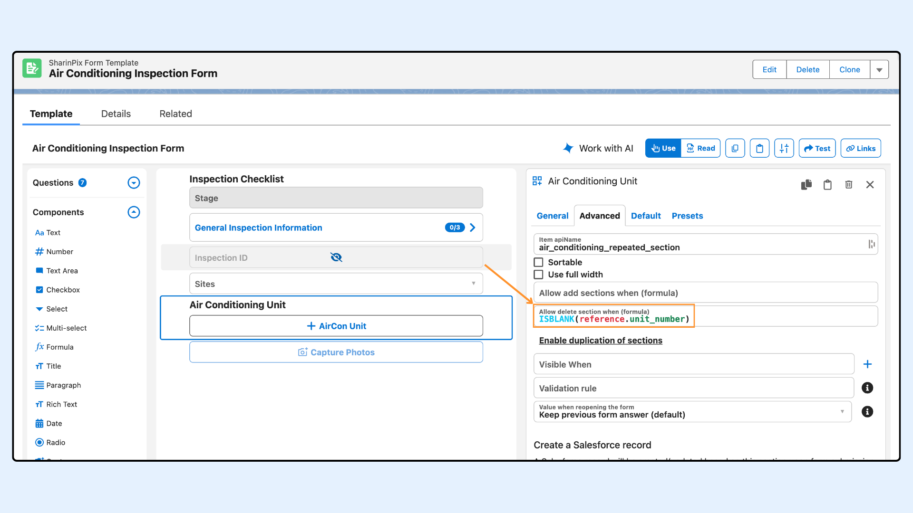

---
layout:
  width: default
  title:
    visible: true
  description:
    visible: true
  tableOfContents:
    visible: true
  outline:
    visible: true
  pagination:
    visible: true
  metadata:
    visible: false
  tags:
    visible: true
  actions:
    visible: true
---

# Form Features - Initial/Follow-up Form Responses (Comparative Form)

## Overview


SharinPix Form can be configured to **compare current form responses with previous submissions**. This comparative view is particularly useful for follow-up forms, recurring inspections, or progress tracking, where users need to refer to their past inputs to provide updated or more accurate information.

This configuration is made directly from the **SharinPix Form Launcher**.

This article covers the following:

* [How to configure the comparative feature on the SharinPix Form Launcher](form-features-initial-follow-up-form-responses-comparative-form.md#configure-comparative-feature-on-the-sharinpix-form-launcher)
* [How to enable comparative mode on a Universal Link](form-features-initial-follow-up-form-responses-comparative-form.md#enable-comparative-mode-on-a-universal-link)
* [Demo of the Conditional Visibility feature with an Air Conditioning Inspection Example](form-features-initial-follow-up-form-responses-comparative-form.md#demo-air-conditioning-inspection-example)
* [Disable deletion of comparative Repeated Sections](form-features-initial-follow-up-form-responses-comparative-form.md#disable-deletion-of-comparative-repeated-sections)


## Getting Started


Every submitted form automatically generates a [**Form Response**](https://app.gitbook.com/s/5EvYRrLbUyvRh8o1jmMG/lightning-web-component/sharinpix-form-response-lwc), which includes a unique **Form Response Data URL**.


### Configure Comparative Feature on the SharinPix Form Launcher

The comparative feature for the SharinPix Form can be configured from the **SharinPix Form Launcher** via the parameter **Initial Form Response** and takes as input <mark style="color:$danger;">`Use the latest form response`</mark> as shown in the diagram below.

After specifying to use the latest form response on the form launcher, the SharinPix Form Template will be opened in comparative mode by using the latest Form Response answers as previous values to compare from.

 (2).png>)

### Enable comparative mode on a Universal Link


The user can also enable comparative mode by directly modifying the [SharinPix Form Universal Link URL](../form-mobile-integration/integration-of-sharinpix-form-with-sfs-app-using-app-extension.md)


* To load a new form that displays answers from a previous submission, add the following custom parameter when opening the form:\
  <mark style="color:$danger;">`ref_response_url=<Form Response Data URL>`</mark>\
  The value for **ref\_response\_url** is the **FormResponseDataURL\_\_c** Field value, which stores all the data, including images, of a submitted [_SharinPix Form Response_](../overview-and-getting-started/sharinpix-forms.md).
* If the referenced response is based on the **same template** , the form will automatically switch to **Comparative Mode**.

### Demo: Air Conditioning Inspection Example

After the user submits the form:

* The form is opened with **Initial Form Response** configured on the [SharinPix Form Launcher](https://app.gitbook.com/s/5EvYRrLbUyvRh8o1jmMG/lightning-web-component/sharinpix-form-launcher) or with a <mark style="color:$danger;">`Form Response Data URL`</mark> directly appended to the **SharinPix Form Universal Link.**
* The diagram below shows a form in **Comparative Mode** on the right after the submission on the left.
* This layout helps users quickly identify changes or ensure consistency.

 (4).png>)

When Comparative Mode is activated:

* The form loads your current editable fields **just above** the answers from the referenced submission.
* This makes it easy to **compare** , **verify** , or **update** information based on past responses.

### Disable deletion of comparative Repeated Sections

In Comparative Mode, repeated sections can include values from the referenced submission.

In some cases, you may want to prevent users from deleting those sections to preserve the comparison context.

If a user deletes a repeated section that came from the referenced response, the comparative data for that section is lost. Adding a new section does not restore that link. It creates a new section with no previous values.

To prevent that, configure an **Allow delete** formula on the repeated section. Use the `reference` attribute to access the previous answer linked to the current answer. In the example below, `reference.unit_number` is used to keep delete disabled when the previous answer already had a unit number.

For more on repeated sections, see [SharinPix Form - Repeated Section](../form-sections-and-repeated-sections/sharinpix-form-sections-and-repeated-sections-1.md). For details on the `reference` attribute, see [SharinPix Form Formula: Fields and Attributes](../form-elements/sharinpix-form-formula-fields-and-attributes.md).

<figure><figcaption></figcaption></figure>

Now when launching the form, the delete button appears only on repeated sections that did not have a unit number in the previous submission.

<figure><figcaption></figcaption></figure>
