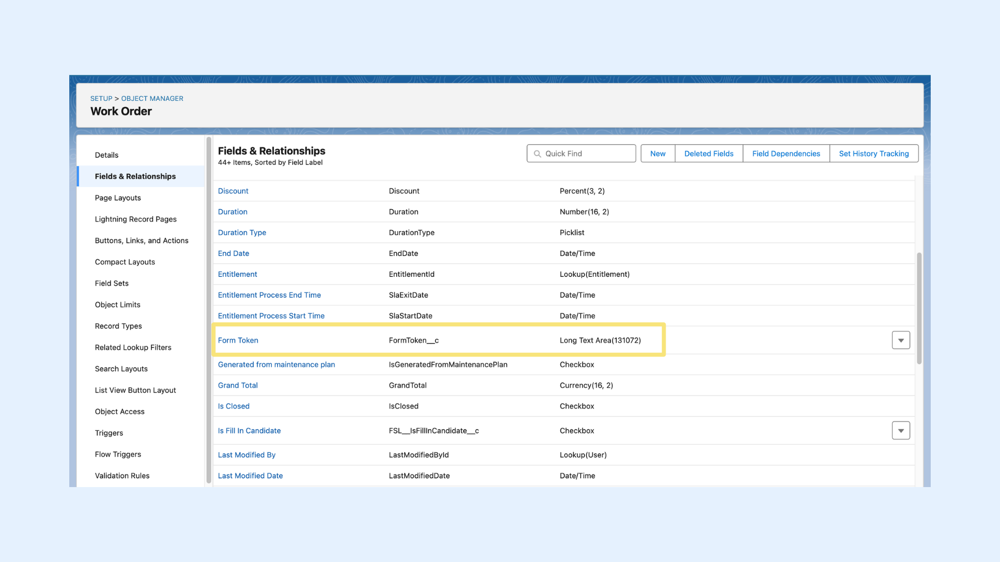
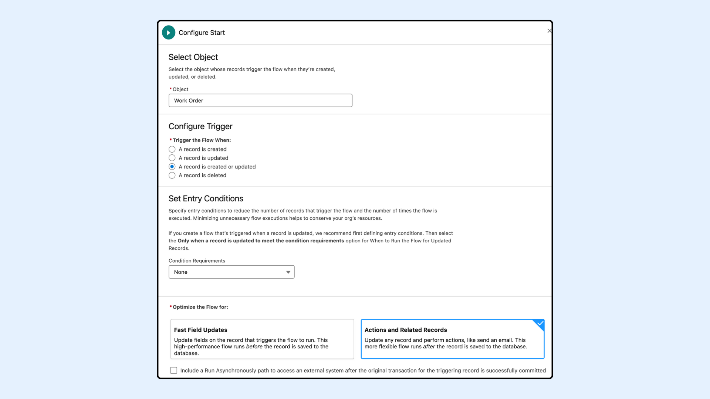
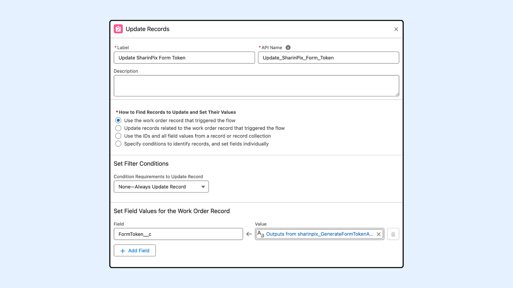
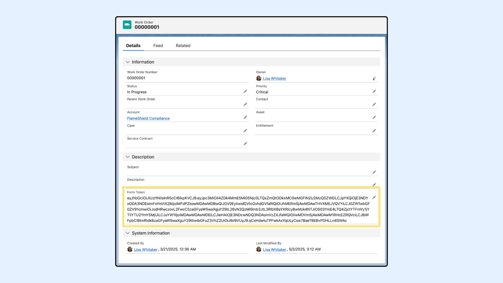

# Automatic Form Token Generation using Flow (Admin-Oriented)

## Overview

Salesforce Admins can streamline their SharinPix Form workflows by automatically generating secure **SharinPix Form Tokens** directly from **Flows**. Once the token is generated, it can be used to dynamically build a [URL](automatic-form-token-generation-using-flow-admin-oriented.md) that opens the SharinPix Form for users to fill out. This is especially useful in Field Service scenarios, where the [link can launch the SharinPix mobile app directly](../integrations/salesforce-field-service/integration-of-sharinpix-app-with-sfs-fsl-app-using-app-extension.md).

SharinPix provides **two Apex invocable methods** for generating these tokens:

* <mark style="color:$danger;">`GenerateFormTokenAutomation`</mark> – Ideal for generating a token for **a specific SharinPix Form Template**.
* <mark style="color:$danger;">`TokenGeneration`</mark> – A more generic method that allows generating tokens for **multiple** different **SharinPix Form Templates** using a single action.

This documentation explains both methods and how to configure your Flow accordingly. It covers the following:

1. [GenerateFormTokenAutomation's Input Parameters](automatic-form-token-generation-using-flow-admin-oriented.md#generateformtokenautomation)
2. Flow Configuration Guide
   * [Step 1: Prepare Custom Field To Store Token](automatic-form-url-generation-using-flow-admin-oriented.md#step-1-prepare-custom-field-to-store-url)
   * [Step 2: Configure a Record-Triggered Flow](automatic-form-token-generation-using-flow-admin-oriented.md#step-2-configure-a-record-triggered-flow)
   * [Step 3: Add the Action to Generate the Form Token](automatic-form-token-generation-using-flow-admin-oriented.md#step-3-add-the-action-to-generate-the-form-token)
   * [Step 4: Add Update Element](automatic-form-token-generation-using-flow-admin-oriented.md#step-4-add-update-element)
   * [Step 5: Save and Activate the Flow](automatic-form-token-generation-using-flow-admin-oriented.md#step-5-save-and-activate-the-flow)
   * [Step 6: Find the SharinPix Token](automatic-form-token-generation-using-flow-admin-oriented.md#step-6-find-the-sharinpix-token)
3. [Form Token Use Case Example: Using a Field Service App Extension to Open a SharinPix Form](automatic-form-token-generation-using-flow-admin-oriented.md#form-token-use-case-example-using-a-field-service-app-extension-to-open-a-sharinpix-form)


**Prerequisites**

Before configuring this automation, ensure the following:

* You have the latest **SharinPix Package** installed. This feature requires version **1.346** or higher. You can follow [this guide](https://app.gitbook.com/s/i8tH1o5AHthxksYgF6ij/how-to-update-sharinpix-package-from-the-appexchange) to upgrade your SharinPix Managed Package to the newest version.
* Users must have the **SharinPix Forms** **Admin** or **SharinPix Forms User** permission set assigned. For more information on these two permission sets, check [SharinPix Permission Sets](../access-and-security/sharinpix-permission-sets.md).
* A form template has been created using the [SharinPix Form Template Editor](sharinpix-form-template-editor.md).


## Input Parameters

### GenerateFormTokenAutomation

Below are the inputs required when using the <mark style="color:$danger;">`GenerateFormTokenAutomation`</mark> invocable method in a Salesforce Flow. These parameters must be provided to successfully generate a SharinPix Form token.

| Parameter        | Description                                                                                                                                      |
| ---------------- | ------------------------------------------------------------------------------------------------------------------------------------------------ |
| recordId         | The Salesforce Record ID (e.g. Work Order ID) to which the form token will be associated. _(Required)_                                           |
| formTemplateId   | The **Name** of the SharinPix Main Form Template for which you want to generate the SharinPix Form Url. _(Required)_                             |
| nameFieldApiName | API name of a field on the record (e.g. <mark style="color:$danger;">`WorkOrderNumber`</mark>) to be used as the job name in the SharinPix Form. |
| expiry           | Number of days after which the token will expire.                                                                                                |
| anonymousUser    | Specifies whether the SharinPix Form should be generated for anonymous access or for an authenticated Salesforce user.                           |

### TokenAutomation

| Parameter     | Description                                                                                                                           |
| ------------- | ------------------------------------------------------------------------------------------------------------------------------------- |
| recordId      | The Salesforce Record ID (e.g. Work Order ID) to which the form token will be associated. _(Required)_                                |
| fieldname     | API name(s) of field(s) to store the token. If more than one field then should separate using (;) _(Required)_                        |
| name          | Name of the current record.                                                                                                           |
| numberOfHours | Number of hours after which the token will expire.                                                                                    |
| permissionId  | ID or Name of the SharinPix Permission object to be used for opening the SharinPix Mobile App. ( in form context, we don't need this) |

## Flow Configuration Guide

The following flow setup uses a **Record-Triggered Flow** to automatically generate a SharinPix Form Token when a **Work Order** is created or updated.

### **Step 1: Prepare Custom Field To Store Token**

A field is needed on the Work Order object to store the generated token. To do so, create a **Text Area (Long)** field to store the entire token.

1. Go to **Setup** > **Object Manager** > **Work Order**.
2. Click on **Fields & Relationships** > **New**.
3. Select **Text Area (Long)** as the field type.
4. Name the field (e.g., <mark style="color:$danger;">`Form Token`</mark>) and set the **length** to the maximum value (<mark style="color:$danger;">`131,072`</mark> characters).
5. **Save** the field.

This field will store the full token returned by the flow.

<figure><figcaption></figcaption></figure>

### **Step 2: Configure a Record-Triggered Flow**

1. Go to **Setup** > **Flows** > Click **New Flow**
2. Choose **Start From Scratch** and click **Next**
3. Choose **Record-Triggered Flow** and click **Create**
4. Set the following values:

| Setting               | Value                          |
| --------------------- | ------------------------------ |
| Object                | Work Order                     |
| Trigger               | A record is created or updated |
| Set Entry Conditions  | None                           |
| Optimize the Flow for | Actions and Related Records    |

<figure><figcaption></figcaption></figure>

<figure><figcaption></figcaption></figure>

### **Step 3: Add the Action to Generate the Form Token**

**GenerateFormTokenAutomation**

1. Add an **Action** element
2. Search for <mark style="color:$danger;">`Sharinpix__GenerateFormTokenAutomation`</mark>
3. On the **Action** modal for <mark style="color:$danger;">`Sharinpix__GenerateFormTokenAutomation`</mark>, populate the fields as indicated below:

| Field                   | Example Value                        |
| ----------------------- | ------------------------------------ |
| Main Form Template Name | Fire Safety Inspection               |
| Record ID               | Triggering WorkOrder > Work Order ID |
| Anonymous User          | False                                |
| Expiry in Days          | 10                                   |
| Name Field API Name     | WorkOrderNumber                      |


**Warning:**

* If the expiry value is not specified, the token will default to 30 days. If the token should not expire, the expiry value should be set to zero (<mark style="color:$danger;">`0`</mark>). This field only accepts whole numbers; decimal values are not supported and will result in an error.
* Ensure the specified template exists in your Salesforce org and that you have entered the correct name or ID.


<figure><figcaption></figcaption></figure>

#### TokenAutomation

1. Add an **Action** element
2. Search for <mark style="color:$danger;">`Sharinpix__TokenGeneration`</mark>
3. On the **Action** \_ \_ modal for <mark style="color:$danger;">`Sharinpix__TokenGeneration`</mark>, populate the fields as indicated below:

| Field                        | Example Value                         |
| ---------------------------- | ------------------------------------- |
| Field API Name(s)            | FormToken\_\_c                        |
| Record NameRecord ID         | Triggering WorkOrder > Work Order ID  |
| Record Name                  | job name for the form                 |
| Hours Before Token Expires   | 10                                    |
| Custom Permission ID or Name | Does **not** apply for SharinPix Form |

### Step 4: Add Update Element

This step is used to store the token generated by the Apex action into the custom field <mark style="color:$danger;">`FormToken__c`</mark> you created on the Work Order.

1. Add an **Update** element
2. Select **Use the Work Order record that triggered the flow**
3. Do not add any filter conditions.
4. In the **Set Field Values for the Work Order Record** section, populate it as indicated below:

| Field          | Value                                                       |
| -------------- | ----------------------------------------------------------- |
| FormToken\_\_c | Outputs from sharinpix\_\_GenerateFormTokenAutomation.token |

<figure><figcaption></figcaption></figure>

### Step 5: Save and Activate the Flow

**Save** the Flow and click **Activate**.

 (1).png>)

### Step 6: Find the SharinPix Token

To test the flow, create or update a **Work Order** record.

After the flow runs, the generated **SharinPix Form Token** will be stored in the `FormToken__c` field of the Work Order. You can view it directly from the record detail page to confirm that the token was generated successfully.

<figure><figcaption></figcaption></figure>

## Form Token Use Case Example: Using a Field Service App Extension to Open a SharinPix Form

You can set up a Field Service App Extension to launch the forms from the Field Service mobile app and directly access them in the **SharinPix Mobile App** by embedding the form token in a SharinPix deeplink or URL.

The format for **deeplinks** to open a form in the SharinPix app is as follows:

<mark style="color:$danger;">`sharinpix://form?token=<sharinpix-token>&host=app.sharinpix.com`</mark>

The format for **universal links** (URL) to open a form in the SharinPix app is as follows:

<mark style="color:$danger;">`https://app.sharinpix.com/native_app/form?token=<sharinpix-token>&host=app.sharinpix.com`</mark>

* The section, <mark style="color:$danger;">`<sharinpix-token>`</mark> , in the above deeplink and universal link formats, should be replaced by the form token.
* For more information on how to configure Field Service App Extensions with SharinPix deeplinks/URLs, please refer to this documentation: [Integration of SharinPix App with SFS (FSL) App using App Extension](../integrations/salesforce-field-service/integration-of-sharinpix-app-with-sfs-fsl-app-using-app-extension.md)
