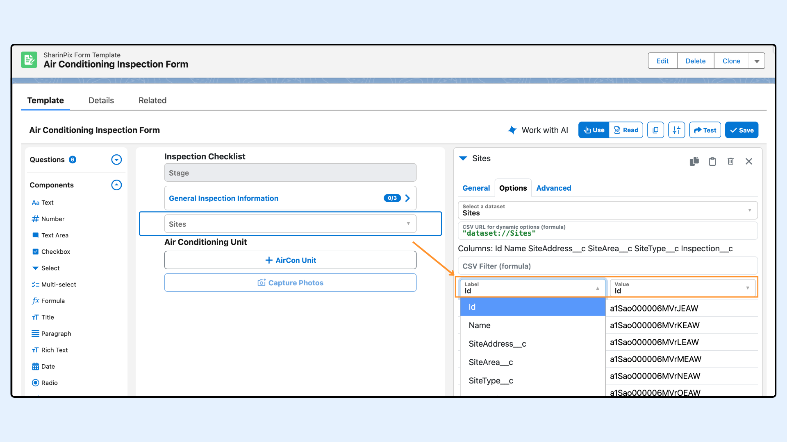
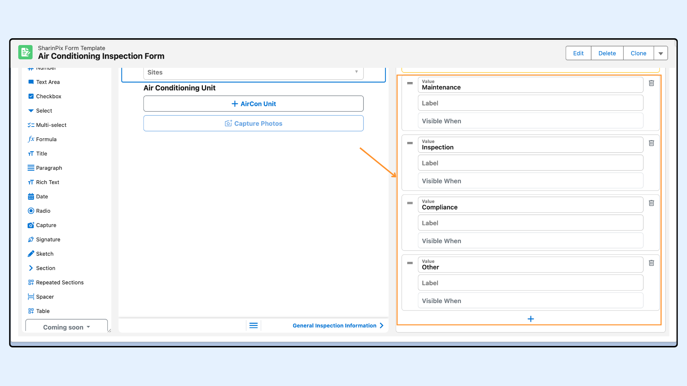
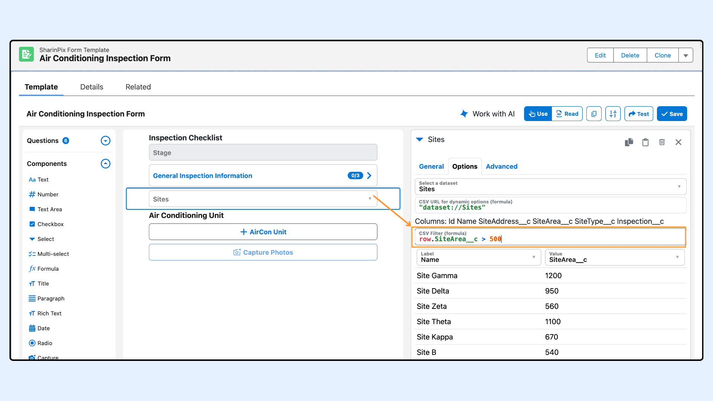
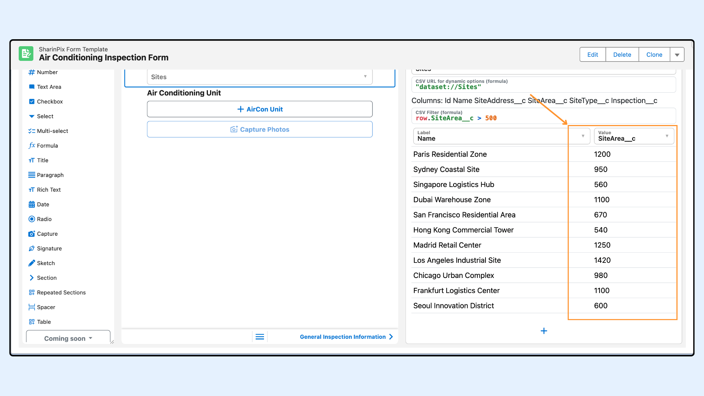

---
layout:
  width: default
  title:
    visible: true
  description:
    visible: true
  tableOfContents:
    visible: true
  outline:
    visible: true
  pagination:
    visible: true
  metadata:
    visible: false
  tags:
    visible: true
  actions:
    visible: true
---

# Form Features - Use Dynamic Salesforce Data with Record Datasets

## Overview

[**Record Datasets**](../salesforce-integration/record-datasets.md) let you use Salesforce data inside SharinPix Forms.

This feature is currently available for **Select** and **Multi-Select** questions. It lets you populate options from a **Record Dataset** generated from Salesforce records.

Use it when the available options should reflect Salesforce data instead of a fixed list entered in the form builder.


Refresh your Record Datasets regularly to keep options in sync with Salesforce.


This article covers:

* [Configure dynamic Select or Multi-Select options with a Record Dataset](form-features-use-dynamic-salesforce-data-with-record-datasets.md#configure-dynamic-select-or-multi-select-options-with-a-record-dataset)
  * [Choose the label and value fields](form-features-use-dynamic-salesforce-data-with-record-datasets.md#choose-the-label-and-value-fields)
  * [Filter available rows](form-features-use-dynamic-salesforce-data-with-record-datasets.md#filter-available-rows)
* [Prefill Repeated Sections with a Record Dataset](form-features-use-dynamic-salesforce-data-with-record-datasets.md#prefill-repeated-sections-with-a-record-dataset)
  * [Set up dataset mapping](form-features-use-dynamic-salesforce-data-with-record-datasets.md#set-up-dataset-mapping)
* [Demo: Select Employees based on their Company](form-features-use-dynamic-salesforce-data-with-record-datasets.md#demo-select-employees-based-on-their-company)

### Configure dynamic Select or Multi-Select options with a Record Dataset

Add a **Select** or **Multi-Select** question.

<figure><figcaption></figcaption></figure>

In the **Options** tab, click **Select a dataset** and choose one of the available **Record Datasets**.


Create the Record Dataset from Salesforce data before configuring the question in the Form Builder.

Refer to [How to Create a Record Dataset](../salesforce-integration/record-datasets.md#how-to-create-a-record-dataset).


<figure><figcaption></figcaption></figure>

The available fields depend entirely on the columns exported into the Record Dataset.

In this example, the dataset includes:

* `Id`
* `Name`
* `SiteAddress__c`
* `SiteArea__c`
* `SiteType__c`
* `Inspection__c`

If a field is not present in the dataset, you cannot use it in the question configuration or the filter formula.

<figure><figcaption></figcaption></figure>

### Choose the label and value fields

After selecting the dataset, choose which column should be used as:

* the **label**, which is shown to the user
* the **value**, which is stored in the form response

In most cases, use a readable field for the label and a stable field for the value.

For example, you might display `Name` while storing `Id`.

You can keep static options or remove them, depending on whether the question should rely entirely on the selected dataset.

<figure><figcaption></figcaption></figure>

#### Filter available rows

In the **CSV Filter (formula)** field, reference dataset columns with `row.<column_name>`.

You can use any column exported in the dataset inside the filter.

With the example dataset above, valid references include:

* `row.Id`
* `row.Name`
* `row.SiteAddress__c`
* `row.SiteArea__c`
* `row.SiteType__c`
* `row.Inspection__c`

Use this filter to show only rows that match specific values.

In this example, the filter keeps only Site records where `SiteArea__c > 500`.

<figure><figcaption></figcaption></figure>

For example:

* `row.SiteArea__c > 500` keeps only large sites
* `row.SiteType__c == "Industrial"` keeps only industrial sites
* `row.Inspection__c == inspection_id` keeps only sites linked to the current Inspection

The available options now include only records where `SiteArea__c` is greater than `500`.

<figure><figcaption></figcaption></figure>

#### Remove duplicate values

If the dataset contains repeated values in the same column, the question can show duplicate options.

Enable `Remove duplicate values from CSV` to keep only one option for each repeated value.

<figure><figcaption></figcaption></figure>

### Prefill Repeated Sections with a Record Dataset

You can use **Pull data from a Salesforce record** in the **Default** tab of a **Repeated Section** to prefill repeated items when the form opens.

This method is not recommended when you need to prefill a large number of items.

It appends the prefill values to the URL, which can make the URL too long.

For larger record sets, use a dataset instead. For the Salesforce-based approach, see [Create and Update Related Salesforce Records with SharinPix Form](../salesforce-integration/create-and-update-related-salesforce-records-with-sharinpix-form.md#configuring-form-repeated-sections-to-pull-child-records).

#### Set up dataset mapping


Create the Record Dataset from Salesforce data before configuring the mapping in the Form Builder.

Refer to [How to Create a Record Dataset](../salesforce-integration/record-datasets.md#how-to-create-a-record-dataset).


Enable **Prefill repeated sections from a dataset**.

<figure><figcaption></figcaption></figure>

Select one of the available datasets, then configure the mapping and [filtering](form-features-use-dynamic-salesforce-data-with-record-datasets.md#filter-available-rows).

Use the mapping to match repeated section questions to dataset columns. For example, map `Site Address` to `SiteAddress__c`.

<figure><figcaption></figcaption></figure>

### Demo: Select Employees based on their Company


**Prerequisite for this example:**

* Create a **Companies** dataset.
* Create an **Employees** dataset with a `Company__c` lookup field.


#### Step 1: Set up the company Select question

* Add a **Select** question with the API name `company`.
* Select the **Companies** dataset.
* Use `Name`, or another readable field, as the label.
* Use `Id` as the value. This value will be used to filter the **Employees** dataset.

<figure><figcaption></figcaption></figure>

#### Step 2: Set up the employees' Multi-Select question

* Add a **Multi-Select** question.
* Select the **Employees** dataset.
*   Use [Filter available rows](form-features-use-dynamic-salesforce-data-with-record-datasets.md#filter-available-rows) to keep only employees linked to the selected company.

    In this example, use:

    `row.Company__c == company.value`

<figure><figcaption></figcaption></figure>


**Tip:**\
\
If you want to get the company ID from the form launch URL, or from a Salesforce field on the record where the form is launched, configure a hidden text question with [Prefill](form-features-default-or-prefill-values.md). You can then reference that hidden field in the filter instead.

