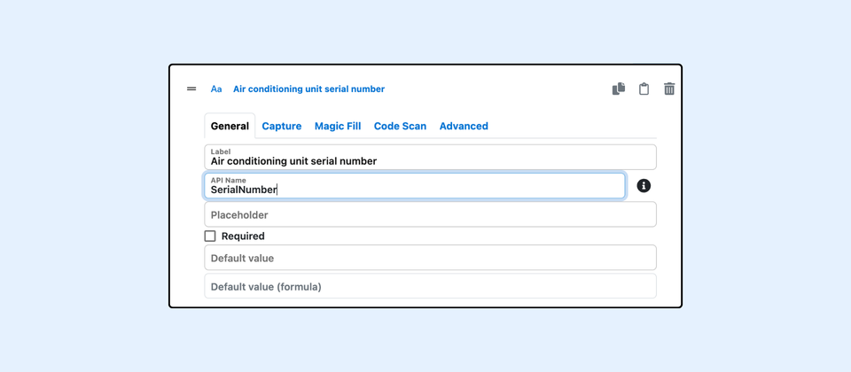

---
layout:
  width: default
  title:
    visible: true
  description:
    visible: true
  tableOfContents:
    visible: true
  outline:
    visible: true
  pagination:
    visible: true
  metadata:
    visible: false
  tags:
    visible: true
---

# SharinPix Form Formula: Fields and Attributes

### Overview 


The **SharinPix Form Formula Field** allows you to dynamically reference and manipulate data. Using formulas, you can combine static values with live data coming from form inputs and other sources to create flexible, data-driven form templates.

This article covers the following:

* [Accessing Form Fields](sharinpix-form-formula-fields-and-attributes.md#overview)
* [Accessing Attributes of Form Fields](sharinpix-form-formula-fields-and-attributes.md#accessing-attributes-of-form-fields)



**Tips:**&#x20;

[Follow this documentation](sharinpix-form-formula-functions-and-operators.md) to learn more about the Functions and Operators available in a SharinPix Form Formula Field


### Getting Started 

Formulas can reference data from the following sources:

1. **Current Form Fields:** Values entered by the end-user (e.g., <mark style="color:red;">`elementAPIName`</mark>).
2. **URL Parameters:** Data passed when launching the form via the <mark style="color:red;">`form.params.`</mark> prefix (e.g., <mark style="color:red;">`form.params.approval_threshold`</mark>).

### Accessing Form Fields 

Any question with an API name can be used in a formula field. An API name can be added to a question using the _API Name field_ on the form builder, as shown below.

<figure><figcaption></figcaption></figure>

<figure><figcaption></figcaption></figure>

The SerialNumber field can then be used in formula fields as shown above


A section or page cannot contain fields with the same API name.


#### Accessing nested fields 

To access a nested field, i.e a field found inside a section, make sure to add an API name to the Section element as well. In the picture below the API name "Bedroom" is added to a Section element.

<figure><figcaption></figcaption></figure>

The "Bedroom" Section element contains a Radio question with the "ACWorking" API name as shown below.

<figure><figcaption></figcaption></figure>

To reference the "ACWorking" Radio question in a formula field found **outside** the "Bedroom" Section, it should be _prefixed_ with the Section's API name as shown in the example below.

<figure><figcaption></figcaption></figure>


**Tips:**&#x20;

A field can be referenced without any prefix if it is being used in the same level (i.e, the section where it is found)


#### Accessing parent fields

The <mark style="color:red;">`parent`</mark> attribute is available for any question found in a section.

<figure><figcaption></figcaption></figure>

By using the <mark style="color:red;">`parent`</mark> attribute, we can access the attributes of the section as shown below.&#x20;

<figure><figcaption></figcaption></figure>


**Tips:**

You can use <mark style="color:red;">`.parent`</mark> to move up the elements tree and reference questions in other sections. For example:

<mark style="color:red;">`parent.parent.SiblingSection.ACWorking`</mark>


if you need to reference a **root-level (main page)** question inside a formula field for a question **nested** in a section, you can reference it by using the [**form**](sharinpix-form-formula-fields-and-attributes.md#global-form-attributes) global field.

In the example below, the form includes a radio question with the API name <mark style="color:red;">`VisitType`</mark> on the main page, and a capture question inside the **Bedroom** section.

<figure><figcaption></figcaption></figure>

<figure><figcaption></figcaption></figure>

To reference <mark style="color:red;">`VisitType`</mark> from a formula on a question in the **Bedroom** section, use <mark style="color:red;">`form.VisitType`</mark>, as shown below.

<figure><figcaption></figcaption></figure>

### Accessing Attributes of Form Fields 

A field can contain several attributes based on its type and they can be accessed by adding a "." following a field API name.

#### Generic Questions attributes 

These attributes are available on almost all questions.

<figure><figcaption></figcaption></figure>

| Attribute    | Purpose                                                                                                                                                                           |
| ------------ | --------------------------------------------------------------------------------------------------------------------------------------------------------------------------------- |
| value        | Returns the current value of the field                                                                                                                                            |
| displayValue | Returns the current value of the field as displayed on the UI                                                                                                                     |
| label        | Returns the label of the question                                                                                                                                                 |
| mediaCount   | Returns the number of media associated with the question                                                                                                                          |
| note         | Returns the current note added to the question if any                                                                                                                             |
| reference    | Return the previous value of the question in the context of a [follow-up form](../advanced-form-configuration/form-features-initial-follow-up-form-responses-comparative-form.md) |
| visible      | Returns whether the question is currently visible or not (This is available to use only if the question has a visibility formula configured)                                      |

**displayValue attribute**

This attribute returns the current value of the field as shown on the UI.

For example, if a question has a label configured for a particular value, then that label will be returned in the formula as shown below.

<figure><figcaption></figcaption></figure>

<figure><figcaption></figcaption></figure>

For date questions it returns the date value as a formatted string, using the date format configured on the question.

<figure><figcaption></figcaption></figure>

<figure><figcaption></figcaption></figure>

#### Section Attributes 

These attributes are only available to sections.

<figure><figcaption></figcaption></figure>

| Attribute              | Purpose                                                                     |
| ---------------------- | --------------------------------------------------------------------------- |
| \_questionsCount       | Returns the number of visible questions that are inside the section         |
| \_questionsFilledCount | Returns the number of visible questions that have filled inside the section |
| index                  | Returns the index of the section if it a repeated section                   |

The API names of the questions inside the Section are also attributes of the Section.

If a Section is a Repeated Section, it will also have the <mark style="color:red;">`index`</mark> attribute, which returns its position in the Repeated element as shown below.

<figure><figcaption></figcaption></figure>

### Repeated Sections attributes

These attributes are only available to the Repeated Sections element.

<figure><figcaption></figcaption></figure>

| Attribute | Purpose                                          |
| --------- | ------------------------------------------------ |
| size      | Returns the number of sections added by the user |

The nested fields of the repeated sections can also be referenced. Follow [this documentation](../form-sections-and-repeated-sections/sharinpix-form-formula-referencing-repeated-section-fields.md) to learn more.

#### Global form attributes 

There are several global attributes that can be accessed by using the <mark style="color:red;">`form`</mark> keyword

<figure><figcaption></figcaption></figure>

| Attribute | Purpose                                                                                                                                                                                                                     |
| --------- | --------------------------------------------------------------------------------------------------------------------------------------------------------------------------------------------------------------------------- |
| compare   | Returns <mark style="color:red;">`true`</mark> when the form being filled is a follow-up form.                                                                                                                              |
| params    | Allows accessing the url params found in the url that was used to load the form. Follow [this documentation](../advanced-form-configuration/sharinpix-forms-context-parameters.md) to learn more about this attribute.      |
| response  | Returns details of the SharinPix Form Response record. This can be used to show additional details on the [SharinPix Form PDF](../form-pdf-configuration/sharinpix-forms-pdf-configuration.md).                             |
| template  | Returns details of the SharinPix Form Template record.                                                                                                                                                                      |
| view      | Returns <mark style="color:$danger;">`"print"`</mark> in the context of pdf. This is useful for hiding or show specific fields on the [SharinPix Form PDF](../form-pdf-configuration/sharinpix-forms-pdf-configuration.md). |

**response attribute**

This attribute of the <mark style="color:red;">`form`</mark> global field contains nested attributes about a SharinPix Form Response record created by the form.

<figure><figcaption></figcaption></figure>

| Attribute | Purpose                                                    |
| --------- | ---------------------------------------------------------- |
| sfid      | The Salesforce Record ID linked to the form response       |
| sfname    | The Salesforce Record Name linked to the form response     |

**template attribute**

This attribute of the <mark style="color:red;">`form`</mark> global field contains nested attributes about the SharinPix Form Template record.

<figure><figcaption></figcaption></figure>

| Attribute | Purpose                |
| --------- | ---------------------- |
| sfid      | The Form Template ID   |
| sfname    | The Form Template Name |

**Root-level fields**

The questions found on the main page can also be referenced directly by using the <mark style="color:red;">`form`</mark> field as shown below.

<figure><figcaption></figcaption></figure>


**Tips:**

This can be used to reference a root-level question from a nested formula field.

