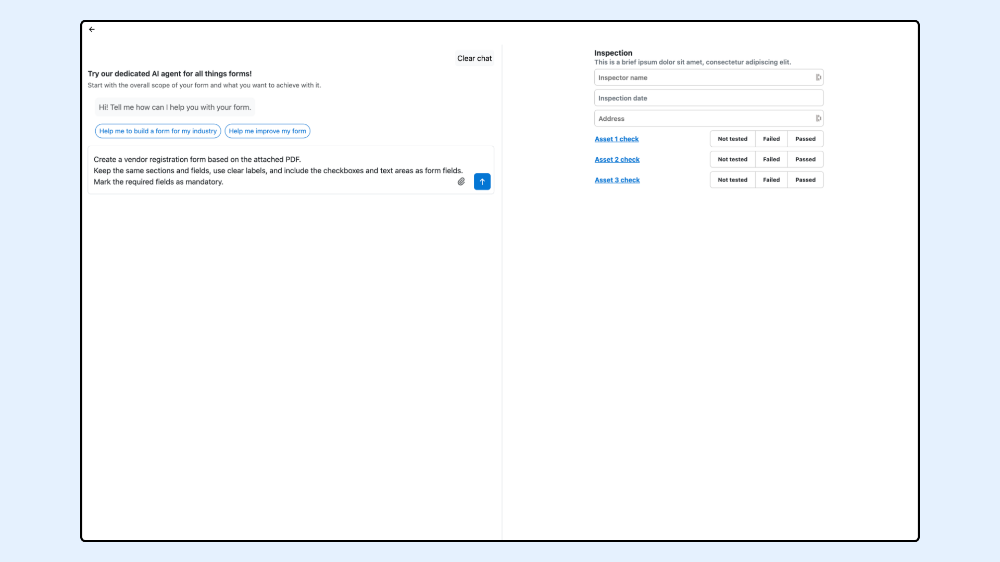
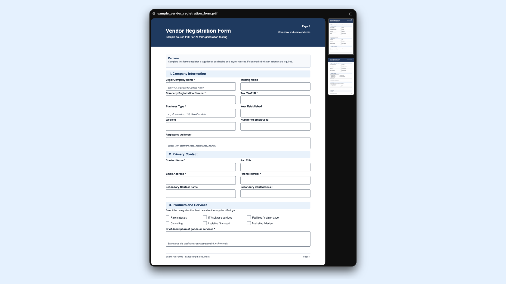
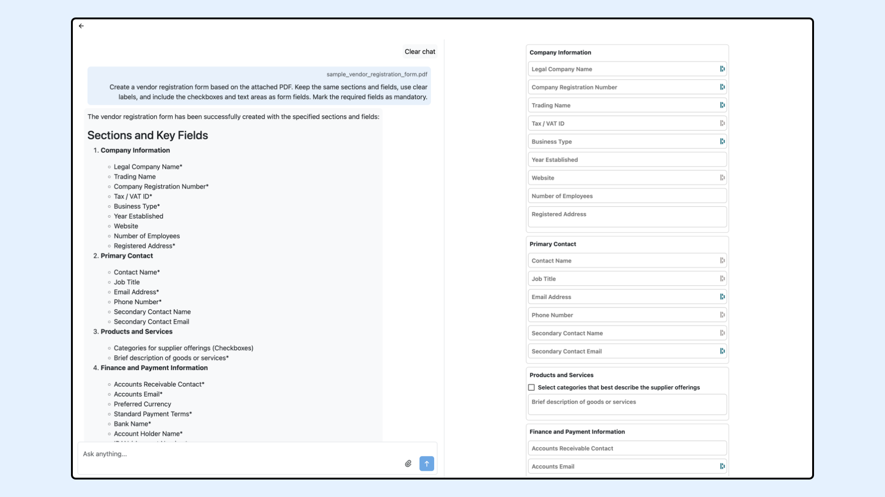

---
layout:
  width: default
  title:
    visible: true
  description:
    visible: true
  tableOfContents:
    visible: true
  outline:
    visible: true
  pagination:
    visible: true
  metadata:
    visible: false
  tags:
    visible: true
---

# Generate Forms with AI

This document explains how to use the built-in AI feature in the SharinPix Form Template Builder to generate forms. You can use the AI chat interface to describe the form you want with a prompt, or upload a sample file, such as an image or PDF, from which the form can be generated.

You can generate a form by entering a prompt in the AI chat interface and optionally uploading sample files such as images or PDFs. The AI then uses that input to generate an initial draft of the form.

<figure><figcaption></figcaption></figure>

### How it works

1. Click on "Work with AI".
2. Enter a short description of the form you want.
3. Attach images or PDF files if you have them.
4. Generate the form.
5. Review and update the result if needed.

### Example prompt

> Create a vendor registration form based on the attached PDF.\
> Keep the same sections and fields, use clear labels, and include the checkboxes and text areas as form fields.\
> Mark the required fields as mandatory.

### Example PDF

<figure><figcaption></figcaption></figure>

### Example output

<figure><figcaption></figcaption></figure>


**Note:**

* The generated form is a draft.
* Review the form before using it.
* Clear prompts and clear files usually give better results.



This feature uses **OpenAI**. If you would like to use another service or model, please contact **support@sharinpix.com**.

