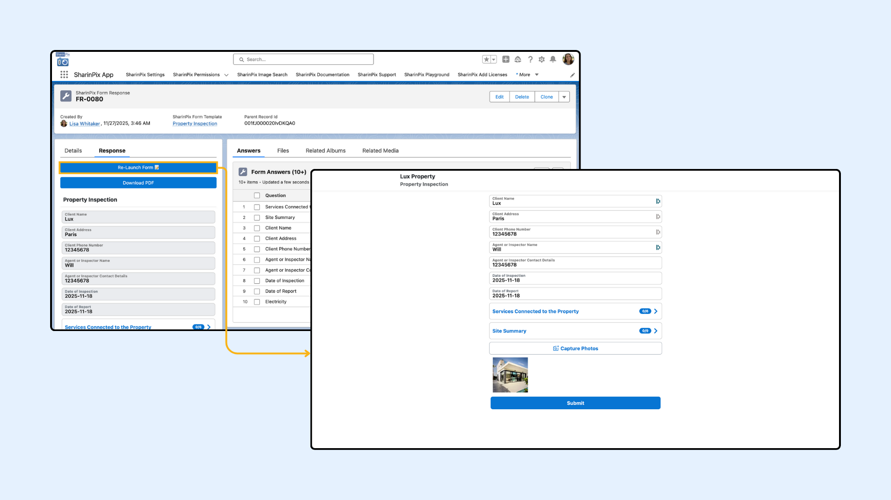

# Reopen A Previously Submitted SharinPix Form

To reopen a submitted SharinPix Form Response using the SharinPix Form Relauncher LWC, it should be dragged and dropped on the submitted [SharinPix Form Response](sharinpix-forms.md) Record Page.

This article consists of:

* [Reopen A Previously Submitted Form Using LWC](reopen-a-previously-submitted-sharinpix-form.md#reopen-a-previously-submitted-sharinpix-form-using-lwc)
* [Reopen A Previously Submitted SharinPix Form Using URL Parameters](reopen-a-previously-submitted-sharinpix-form.md#reopen-a-previously-submitted-sharinpix-form-using-url-parameters)
* [Configuring URL Parameter Using A Flow](reopen-a-previously-submitted-sharinpix-form.md#configuring-url-parameter-using-a-flow)
* [Configuring URL Parameter Using A Universal Link](reopen-a-previously-submitted-sharinpix-form.md#configuring-url-parameter-using-a-universal-link)
* [Preserving Specific Values When Re-Opening A Form](reopen-a-previously-submitted-sharinpix-form.md#preserve-value-of-only-part-of-the-form-when-re-opening-a-form)


**Prerequisites:**

Before configuring this automation, ensure the following:

* You have the latest **SharinPix Package** installed. This feature requires version **1.385** or higher. You can follow [this guide](https://app.gitbook.com/s/i8tH1o5AHthxksYgF6ij/how-to-update-sharinpix-package-from-the-appexchange) to upgrade your SharinPix Managed Package to the newest version.
* Users must have the **SharinPix Forms** **Admin** or **SharinPix Forms User** permission set assigned. For more information on these two permission sets, check [SharinPix Permission Sets](../access-and-security/sharinpix-permission-sets.md).
* A form template has been created using the [SharinPix Form Template Editor](sharinpix-form-template-editor.md).


## Reopen A Previously Submitted SharinPix Form Using LWC

Submitting a SharinPix Form creates a SharinPix Form Response Page on Salesforce.

.png>)

From the SharinPix Form Response Record Page App Builder, drag and drop the SharinPix Form Relauncher LWC on the page as shown below. The configuration parameters are similar to the SharinPix Form Launcher. It can launch the form in a new tab on the web browser if the Open in Online Mode is checked, else it will launch the SharinPix Mobile App.

 (2).png>)

Once the changes are applied, the form can be reopened with all the data from the FR-0080.

<figure><figcaption></figcaption></figure>

## Reopen A Previously Submitted SharinPix Form Using URL Parameters

To reopen a submitted SharinPix Form Response, the **form\_response\_url** and **form\_response\_id** have to be added to the form URL. The **form\_response\_url** is the **FormResponseDataURL\_\_c,** which stores all the data, including images, of the submitted [SharinPix Form Response](sharinpix-forms.md). The **form\_response\_id** is the **PublicId\_\_c,** which contains the SharinPix ID of the Form Response.


Submitting this form will create a new SharinPix Form Response record on Salesforce.


## Configuring URL Parameter Using A Flow

An example can be to use a flow, such as a record-triggered flow, when a SharinPix Form Response record is created. The existing [Generate Form URL Automation](automatic-form-url-generation-using-flow-admin-oriented.md) can be used to generate a new Form URL with the Form Response Data URL and Form Response Public ID of the triggering record as custom parameters:

```
form_response_url={!$Record.sharinpix__FormResponseDataURL__c}&form_response_id={!$Record.sharinpix__PublicId__c}
```

 (2).png>)

This will allow a user to reopen the submitted SharinPix Form Response (including all data such as input values, images, etc.) and submit a new one.

The following example shows how a flow has been used to generate and update the Description field of the parent Account Record with the URL to reopen the last submitted SharinPix Form Response.

 (2).png>)

## Configuring URL Parameter Using A Universal Link

To configure this using a Universal Link, simply append the **form\_response\_url** and the **form\_response\_id** to the URL as follows:

```
https://app.sharinpix.com/native_app/form?token=<sharinpix-form-token>&form_response_url=<FormResponseDataURL__c>&form_response_id=<PublicId__c>
```

## Preserve Value Of Only Part Of The Form When Re Opening A Form

Users can configure individual Form Questions so they **do not automatically reuse (refill) values from previous submissions**. This setting is available in the **Advanced** tab of a question configuration panel in the [SharinPix Form Template Editor](sharinpix-form-template-editor.md).

In the example below, the _Site Summary_ [Form Section](sharinpix-form-sections-and-repeated-sections.md) has been configured to not use the value from the previous form submission, **only when** the custom parameter `stage=review` is included in the form URL.

 (2).png>)
