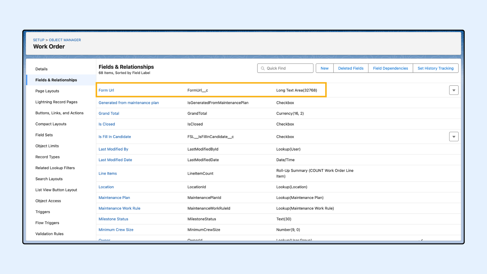
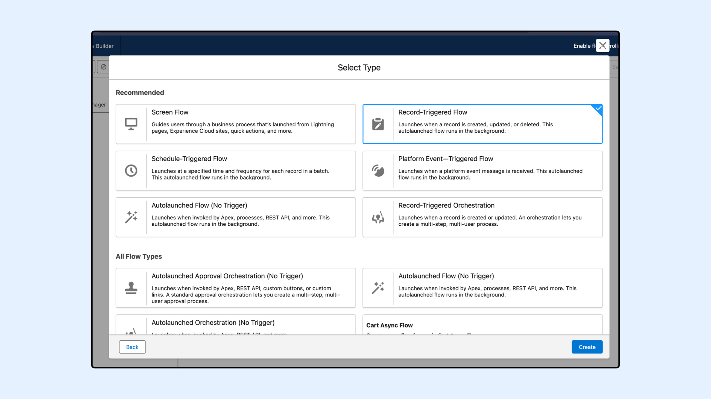
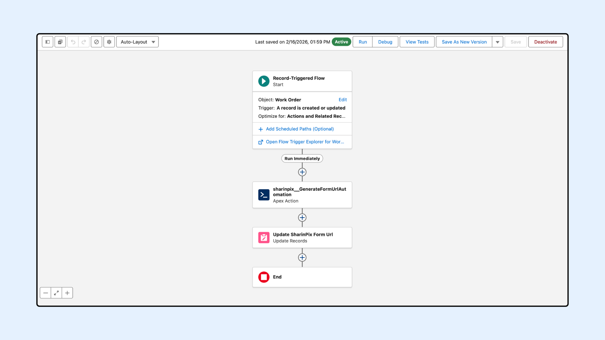

---
layout:
  width: default
  title:
    visible: true
  description:
    visible: true
  tableOfContents:
    visible: true
  outline:
    visible: true
  pagination:
    visible: true
  metadata:
    visible: false
  tags:
    visible: true
---

# Automatic Form URL Generation using Flow (Admin-Oriented)

## Overview

The <mark style="color:$danger;">`GenerateFormUrlAutomation`</mark> class is an **Invocable Apex** utility that allows Salesforce Admins to automatically generate secure **SharinPix Form URLs** directly from **Flows**.

The generated URL opens a SharinPix Form on the SharinPix Mobile App or on a Web Browser for users to fill out.

This article covers the following:

1. [GenerateFormUrlAutomation's Input Parameters](https://app.gitbook.com/s/5EvYRrLbUyvRh8o1jmMG/sharinpix-form/automatic-form-url-generation-using-flow-admin-oriented)
2. Flow Configuration Guide
   * [Step 1: Prepare Custom Field To Store URL](https://app.gitbook.com/s/5EvYRrLbUyvRh8o1jmMG/sharinpix-form/automatic-form-url-generation-using-flow-admin-oriented#step-1-prepare-custom-field-to-store-url)
   * [Step 2: Configure a Record-Triggered Flow](https://app.gitbook.com/s/5EvYRrLbUyvRh8o1jmMG/sharinpix-form/automatic-form-url-generation-using-flow-admin-oriented#step-2-configure-a-record-triggered-flow)
   * [Step 3: Add the Action to Generate the Form Url](https://app.gitbook.com/s/5EvYRrLbUyvRh8o1jmMG/sharinpix-form/automatic-form-url-generation-using-flow-admin-oriented#step-3-add-the-action-to-generate-the-form-url)
   * [Step 4: Add Update Element](https://app.gitbook.com/s/5EvYRrLbUyvRh8o1jmMG/sharinpix-form/automatic-form-url-generation-using-flow-admin-oriented#step-4-add-update-element)
   * [Step 5: Save and Activate the Flow](https://app.gitbook.com/s/5EvYRrLbUyvRh8o1jmMG/sharinpix-form/automatic-form-url-generation-using-flow-admin-oriented#step-5-save-and-activate-the-flow)
   * [Step 6: Find the SharinPix Form URL](https://app.gitbook.com/s/5EvYRrLbUyvRh8o1jmMG/sharinpix-form/automatic-form-url-generation-using-flow-admin-oriented#step-6-find-the-sharinpix-form-url)
3. [Demo](automatic-form-url-generation-using-flow-admin-oriented.md#demo)


**Prerequisites**

Before configuring this automation, ensure the following:

* You have the latest **SharinPix Package** installed. This feature requires version **1.376** or higher. You can follow [this guide](https://app.gitbook.com/s/i8tH1o5AHthxksYgF6ij/how-to-update-sharinpix-package-from-the-appexchange) to upgrade your SharinPix Managed Package to the newest version.
* Users must have the **SharinPix Forms** **Admin** or **SharinPix Forms User** permission set assigned. For more information on these two permission sets, check [SharinPix Permission Sets](https://app.gitbook.com/s/5EvYRrLbUyvRh8o1jmMG/access-and-security/sharinpix-permission-sets).
* A form template has been created using the [SharinPix Form Template Editor](https://app.gitbook.com/s/5EvYRrLbUyvRh8o1jmMG/sharinpix-form/sharinpix-form-template-editor).


## Input Parameters

Below are the inputs required when using the <mark style="color:$danger;">`GenerateFormUrlAutomation`</mark> invocable method in a Salesforce Flow. These parameters must be provided to successfully generate a SharinPix Form URL.

| Parameter        | Description                                                                                                                                                                                                                                                                                                                                                                                                   |
| ---------------- | ------------------------------------------------------------------------------------------------------------------------------------------------------------------------------------------------------------------------------------------------------------------------------------------------------------------------------------------------------------------------------------------------------------- |
| recordId         | The Salesforce Record ID (e.g. Work Order ID) to which the form url will be associated. _(Required)_                                                                                                                                                                                                                                                                                                          |
| formTemplateId   | The ID, Name or Url of the SharinPix Form Template for which you want to generate the SharinPix Form Url. _(Required)_                                                                                                                                                                                                                                                                                        |
| nameFieldApiName | API name of a field on the record (e.g. <mark style="color:$danger;">`WorkOrderNumber`</mark>) to be used as the job name in the SharinPix Form.                                                                                                                                                                                                                                                              |
| expiry           | Number of days after which the url will expire.                                                                                                                                                                                                                                                                                                                                                               |
| anonymousUser    | Specifies whether the SharinPix Form should be generated for anonymous access or for an authenticated Salesforce user.                                                                                                                                                                                                                                                                                        |
| formOnline       | Specifies whether to generate a url that opens a SharinPix Form in Online Mode (On the Web Browser).                                                                                                                                                                                                                                                                                                          |
| customParameters | 
Additional user-defined parameters appended to the SharinPix Form launcher URL.  Can add <a href="https://app.gitbook.com/s/5EvYRrLbUyvRh8o1jmMG/mobile-app/sharinpix-mobile-app-deeplink-syntax#ret_url">ret_url</a>, prefill values parameters and so on. (e.g. <mark style="color:$danger;"><code>nameFieldApiName=Name&#x26;pvInspectionName=Room&#x26;ret_url=salesforce1://</code></mark>)
 |

## Flow Configuration Guide

The following flow setup uses a **Record-Triggered Flow** to automatically generate a SharinPix Form Url when a **Work Order** is created or updated.

### Step 1: Prepare Custom Field To Store URL

A field is needed on the Work Order object to store the generated URL. To do so, create a **Text Area (Long)** field to store the entire URL.

1. Go to **Setup** > **Object Manager** > **Work Order**.
2. Click on **Fields & Relationships** > **New**.
3. Select **Text Area (Long)** as the field type.
4. Name the field (e.g., <mark style="color:$danger;">`Form Url`</mark>) and set the length to the default value (<mark style="color:$danger;">`32,768`</mark> characters).
5. **Save** the field.

This field will store the full Form URL returned by the flow.

<figure><figcaption></figcaption></figure>

### Step 2: Configure a Record-Triggered Flow

1. Go to **Setup** > **Flows** > Click **New Flow**
2. Choose **Start From Scratch** and click **Next**
3. Choose **Record-Triggered Flow** and click **Create**
4. Set the following values:

| Setting               | Value                          |
| --------------------- | ------------------------------ |
| Object                | Work Order                     |
| Trigger               | A record is created or updated |
| Set Entry Conditions  | None                           |
| Optimize the Flow for | Actions and Related Records    |

<figure><figcaption></figcaption></figure>

<figure><figcaption></figcaption></figure>

### Step 3: Add the Action to Generate the Form Url


**Warning:**

Starting with the Salesforce **Winter’26 release**, Apex Actions can no longer be executed directly in the **Run Immediately** path of a record-triggered flow. Instead, they must be placed in an **asynchronous path** , as the synchronous execution option is no longer supported.

For more details, please refer to the documentation here:\
[_Unable to save a flow with an Apex Action after the Salesforce Winter ’26 release – What should I do?_](https://app.gitbook.com/s/i8tH1o5AHthxksYgF6ij/i-am-unable-to-save-a-flow-with-an-apex-action-after-the-salesforce-winter-26-release-what-should-i)


1. Add an **Action** element
2. Search for <mark style="color:$danger;">`Sharinpix__GenerateFormUrlAutomation`</mark>
3. On the **Action** modal for <mark style="color:$danger;">`Sharinpix__GenerateFormUrlAutomation`</mark>, populate the fields as indicated below:

| Field               | Example Value                        |
| ------------------- | ------------------------------------ |
| Form Template ID    | Fire Safety Inspection               |
| Parent Record ID    | Triggering WorkOrder > Work Order ID |
| Expiry in Days      | 15                                   |
| Name Field API Name | WorkOrderNumber                      |
| Anonymous User      | False                                |
| Custom Parameters   | pvdate=09/05/2025                    |
| Form Online         | False                                |

<figure><figcaption></figcaption></figure>


**Warning:**

* If the expiry value is not specified, the token will default to 30 days. If the token should not expire, the expiry value should be set to zero (<mark style="color:$danger;">`0`</mark>). This field only accepts whole numbers; decimal values are not supported and will result in an error.
* Ensure the specified template exists in your Salesforce org and that you have entered the correct name or ID.


**Output Resources** from <mark style="color:$danger;">`Sharinpix__GenerateFormUrlAutomation`</mark>

| Resources                  | Description                                                                                            |
| -------------------------- | ------------------------------------------------------------------------------------------------------ |
| Form Url                   | An automatically generated URL to the form.                                                            |
| Form Token                 | An automatically generated token for the form.                                                         |
| Form Additional Parameters | Set of parameters that are appended to the URL of the form such as prefill values, context parameters. |

### Step 4: Add Update Element

This step is used to store the URL generated by the Apex action into the custom field <mark style="color:$danger;">`FormUrl__c`</mark> you created on the Work Order.

1. Add an **Update** element
2. Select **Use the Work Order record that triggered the flow**
3. Do not add any filter conditions.
4. In the **Set Field Values for the Work Order Record** section, populate it as indicated below:

| Field        | Value                                                         |
| ------------ | ------------------------------------------------------------- |
| FormUrl\_\_c | Outputs from sharinpix\_\_GenerateFormTokenAutomation.formUrl |

Optionally, you can also extract the **Form Token** and **Form Additional Parameters** and store them in their respective fields.

<figure><figcaption></figcaption></figure>

### Step 5: Save and Activate the Flow

**Save** the Flow and click **Activate**.

<figure><figcaption></figcaption></figure>

### Step 6: Find the SharinPix Form URL

To test the flow, create or update a **Work Order** record.

After the flow runs, the generated **SharinPix Form URL** will be stored in the <mark style="color:$danger;">`FormUrl__c`</mark> field of the Work Order. You can view it directly from the record detail page to confirm that the token was generated successfully.

<figure><figcaption></figcaption></figure>

## Demo

The diagram below illustrates the interaction flow when a user clicks the form URL from a Work Order record, launching the SharinPix Form directly in the SharinPix Mobile App.

