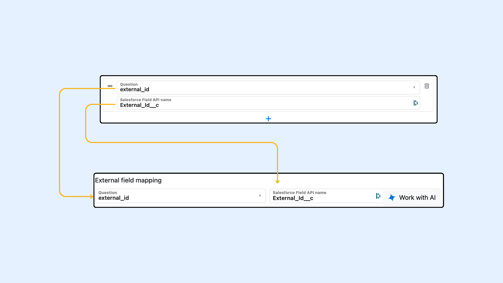

---
layout:
  width: default
  title:
    visible: true
  description:
    visible: true
  tableOfContents:
    visible: true
  outline:
    visible: true
  pagination:
    visible: true
  metadata:
    visible: false
  tags:
    visible: true
  actions:
    visible: true
---

# Create and Update Related Salesforce Records with SharinPix Form

### Overview

A SharinPix Form can be configured to synchronize Salesforce related (child) records with the parent record linked to the Form Response. In other words, SharinPix Forms can be used to display, create, and update related (child) records.

For example, when a form is launched from an Account, that Account is automatically set as the parent record of the Form Response. By using [Repeated Sections](../form-sections-and-repeated-sections/sharinpix-form-sections-and-repeated-sections-1.md), multiple related Contact records can be created or updated directly within the form. When the form is reopened, those Contacts can be retrieved and their existing field values can be prefilled for review or updates.

**This article consists of:**

* [Configuring Form Repeated Section To Pull Child Records From Salesforce](create-and-update-related-salesforce-records-with-sharinpix-form.md#configuring-form-repeated-sections-to-pull-child-records)
* [Configuring Form Repeated Section To Push Child Records To Salesforce](create-and-update-related-salesforce-records-with-sharinpix-form.md#configuring-form-section-or-repeated-sections-to-push-child-records)


**Prerequisite**

Before using this feature, ensure:

* Ensure that you are using the most recent SharinPix Package Version. Follow this document to [_upgrade the SharinPix package_](https://app.gitbook.com/s/i8tH1o5AHthxksYgF6ij/how-to-update-sharinpix-package-from-the-appexchange)
* Admins or power users who need to configure or set up form features should be assigned the permission set **SharinPix Forms Admin Permission**.\
  End users who only need to use the forms should be assigned the permission set **SharinPix Forms Users Permission**.


#### Configuring Form Repeated sections to pull child records


If you need to prefill many repeated items, use a dataset instead. See [Prefill Repeated Sections with a Record Dataset](../form-elements/form-features-use-dynamic-salesforce-data-with-record-datasets.md#prefill-repeated-sections-with-a-record-dataset).


To pull Salesforce related records into a SharinPix Form, the **Pull data from a Salesforce record** section of the Repeated Section element must be configured in the **Default** tab.

1. _**Object API Name**_ - \[Mandatory] The API name of the child object.
2. _**Lookup API Name**_ - \[Mandatory] The API name of the lookup field on the child object that links to the Form Response parent record.
3. _**Lookup value field API Name -** \[Required only if you want to create child records, **not parent to the Form Response]** The API name of the field where the Form Response parent record ID is stored._ This is used when child records are created for a different object, rather than directly for the Form Response parent record.

For the third option _**Lookup value field API Name,**_ this option can be used for example:\
SharinPix Form is launched from an opportunity object; here, the Form Response Parent object is Opportunity. On the opportunity record, you can store a salesforce record Id for any object (a field on the opportunity record with API name _**MyObjectRecordId\_\_c**_).

The Lookup value field API Name should be set to _**MyObjectRecordId\_\_c.**_ Let's say we still want to create Contacts for an Account; then the Account's record ID should be stored in the MyObjectRecordId\_\_c field. This configuration will allow you to create child records for a specific parent object not directly related to the Form Response.

<figure><figcaption></figcaption></figure>

After the setup for retrieving the child records to be filled in the form is completed, the fields to be pulled must be configured. Each question within the repeated section can be used to represent a specific Salesforce field from the child object.

<figure><figcaption></figcaption></figure>

**Question** - A dropdown of all form questions API names in this specific section

**Salesforce Field API Name** - The Field API Name of the child object of which to pull the value

Each question in the section will represent one Salesforce field in the child record being pulled. Example if the Form Section contains:

**Batch Number:**

* Form Field API Name - _batch\_number_
* Salesforce Field API Name - _Batch\_Number\_\_c_

**Compliance Status:**

* Form Field API Name - _compliance\_status_
* Salesforce Field API Name - _Compliance\_Status\_\_c_

**Emergency Exists Functional:**

* Form Field API Name - _emergency\_exits\_functional_
* Salesforce Field API Name - _Emergency\_Exits\_Functional\_\_c_

**External Id:**

* Form Field API Name - _external\_id_
* Salesforce Field API Name - _External\_Id\_\_c_


**Note**

Two steps are required:

1. Create a Salesforce custom **External Id text field** for the child object that you want to retrieve and upsert.
2. Create a **Question of type text** to hold the External Id value of the child record (you can disable the text input to prevent editing).

This is because the external ID field API name is needed to update the records that will be pulled into the form and represented as sections.

If you have no child records to be pulled but want to create them directly from the form, when a response is submitted, a UUID will be auto-generated and will populate the external id field on salesforce. **You do not need to provide an external ID value within the form; leave the question as disabled and empty.**



**Alert**\
\
Beware that if the Form Question that holds the External Id value is set to hidden and the form configuration has the checkbox "**Include hidden fields in response** " set to false, this will not send the external id value to Salesforce when the form is submitted hence existing child records will not be updated and a new child record will be created everytime the form is submitted.


<figure><figcaption></figcaption></figure>

All Inspection child records for the selected Account are pulled by this configuration. For example, if the Account contains 10 related Inspection records, the SharinPix Form is opened with 10 repeated sections, each one representing a single child record.

To synchronize Salesforce records with SharinPix Form repeated sections, the following must be done:

* A question must be created inside the repeated section to store the record’s external ID (as shown in the previous image above).
* The Salesforce API name of the external ID field must be specified in the record pull mappings.

<figure><figcaption></figcaption></figure>

In the External field mapping section, the field that represents the external ID (from the mapped fields) must be selected. This is then used to upsert the child records.

#### Configuring Form Section or Repeated sections to push child records

Once we have configured the form to pull related child records to represent in repeated sections in our form, we need to specify which fields we want to populate in the record. [You can follow the documentation for creation of child records from SharinPix Forms.](../create-child-records-with-form-sections.md)


**Note**

It is important to specify the External ID field in the push configuration for the existing child records to be able to update. If not specified, new child records will be created.


Once the form configuration is complete, each time a Form Response is submitted, it will check the related child Inspection records. For each Inspection record (represented as a section), it will first check whether a corresponding record already exists by comparing the defined **External ID** field. If no matching record is found, a new Inspection record will be created. If a matching record already exists, the existing Inspection record will be updated with the data from the submitted Form Response.

<figure><figcaption></figcaption></figure>

<figure><figcaption></figcaption></figure>


Please note that there is no limitation on the number of child records that can be retrieved in a form. However, retrieving a large number of records may result in the form URL becoming too long. This is not only influenced by the number of records retrieved, but also by the number of Salesforce fields pulled for each record.

