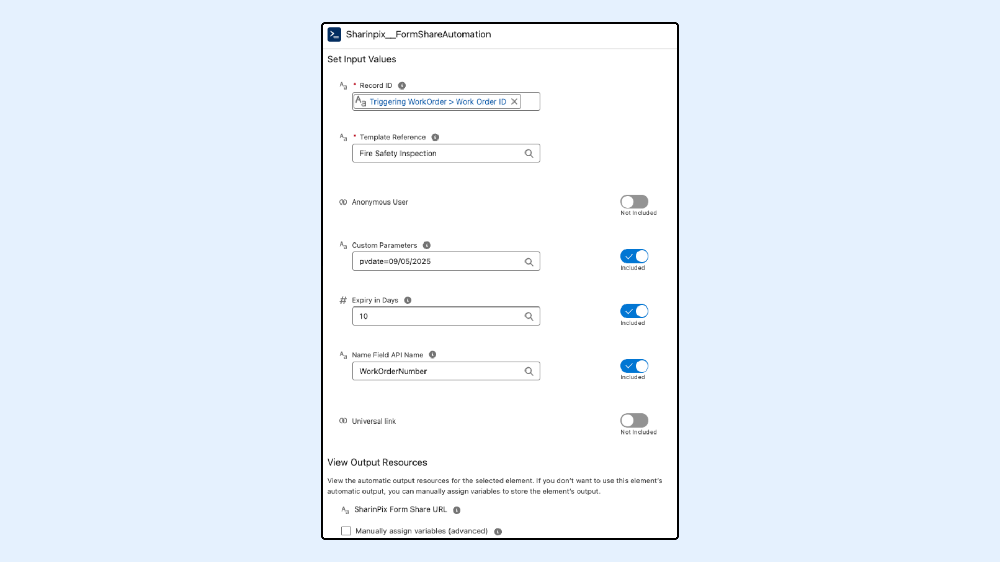
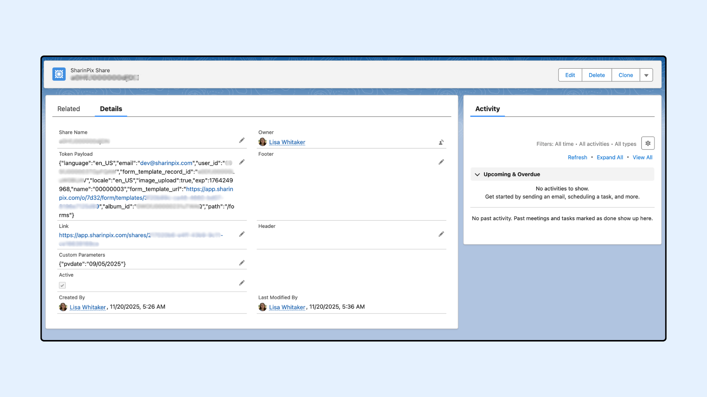

---
layout:
  width: default
  title:
    visible: true
  description:
    visible: true
  tableOfContents:
    visible: true
  outline:
    visible: true
  pagination:
    visible: true
  metadata:
    visible: false
  tags:
    visible: true
  actions:
    visible: true
---

# Generate SharinPix Shareable Form Links Automatically

## Overview

This article explains how <mark style="color:$danger;">`FormShareAutomation`</mark> allows users to automatically generate a shareable link that launches a SharinPix Form directly from a Salesforce Flow.

Instead of using long-form URLs, a share link provides a shortened URL that can be easily distributed, for example, via email or SMS, to external or internal users. When opened, the link takes the user directly to the form, where they can fill it out and submit it.

This documentation covers the following:

1. [FormShareAutomation's Input Parameters](generate-sharinpix-shareable-form-links-automatically.md#input-parameters)
2. Flow Configuration Guide
   * Step 1: [Prepare Custom Field To Store Share URL](generate-sharinpix-shareable-form-links-automatically.md#step-1-prepare-custom-field-to-store-share-url)
   * Step 2: [Configure a Record-Triggered Flow](generate-sharinpix-shareable-form-links-automatically.md#step-2-configure-a-record-triggered-flow)
   * Step 3: [Add the Action to Generate the Share Link](generate-sharinpix-shareable-form-links-automatically.md#step-3-add-the-action-to-generate-the-share-link)
   * Step 4: [Add Update Element](generate-sharinpix-shareable-form-links-automatically.md#step-4-add-update-element)
   * Step 5: [Save and Activate the Flow](generate-sharinpix-shareable-form-links-automatically.md#step-5-save-and-activate-the-flow)
   * Step 6: [Find the SharinPix Share URL](generate-sharinpix-shareable-form-links-automatically.md#step-6-find-the-sharinpix-share-url)


**Prerequisites:**

Before configuring this automation, ensure the following:

* You have the latest **SharinPix Package** installed. This feature requires version **1.384** or higher. You can follow [this guide](https://app.gitbook.com/s/i8tH1o5AHthxksYgF6ij/how-to-update-sharinpix-package-from-the-appexchange) to upgrade your SharinPix Managed Package to the newest version.
* Users must have the **SharinPix Forms** **Admin** or **SharinPix Forms User** permission set assigned. For more information on these two permission sets, check [SharinPix Permission Sets](https://app.gitbook.com/s/5EvYRrLbUyvRh8o1jmMG/access-and-security/sharinpix-permission-sets).
* A form template has been created using the [SharinPix Form Template Editor](../form-elements/sharinpix-form-template-editor.md).


## Input Parameters

Below are the inputs required when using the <mark style="color:$danger;">`FormShareAutomation`</mark> invocable method in a Salesforce Flow. These parameters must be provided to successfully generate a SharinPix Share URL.

| Parameter         | Description                                                                                                                                                                                                                                                                                                                                                                                                  |
| ----------------- | ------------------------------------------------------------------------------------------------------------------------------------------------------------------------------------------------------------------------------------------------------------------------------------------------------------------------------------------------------------------------------------------------------------ |
| recordId          | The Salesforce Record ID (e.g. Work Order ID) to which the form url will be associated. _(Required)_                                                                                                                                                                                                                                                                                                         |
| templateReference | The Name of the Main Form Template for which you want to generate the SharinPix Form URL. _(Required)_                                                                                                                                                                                                                                                                                                       |
| nameFieldApiName  | API name of a field on the record (e.g. <mark style="color:$danger;">`WorkOrderNumber`</mark>) to be used as the job name in the SharinPix Form.                                                                                                                                                                                                                                                             |
| expiry            | Number of days after which the url will expire.                                                                                                                                                                                                                                                                                                                                                              |
| customParameters  | 
Additional user-defined parameters appended to the SharinPix Form launcher URL. Can add <a href="https://app.gitbook.com/s/5EvYRrLbUyvRh8o1jmMG/mobile-app/sharinpix-mobile-app-deeplink-syntax#ret_url">ret_url</a>, prefill values parameters and so on. (e.g. <mark style="color:$danger;"><code>nameFieldApiName=Name&#x26;pvInspectionName=Room&#x26;ret_url=salesforce1://</code></mark>)
 |
| Anonymous User    | When set to **true**, the URL becomes anonymous, and the form submission is not associated with any user.                                                                                                                                                                                                                                                                                                    |
| Universal Link    | When this is set to **true**, the share creates a **universal link** that opens the form in the **SharinPix Mobile App**.                                                                                                                                                                                                                                                                                    |

## Flow Configuration Guide

The following flow setup uses a **Record-Triggered Flow** to automatically generate a SharinPix Share URL when a **Work Order** is created or updated.

## Step 1: Prepare Custom Field To Store Share URL

A field is needed on the Work Order object to store the generated URL. To do so, create a **URL** field to store the share URL.

1. Go to **Setup** > **Object Manager** > **Work Order**.
2. Click on **Fields & Relationships** > **New**.
3. Select **URL** as the field type.
4. Name the field (e.g., <mark style="color:$danger;">`Share Link`</mark>).
5. **Save** the field.

This field will store the Form Share URL returned by the flow.

.png>)

## Step 2: Configure a Record-Triggered Flow

1. Go to **Setup** > **Flows** > Click **New Flow**
2. Choose **Record-Triggered Flow** and click **Create**
3. Set the following values:

| Setting               | Value                       |
| --------------------- | --------------------------- |
| Object                | Work Order                  |
| Trigger               | A record is created         |
| Set Entry Conditions  | None                        |
| Optimize the Flow for | Actions and Related Records |
| Add Asynchronous Path | Enabled                     |

 (1).png>)

 (1).png>)

## Step 3: Add the Action to Generate the Share Link

1. Add an **Action** element
2. Search for <mark style="color:$danger;">`Sharinpix__FormShareAutomation`</mark>
3. On the **Action** modal for <mark style="color:$danger;">`Sharinpix__FormShareAutomation`</mark>, populate the fields as indicated below:

| Field               | Example Value                        |
| ------------------- | ------------------------------------ |
| Template Reference  | Fire Safety Inspection               |
| Record ID           | Triggering WorkOrder > Work Order ID |
| Expiry in Days      | 10                                   |
| Name Field API Name | WorkOrderNumber                      |
| Custom Parameters   | pvdate=09/05/2025                    |
| Anonymous User      | false                                |
| Universal Link      | false                                |

<figure><figcaption></figcaption></figure>


**Warning:**

* If the expiry value is not specified, the token will default to **30 days**. If the token should not expire, the expiry value should be set to zero (<mark style="color:$danger;">`0`</mark>). This field only accepts whole numbers; decimal values are not supported and will result in an error.
* Ensure the specified template exists in your Salesforce org and that you have entered the correct name or ID.


## Step 4: Add Update Element

This step is used to store the URL generated by the Apex action into the custom field <mark style="color:$danger;">`ShareLink__c`</mark> you created on the Work Order.

1. Add an **Update** element
2. Select **Use the Work Order record that triggered the flow**
3. Do not add any filter conditions.
4. In the **Set Field Values for the Work Order Record** section, populate it as indicated below:

| Field          | Value                                                     |
| -------------- | --------------------------------------------------------- |
| ShareLink\_\_c | Outputs from sharinpix\_\_GenerateFormTokenAutomation.url |

.png>)

## Step 5: Save and Activate the Flow

**Save** the Flow and click **Activate**.

 (1).png>)

## Step 6: Find the SharinPix Share URL

To test your flow, create a **Work Order** record (or the object used in your automation).

After the flow runs, the generated **SharinPix Share Link** will be stored in the <mark style="color:$danger;">`ShareLink__c`</mark> field of the Work Order. You can view it directly from the record detail page to confirm that the link was generated successfully.

Clicking the link will immediately launch the corresponding **SharinPix Form**, allowing the user to fill it out and submit it.

.png>)

.png>)

You can also verify that a corresponding SharinPix Share record has been created, containing all details related to the generated share link.

<figure><figcaption></figcaption></figure>
