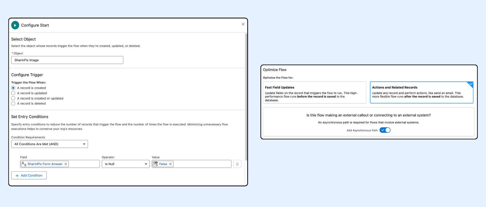
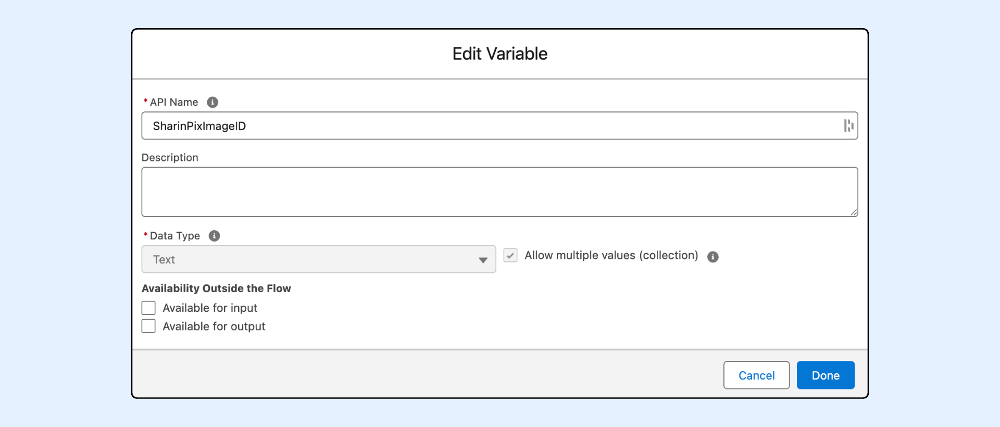
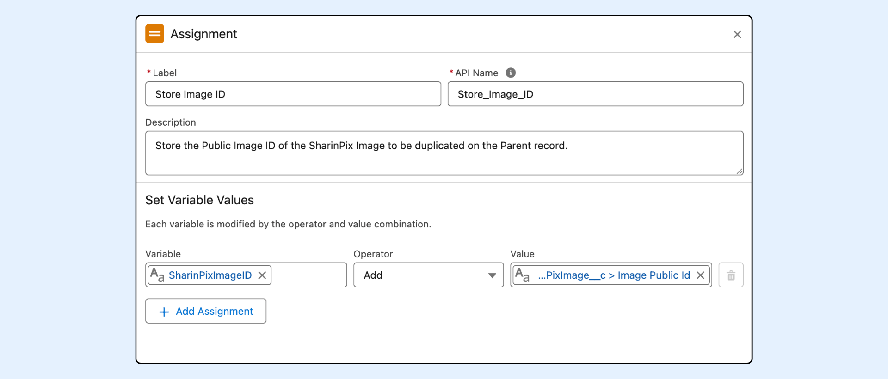
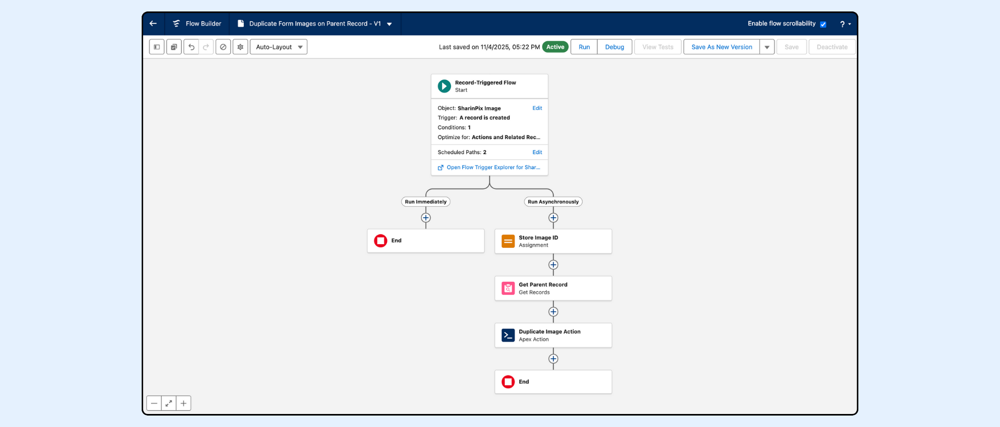
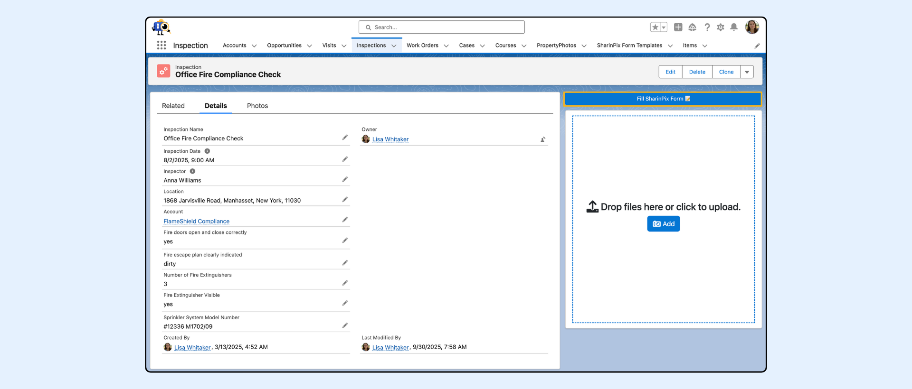
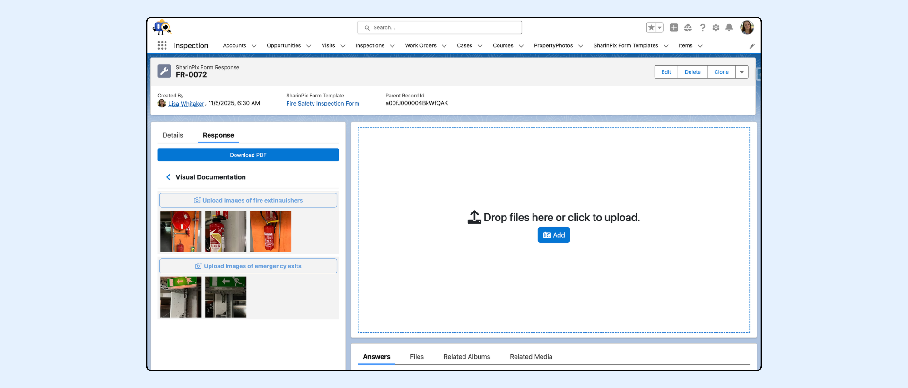

---
layout:
  width: default
  title:
    visible: true
  description:
    visible: true
  tableOfContents:
    visible: true
  outline:
    visible: true
  pagination:
    visible: true
  metadata:
    visible: false
  tags:
    visible: true
---

# Import Images from Form Response to Parent Object (Admin-Oriented)

## Overview

The [`DuplicateImagesAutomation`](https://app.gitbook.com/s/5EvYRrLbUyvRh8o1jmMG/cookbook/duplicate-sharinpix-images-using-a-flow-admin-oriented) Invocable Apex method allows users to automatically **import or duplicate images uploaded in a SharinPix Form Response (via Form Answers)** to the corresponding **Parent record’s album (Salesforce Object from which the SharinPix Form was launched)**.

This automation ensures that all images captured through SharinPix Forms are automatically propagated to the related Parent Object (e.g., _Case, Site, or Inspection_), maintaining centralized visibility and data consistency.

This article covers the following:

* Prerequisites
* [DuplicateImagesAutomation’s Input Parameters](import-images-from-form-response-to-parent-object-admin-oriented.md#input-parameters)
* Flow Setup
  * Step 1: [Configure a Record-Triggered Flow](import-images-from-form-response-to-parent-object-admin-oriented.md#step-1-configure-a-record-triggered-flow)
  * Step 2: [Assign Variables for the Action](import-images-from-form-response-to-parent-object-admin-oriented.md#step-2-assign-variables-for-the-action)
  * Step 3: [Get Parent Record](import-images-from-form-response-to-parent-object-admin-oriented.md#step-3-get-parent-record)
  * Step 4: [Add the Duplicate Image Action](import-images-from-form-response-to-parent-object-admin-oriented.md#step-4-add-the-duplicate-image-action)
  * Step 5: Save and Activate the Flow
* [Demo: Form Response to Parent Duplication Example](import-images-from-form-response-to-parent-object-admin-oriented.md#demo-importing-images-from-form-response-to-parent-inspection-example)


**Prerequisites:**

Before configuring this automation, ensure the following:

1. You have the latest **SharinPix Managed Package** installed.
   * Refer to the [_Upgrade SharinPix Package_ article](https://app.gitbook.com/s/i8tH1o5AHthxksYgF6ij/how-to-update-sharinpix-package-from-the-appexchange) to confirm installation and version.
2. Users must have one of the following permission sets assigned:
   * **SharinPix Admin** or **SharinPix User**
3. **Image Sync** is configured on the **Form Answer** object.
4. The **Parent record** (e.g., _Case, Site, or Inspection_) is linked through a **Form Response** lookup relationship.


## Input Parameters

Below are the inputs required when using the **DuplicateImagesAutomation** invocable method in a Salesforce Flow.

These parameters must be provided for the duplication to execute successfully.

| Parameter            | Description                                                                                                                                                     |
| -------------------- | --------------------------------------------------------------------------------------------------------------------------------------------------------------- |
| Destination Album ID | The ID of the parent record (album) where the image will be duplicated. Typically retrieved through the Form Response lookup to the Parent record. _(Required)_ |
| List of Image IDs    | The list of SharinPix Image Public IDs that will be duplicated. _(Required)_                                                                                    |
| Duplicate Tags       | Optional boolean value indicating whether image tags should also be duplicated. _(Default: false)_                                                              |

## Flow Setup

This flow configuration demonstrates how to **import or duplicate images from a Form Response** to its related **Parent record** using the SharinPix DuplicateImagesAutomation Apex Action.

### Step 1: Configure a Record-Triggered Flow

* Go to **Setup → Flows → New Flow**
* Choose **Record-Triggered Flow** and click **Create**
* Set the following values:

| Setting                | Value                                                       |
| ---------------------- | ----------------------------------------------------------- |
| Object                 | <mark style="color:$danger;">`SharinPix Image`</mark>       |
| Trigger                | A record is created                                         |
| Condition Requirements | All Conditions Are Met (AND)                                |
| Field                  | <mark style="color:$danger;">`SharinPix Form Answer`</mark> |
| Operator               | Is Null                                                     |
| Value                  | <mark style="color:$danger;">`False`</mark>                 |
| Optimize Flow For      | Actions and Related Records                                 |
| Asynchronous Path      | Enabled (since an external Apex call is made)               |

<figure><figcaption></figcaption></figure>

This ensures that the Flow runs **only when a new image linked to a Form Answer** is created.

### Step 2: Assign Variables for the Action

Before creating the Assignment element, you must first create a **new resource** that will hold the image IDs to be duplicated.

#### 2.1 Create the Resource

* In Flow Builder, click **New Resource**.
* Set the following values:

| Setting                                | Value                                                  |
| -------------------------------------- | ------------------------------------------------------ |
| **Resource Type**                      | Variable                                               |
| **API Name**                           | <mark style="color:$danger;">`SharinPixImageID`</mark> |
| **Data Type**                          | Text                                                   |
| **Allow multiple values (Collection)** | ✅ Checked                                              |
| **Available for input**                | leave unchecked                                        |
| **Available for output**               | leave unchecked                                        |

<figure><figcaption></figcaption></figure>

This variable acts as a **Text Collection Variable** to store one or more SharinPix Image Public IDs.\
The collection type is required because the _DuplicateImagesAutomation_ Apex Action expects a list of image IDs, even if there is only one image.

#### 2.2 Add the Assignment Element

Next, add an **Assignment** element to populate the variable you just created.

| Setting         | Value                                                                                   |
| --------------- | --------------------------------------------------------------------------------------- |
| **Label**       | Store Image ID                                                                          |
| **API Name**    | <mark style="color:$danger;">`Store_Image_ID`</mark>                                    |
| **Description** | Store the Public Image ID of the SharinPix Image to be duplicated on the Parent record. |

**Variable Values**

<table><thead><tr><th width="187.59765625">Variable</th><th width="111.0625">Operator</th><th>Value</th></tr></thead><tbody><tr><td><code>SharinPixImageID</code></td><td>Add</td><td><mark style="color:$danger;"><code>{!$Record.sharinpix__ImagePublicId__c}</code></mark>( Triggering SharinPix Image Record > Image Public ID )</td></tr></tbody></table>

<figure><figcaption></figcaption></figure>

### Step 3: Get Parent Record

Use a **Get Records** element to fetch the **Parent Record ID** through the **Form Response**.

<table><thead><tr><th width="263.2890625">Setting</th><th>Value</th></tr></thead><tbody><tr><td><strong>Label</strong></td><td>Get Parent Record</td></tr><tr><td><strong>API Name</strong></td><td><mark style="color:$danger;"><code>Get_Parent_Record</code></mark></td></tr><tr><td><strong>Object</strong></td><td><mark style="color:$danger;"><code>SharinPix Form Response</code></mark></td></tr><tr><td><strong>Condition Requirements</strong></td><td>All Conditions Are Met (AND)</td></tr><tr><td><strong>Field</strong></td><td>Record ID</td></tr><tr><td><strong>Operator</strong></td><td>Equals</td></tr><tr><td><strong>Value</strong></td><td><mark style="color:$danger;"><code>{!$Record.sharinpix__FormAnswer__r.sharinpix__FormResponse__r.Id}</code></mark>( Triggering SharinPix Image > Form Answer > Form Response > Record ID )</td></tr><tr><td><strong>How Many Records to Store</strong></td><td>Only the first record</td></tr></tbody></table>

 (1).png>)

### Step 4: Add the Duplicate Image Action

Add an **Action** element that calls the **SharinPix DuplicateImagesAutomation**.


**Important:**

Starting with the **Salesforce Winter ’26 release**, Apex Actions must be executed in the **Asynchronous Path**.\
They can no longer be placed in the “Run Immediately” section of Record-Triggered Flows.

For more information, see:\
[_Unable to save a flow with an Apex Action after the Salesforce Winter ’26 release – What should I do?_](https://app.gitbook.com/s/i8tH1o5AHthxksYgF6ij/i-am-unable-to-save-a-flow-with-an-apex-action-after-the-salesforce-winter-26-release-what-should-i)


Set the following parameters:

<table><thead><tr><th width="326.296875">Field</th><th>Value</th></tr></thead><tbody><tr><td><strong>Destination Album ID</strong></td><td><mark style="color:$danger;"><code>Get Parent Record → Parent Record Id</code></mark></td></tr><tr><td><strong>List of Image IDs</strong></td><td><mark style="color:$danger;"><code>SharinPixImageID</code></mark></td></tr><tr><td><strong>Duplicate Tags</strong></td><td>Not Included</td></tr></tbody></table>

 (1).png>)

### Step 5: Save and Activate

* Click **Save**
* Name the flow clearly (e.g., _Import Images from Form Response to Parent Object_)
* Click **Activate**

<figure><figcaption></figcaption></figure>

The flow is now ready to automatically replicate uploaded images from Form Responses (via Form Answers) to the associated Parent record album.

## Demo: Importing Images from Form Response to Parent (Inspection Example)

This example demonstrates how the flow automatically **imports images submitted through a SharinPix Form** into the related **Inspection record’s SharinPix album** in Salesforce.

**Scenario**

A field technician launches a **“Site Safety Inspection” form** from an existing **Inspection record** in Salesforce.\
During the inspection, the technician captures several photos (e.g., of fire extinguishers, emergency exits, and signage) directly in the form.

**When the form is submitted:**

1. SharinPix automatically creates **Form Answer** and **Form Response** records in Salesforce.
2. Each photo uploaded becomes a **SharinPix Image** record linked to the corresponding Form Answer.
3. The Record-Triggered Flow detects the creation of these SharinPix Image records.
4. The flow retrieves the related **Form Response** , obtains the **Parent record ID** (the Inspection record), and calls the **DuplicateImagesAutomation** Apex Action.
5. The Apex Action duplicates each image from the Form Answer level to the **Inspection record’s SharinPix Album**.

### Result in Salesforce

Once the flow completes:

* The images appear automatically under the **Inspection record’s album** in SharinPix.
* The same images remain visible within each corresponding Form Answer for traceability.
* No manual upload or linking is required.

_Form launched from Inspection record:_

<figure><figcaption></figcaption></figure>

<figure><figcaption></figcaption></figure>

_Images automatically displayed in the Inspection’s SharinPix album:_

 (2).png>)
