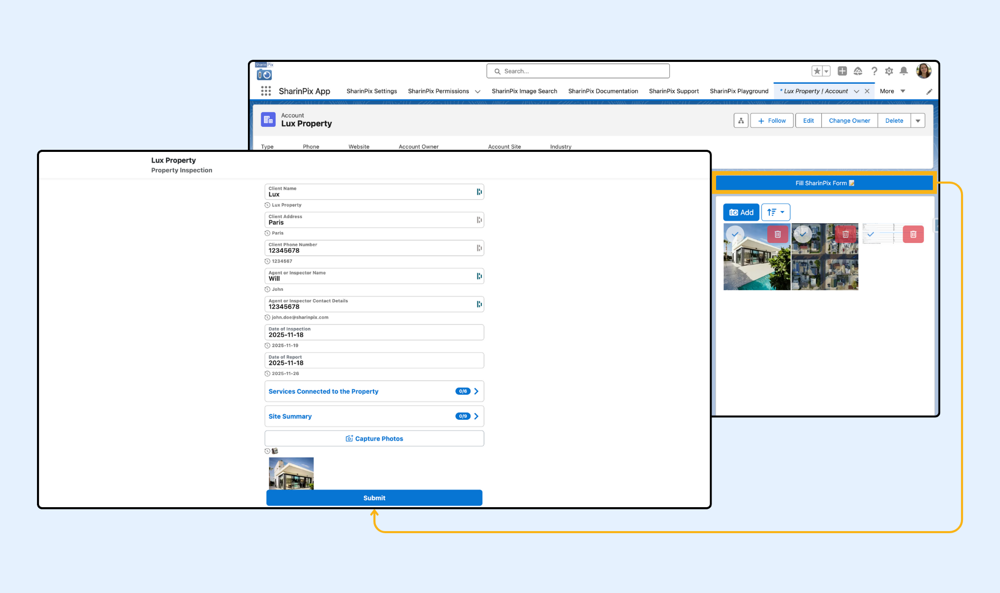
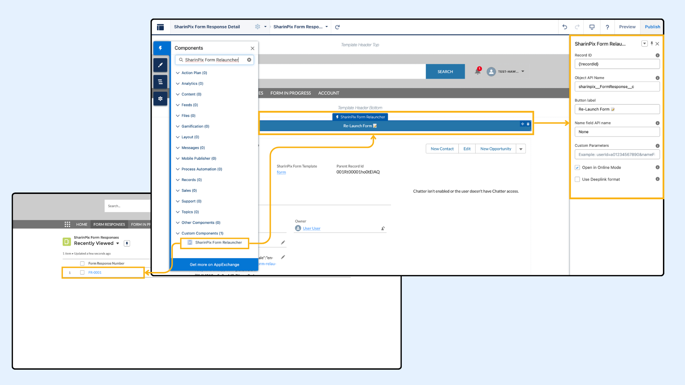

---
layout:
  width: default
  title:
    visible: true
  description:
    visible: true
  tableOfContents:
    visible: true
  outline:
    visible: true
  pagination:
    visible: true
  metadata:
    visible: false
  tags:
    visible: true
  actions:
    visible: true
---

# Reopen A Previously Submitted SharinPix Form

To reopen a submitted SharinPix Form Response using the SharinPix Form Relauncher LWC, it should be dragged and dropped on the submitted [SharinPix Form Response](../overview-and-getting-started/sharinpix-forms.md) Record Page.

This article consists of:

* [Reopen A Previously Submitted Form Using LWC](reopen-a-previously-submitted-sharinpix-form.md#reopen-a-previously-submitted-sharinpix-form-using-lwc)
* [Reopen A Previously Submitted SharinPix Form Using LWC In Digital Experience](reopen-a-previously-submitted-sharinpix-form.md#reopen-a-previously-submitted-sharinpix-form-using-lwc-in-digital-experience)
* [Reopen A Previously Submitted SharinPix Form Using URL Parameters](reopen-a-previously-submitted-sharinpix-form.md#reopen-a-previously-submitted-sharinpix-form-using-url-parameters)
* [Configuring URL Parameter Using A Flow](reopen-a-previously-submitted-sharinpix-form.md#configuring-url-parameter-using-a-flow)
* [Configuring URL Parameter Using A Universal Link](reopen-a-previously-submitted-sharinpix-form.md#configuring-url-parameter-using-a-universal-link)
* [Prefill Behavior When Reopening A Form](reopen-a-previously-submitted-sharinpix-form.md#prefill-behavior-when-reopening-a-form)


**Prerequisites:**

Before configuring this automation, ensure the following:

* You have the latest **SharinPix Package** installed. This feature requires version **1.385** or higher. You can follow [this guide](https://app.gitbook.com/s/i8tH1o5AHthxksYgF6ij/how-to-update-sharinpix-package-from-the-appexchange) to upgrade your SharinPix Managed Package to the newest version.
* Users must have the **SharinPix Forms** **Admin** or **SharinPix Forms User** permission set assigned. For more information on these two permission sets, check [SharinPix Permission Sets](https://app.gitbook.com/s/5EvYRrLbUyvRh8o1jmMG/access-and-security/sharinpix-permission-sets).
* A form template has been created using the [SharinPix Form Template Editor](../form-elements/sharinpix-form-template-editor.md).



**Information:**

The SharinPix Form Relauncher component is available in **Lightning**. It can be used:

* On the Experience Builder
* On Desktop
* On Mobile
* In Flows (But not in Field Service Mobile Flow)
* In your own Lightning Component Development


## Reopen A Previously Submitted SharinPix Form Using LWC

Submitting a SharinPix Form creates a SharinPix Form Response Page on Salesforce.



From the SharinPix Form Response Record Page App Builder, drag and drop the SharinPix Form Relauncher LWC on the page as shown below. The configuration parameters are similar to the SharinPix Form Launcher. It can launch the form in a new tab on the web browser if the Open in Online Mode is checked, else it will launch the SharinPix Mobile App.

.png>)

Once the changes are applied, the form can be reopened with all the data from the FR-0080.

<figure><figcaption></figcaption></figure>

## Reopen A Previously Submitted SharinPix Form Using LWC In Digital Experience

In the Experience Builder, navigate to the SharinPix Form Response or Form In Progress record page. Drag and drop the SharinPix Form Relauncher component onto the layout and configure the parameters. Once configured, the form can be reopened with its existing data.

<figure><figcaption></figcaption></figure>

When the SharinPix Form Relauncher is used in a Salesforce Flow, use the same parameters listed below.

SharinPix Form Relauncher parameters in Digital Experience Builder and Salesforce Flow:

<table><thead><tr><th width="197.76953125">Parameter</th><th width="280.828125">Description</th><th width="271.8203125">Default/Notes</th></tr></thead><tbody><tr><td>Record Id</td><td>The Salesforce record Id of the form response or form in progress.</td><td><p>In Digital Experience, use <mark style="color:$danger;"><code>{!recordId}</code></mark> to dynamically retrieve the record Id.</p><p></p><p>In Flow, create a resource such as <mark style="color:$danger;"><code>recordId</code></mark> and pass the record Id as an input variable from the record page.</p></td></tr><tr><td>Object API Name</td><td>The object API name from where the SharinPix Form Relauncher is being used.</td><td>This component is intended to be used on <mark style="color:$danger;"><code>sharinpix__FormResponse__c</code></mark> and <mark style="color:$danger;"><code>sharinpix__FormInProgress__c</code></mark> only.</td></tr><tr><td>Button Label</td><td>The text displayed on the button.</td><td></td></tr><tr><td>Name Field API Name</td><td>The field API name to be used as job name.</td><td>If set to None, value will default to either the record's name (if available) or the record ID.</td></tr><tr><td>Custom Parameters</td><td>Additional user-defined parameters to append to the SharinPix Form launcher URL.</td><td></td></tr><tr><td>Open in Online Mode</td><td>Open the form in online mode.</td><td></td></tr><tr><td>Use Deeplink format</td><td>Generate a deeplink when enabled instead of a universal link.</td><td></td></tr></tbody></table>

## Reopen A Previously Submitted SharinPix Form Using URL Parameters

To reopen a submitted SharinPix Form Response, the **form\_response\_url** and **form\_response\_id** have to be added to the form URL. The **form\_response\_url** is the **FormResponseDataURL\_\_c,** which stores all the data, including images, of the submitted [SharinPix Form Response](../overview-and-getting-started/sharinpix-forms.md). The **form\_response\_id** is the **PublicId\_\_c,** which contains the SharinPix ID of the Form Response.


Submitting this form will create a new SharinPix Form Response record on Salesforce.


## Configuring URL Parameter Using A Flow

An example can be to use a flow, such as a record-triggered flow, when a SharinPix Form Response record is created. The existing [Generate Form URL Automation](automatic-form-url-generation-using-flow-admin-oriented.md) can be used to generate a new Form URL with the Form Response Data URL and Form Response Public ID of the triggering record as custom parameters:

```
form_response_url={!$Record.sharinpix__FormResponseDataURL__c}&form_response_id={!$Record.sharinpix__PublicId__c}
```

.png>)

This will allow a user to reopen the submitted SharinPix Form Response (including all data such as input values, images, etc.) and submit a new one.

The following example shows how a flow has been used to generate and update the Description field of the parent Account Record with the URL to reopen the last submitted SharinPix Form Response.

.png>)

## Configuring URL Parameter Using A Universal Link

To configure this using a Universal Link, simply append the **form\_response\_url** and the **form\_response\_id** to the URL as follows:

```
https://app.sharinpix.com/native_app/form?token=<sharinpix-form-token>&form_response_url=<FormResponseDataURL__c>&form_response_id=<PublicId__c>
```

## Prefill Behavior When Reopening A Form

This setting controls what happens to each question when a submitted form is reopened.

Open the question you want to configure, then go to the **Advanced** tab.

<figure><figcaption></figcaption></figure>

In **Value when reopening the form**, select the behavior you want to use.

<figure><figcaption></figcaption></figure>

Each question can use one of these options:

* Keep previous form answer
* Update via Salesforce/URL
* Clear previous form answer

### Keep previous form answer

* This is the default behavior.
* The previously submitted value takes priority for that question.
* If no previous value exists for that question, it follows the normal starting behavior.
* That can include a [prefill value from Salesforce fields](../form-elements/form-features-default-or-prefill-values.md), a value passed through `pv` parameters in the form URL, a default value, or a blank state.

### Update via Salesforce/URL

* Use this option when the question should reflect the latest available prefill value.
* This includes [prefill values from Salesforce fields](../form-elements/form-features-default-or-prefill-values.md) pulled through **Pull data from a Salesforce field to pre-fill this value**.
* This also includes values passed through the form URL by using `pv` parameters such as `pvName=John`.
* If a new prefill value is available when the form is reopened, it replaces the previously submitted answer for that question.
* If no prefill value is available, the previous answer is kept.

### Clear previous form answer

* Use this option when the question should be reviewed again.
* The previous answer is discarded when the form is reopened.
* The question can still receive a [prefill value from Salesforce fields](../form-elements/form-features-default-or-prefill-values.md) or a value passed through `pv` parameters in the form URL.
* If no prefill value is available, the question falls back to its default value or stays blank.


Use **Keep previous form answer** to persist previously submitted answers, **Update via Salesforce/URL** for values that should stay in sync with current Salesforce field values, and **Clear previous form answer** for questions that should be reviewed again when a form is reopened.

