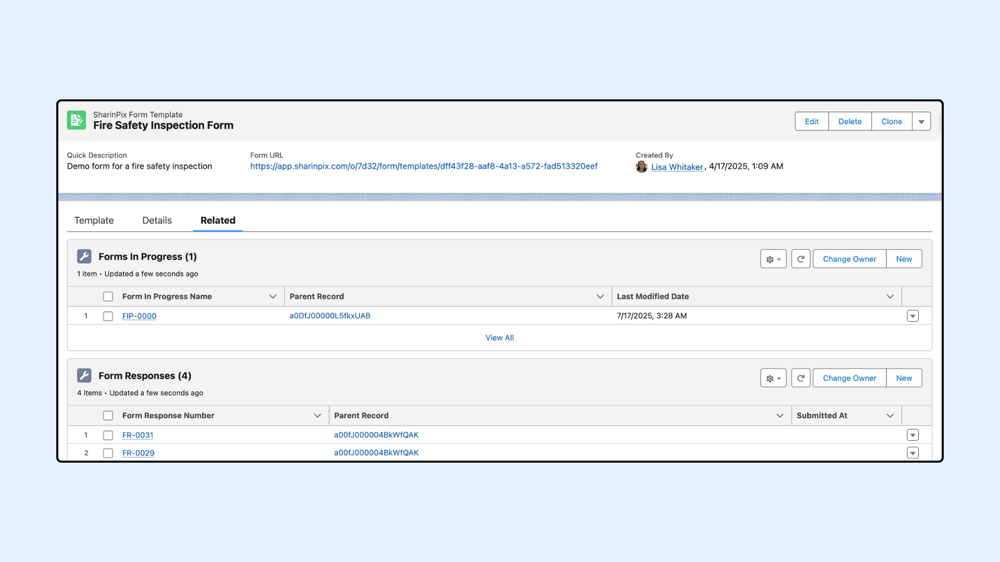

---
layout:
  width: default
  title:
    visible: true
  description:
    visible: true
  tableOfContents:
    visible: true
  outline:
    visible: true
  pagination:
    visible: true
  metadata:
    visible: false
  tags:
    visible: true
---

# SharinPix Form In Progress

## Overview

**SharinPix Form In Progress** allows users to start filling a form in web mode and save the current state of the form. After saving the form, a Form In Progress Record is created on Salesforce where the user can either complete the form and submit or continue filling the form and save. Upon submission, the Form In Progress Record is converted into a Form Response Record.


**Prerequisites**

Before using the **SharinPix Form In Progress** , ensure the following:

* The SharinPix team needs to activate the **Create Form In Progress On Salesforce** flag in your Organization Settings. Please [contact SharinPix Support](https://app.gitbook.com/s/5EvYRrLbUyvRh8o1jmMG/getting-started-with-sharinpix/how-to-contact-support) to have this done.
* Users must have the **SharinPix Forms** **Admin** or **SharinPix Forms User** permission set assigned. For more information on these two permission sets, check [SharinPix Permission Sets](https://app.gitbook.com/s/5EvYRrLbUyvRh8o1jmMG/access-and-security/sharinpix-permission-sets).
* The lookup relationship is set up, as detailed in [the next article](setup-custom-lookup-for-sharinpix-form-in-progress.md). This enables users to view related Form In Progress records in Salesforce.
* You have the **latest** **SharinPix Package Version** Installed. Refer to [_this documentation_](https://app.gitbook.com/s/i8tH1o5AHthxksYgF6ij/how-to-update-sharinpix-package-from-the-appexchange) to update your package.


## Getting Started

Once a form is opened in Web mode, users can either save their current progress or submit it as shown below:

<figure><figcaption></figcaption></figure>


To see a record's related Form in Progress records in Salesforce, make sure the lookup relationship is configured, as explained on [setup-custom-lookup-for-sharinpix-form-in-progress.md](setup-custom-lookup-for-sharinpix-form-in-progress.md "mention").


Upon Save, a Form In Progress Record is created on Salesforce and can be accessed as follows:

<figure><figcaption></figcaption></figure>


**Warning**

If the tab is closed without pressing the Save button, all progress will be lost. The SharinPix Form should be saved or submitted.


The Form In Progress Record can be accessed from the Form Template Related List or from the Record Page where a custom lookup has been set up. From here, the form can be completed, saved, and submitted. Upon submitting the Form, the Form In Progress Record is deleted, and its corresponding Form Response Record is created. The PDF URL of the partially filled form is also available from here.

<figure><figcaption></figcaption></figure>


**Alert**

The SharinPix Form In Progress LWC shown in the above screenshot is only available on the SharinPix Form In Progress lightning\_\_RecordPage. To use it on a Digital Experience Page, the LWC should be added manually on the Site Page.

