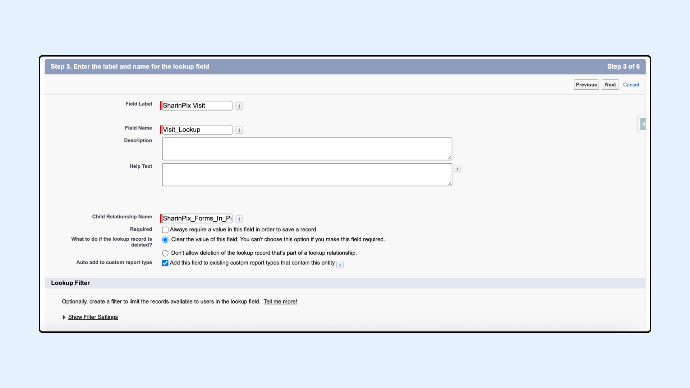
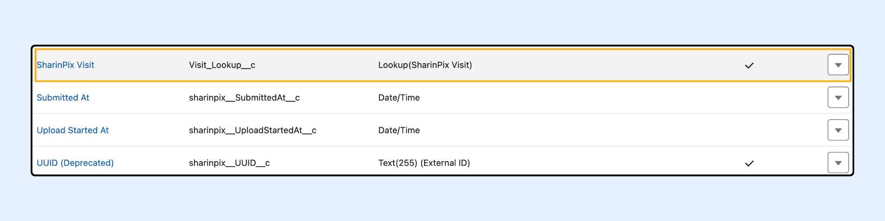

# Setup Custom Lookup For SharinPix Form In Progress

## Overview

In this article, we will demonstrate how to setup the SharinPix Form In Progress Sync. To do so we will:

1. [Create a lookup relationship field on the SharinPix Form In Progress object](setup-custom-lookup-for-sharinpix-form-in-progress.md#step-1-creation-of-a-lookup-relationship-field-on-sharinpix-form-in-progress)
2. [Configure the SharinPix Form In Progress Setting custom metadata](setup-custom-lookup-for-sharinpix-form-in-progress.md#step-2-configure-the-custom-metadata)


**Prerequisite:**

* The **SharinPix Form In Progress Sync Setting** works alongside the\*\* SharinPix Form **feature. Therefore**, **ensure that the** SharinPix Form \*\*feature has been configured properly before configuring this Sync Setting. For more information on how to configure **SharinPix Form** , please refer to the following article: [SharinPix Form](sharinpix-forms.md)
* The latest SharinPix Package version: [_How to upgrade SharinPix package_](https://docs.sharinpix.com/m/FAQ/l/1236928-how-to-update-sharinpix-package-from-the-appexchange)
* The **SharinPix Forms Admin** or **SharinPix Forms User** permission set should be assigned to all users to ensure they have the right to create, edit, and delete the **SharinPix Form In Progress** record through the SharinPix Form In Progress Sync Setting. For more information on these two permission sets, check [SharinPix](../access-and-security/sharinpix-permission-sets.md)


## Step 1: Creation of a Lookup Relationship Field on SharinPix Form In Progress

Depending on the Object you want to use SharinPix Form In Progress Sync on, you must create a lookup relationship field on the SharinPix Form In Progress Object that links to the parent object. This demo will use the **SharinPix Visit** object.

Follow the steps below:

* Go to **Setup, then access Object Manager**
* Type form in the search bar, press Enter, and click **SharinPix Form In Progress**
* On the left menu, click on **Fields and Relationships,** and then click on **New**

For the new field:

* Select **Lookup Relationship** as **Data Type** then click **Next**
* For the field **Related To** , select **SharinPix Visit** then click **Next**

 (3).png>)

* On the next page, the field **Field Label** will be auto-populated
* Enter a **Field Name;** as an example **Visit\_Lookup\_\_c**
* Leave the other fields as default

<figure><figcaption></figcaption></figure>

* Proceed to the next steps and finally save the new relationship.

When you take a look back at the **Fields & Relationships** section, you should see the new relationship displayed as shown in the figure below.

<figure><figcaption></figcaption></figure>

* Copy the field name: **Visit\_Lookup\_\_c** as we will need this in our next step.


**Warning:**

Ensure that you provide at least read access to the lookup field (**Visit\_Lookup\_\_c** in this case) for all users viewing/creating SharinPix Form Response records.


## Step 2: Configure the Custom Metadata

This section demonstrates how to configure the SharinPix Form In Progress Setting custom metadata.

To do so, follow the steps below:

* Go to **Setup** and type metadata, then click on **Custom Metadata Types**
* Select the **Manage Records** action next to the label **SharinPix Form In Progress Setting**

<figure><figcaption></figcaption></figure>

* Create a new record.
* For the field **Label**, as an example, enter **Form Sync on Visit**
* The field **SharinPix Form In Progress Setting Name** is auto-populated when clicking anywhere outside the text box.
* For the field **Parent Object Name** , enter the **object API name;** in our case it is **sharinpix\_\_Visit\_\_c**
* For the field **Parent Field Name** , enter the field name of the lookup relationship field created in the previous section, that is **Visit\_Lookup\_\_c** ( Remember the field name we asked you to copy? You can now paste it here )
* Click **Save** when done.

 (1) (3).png>)


**Warning:**

You should be careful when entering values for the fields **Parent Object Name** and **Parent Field Name**.

* The field **Parent Object Name** refers to the object's API Name. In case you are using a custom object, you should ensure that the API name is correctly entered. For example, if you are using a custom object named **My Custom Object**, the value to be entered for the field **Parent Object Name** will be **My\_Custom\_Object\_\_c**.
* The field **Parent Field Name** on the other hand refers to the field name of the lookup relationship. You should ensure that the value entered for the field **Parent Field Name** matches the corresponding field name value in the lookup relationship.

