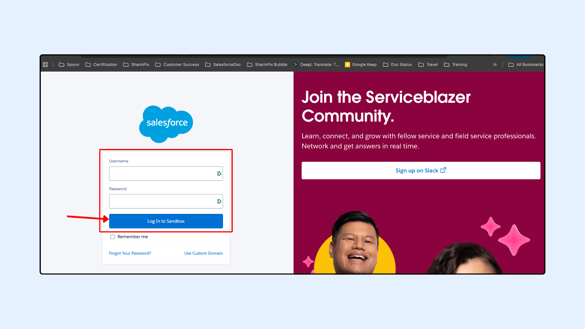

---
layout:
  width: default
  title:
    visible: true
  description:
    visible: true
  tableOfContents:
    visible: true
  outline:
    visible: true
  pagination:
    visible: true
  metadata:
    visible: false
  tags:
    visible: true
---

# Cannot log in on Sandbox to install SharinPix - what should I do?

## Problem

When you try to install SharinPix on a **Salesforce Sandbox**, the installer/login page may automatically redirect you to your **Production** login screen instead of the Sandbox login screen. As a result, you can’t authenticate into the Sandbox to complete the installation.

## Cause

This usually happens because Salesforce defaults to the Production login domain, or your browser/session is already linked to a Production domain.

## Solution

1. **On the Salesforce login page** that appears during the installation process, click **Use Custom Domain**

<figure><figcaption></figcaption></figure>

2. **Enter your Sandbox custom domain** (for example: `yourcompany--sandboxname`) and continue.

<figure><figcaption></figcaption></figure>

3. You should now be **redirected to the Sandbox login screen**.
4. Enter your **Sandbox credentials** and log in to sandbox.

<figure><figcaption></figcaption></figure>

5. Once authenticated, you can **continue the SharinPix installation** normally by following the installation documentation: [_Install SharinPix from the App Exchange in a Sandbox_](https://app.gitbook.com/s/2putv2B9RAZpym8daOH2/basic-setup/basic-setup-steps-start-with-sharinpix-in-3-steps)


If you still have issues, please [contact our support team](https://app.gitbook.com/s/2putv2B9RAZpym8daOH2/how-to-contact-support) for help.

