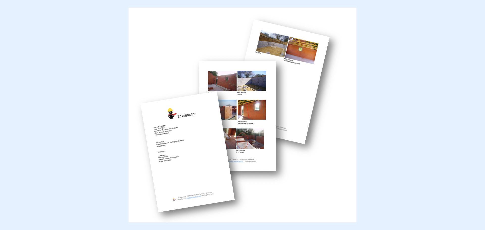

---
layout:
  width: default
  title:
    visible: true
  description:
    visible: true
  tableOfContents:
    visible: true
  outline:
    visible: true
  pagination:
    visible: true
  metadata:
    visible: false
  tags:
    visible: true
---

# How SharinPix can help with Images in PDF?

You have requirements in your project to integrate Images in a generated PDF from Salesforce?

SharinPix can help, a lot!

* First, you can consider using SharinPix [Entreprise plan](what-is-the-pricing-for-salesforce-on-alibaba-cloud.md) which includes SharinPix PDF generation capabilities with[ SharinPix to PDF Lighting Component](https://app.gitbook.com/s/5EvYRrLbUyvRh8o1jmMG/lightning-web-component/sharinpix-to-pdf)
* You can also choose any other tool on the AppExchange for advanced features on PDF generation.\
  It could be using an AppExchange tool such as Conga, Nintex Drawloop, Webmerge, Docomotion, DaDaDocs or any other. You can find a list of those AppExchange applications [here](https://appexchange.salesforce.com/appxSearchKeywordResults?keywords=document%20generation).
* Or it could be using Visualforce rendering as a PDF File. You can read more about this [here](https://developer.salesforce.com/docs/atlas.en-us.pages.meta/pages/pages_output_pdf_renderas.htm).

To integrate images into those generated documents, you will face 2 different problems:

\- How to retrieve the images from my record (and organize them in order to insert them at the right place in the document)

\- How to keep my generated document size into the limitations to generate, store or send it

## Organize images in a generated document

If you plan to go with Salesforce files from a record, uploaded from a mobile, your files will get unorganized and named with a filename like IMG0001.jpg IMG0002.jpg ....

**There is no way to get them sorted and organized to appear in specific section of your generated document.**

At the opposite, when you upload images to SharinPix you can use [SharinPix Image Sync](https://app.gitbook.com/s/5EvYRrLbUyvRh8o1jmMG/image-sync/what-is-sharinpix-image-sync) in order to get SharinPix Image Custom object records created as related list of your record. So for each image, you will have access within a SharinPix Image record to all the image metadata.

Using [SharinPix Tags](https://app.gitbook.com/s/5EvYRrLbUyvRh8o1jmMG/features/working-with-tags), you can mark some images with specific tags as an example a tag for before images and an other tag as after images.

Tags are available as a field in SharinPix Image record and make you able to categorize images in order to get them included in the right place of your generated document!

You can even retrieve the date taken for the picture and not rely only on the upload date to sort your images by shooting order.

## Keep my document size in the limitations

What are the limitations for a generated document?

**Mail Limitations : 10MB (sometimes 20MB or 25MB)**

First of all, you can expect to have trouble trying to send by email any document larger than 10MB.\
Even if some email services accept up to 20MB or 25MB, most of the email services currently used on the internet **doesn't allow any attachements to be bigger than 10MB**.

As today images taken by smartphone camera can be up to 5MB, that will restrict your document to only contain no more than 3 images and sometime even less.

**PDF File size Limitations: 30MB of images for Visual Force rendering**

Further more, if you plan to use the Visualforce rendering as PDF file, you have to know that **you can't generate a PDF using more than 30MB of images** ([PDF Rendering Limitations](https://developer.salesforce.com/docs/atlas.en-us.pages.meta/pages/pages_output_pdf_considerations.htm)).

Most of the AppExchange vendors have also size limitations, but those value are specific to each ones.

**How SharinPix is solving this problem?**

Using [SharinPix Image Sync](https://app.gitbook.com/s/5EvYRrLbUyvRh8o1jmMG/image-sync/what-is-sharinpix-image-sync) and the **SharinPix transformation** you can configure there, you'll be able to **automatically get resized version of the images uploaded available as URL** in your SharinPix Image record. Then you will be able to go with PDF containing hundreds of photos without reaching any of those limits, while keeping a good document quality at reading.

## Working with Document Generation Tools from the AppExchange

This integration relies on:

\- related list of SharinPix Image records

\- URL field (original or personalized)

Conga\
Use a Conga Query to construct a table of SharinPix Image records and for each use a Merge Image field as per this documentation : https://support.getconga.com/Conga\_Composer/Creating\_Composer\_Templates/Word\_Templates/Special\_Merge\_Fields\_in\_Word/IMAGE\_prefix\_in\_Word

https://support.getconga.com/Conga\_Composer/Creating\_Composer\_Templates/PowerPoint\_Templates/Advanced\_PowerPoint\_Templates/08\_Image\_Merge\_Fields\_in\_PowerPoint

https://support.getconga.com/Conga\_Mix/Mix/06Field\_Formatting\_and\_Images

As an example, a Conga query should list all the images and filter by your own logic.\
Then using this kind of merge field in Word you can have a table for images within that "SHARINPIX" query:

<mark style="color:$danger;">`{{TableStart:SHARINPIX}}{{IMAGE:`</mark> <mark style="color:$danger;">`SHARINPIX__SHARINPIXIMAGE_IMAGEURLMINI:W=200}}{{TableEnd:SHARINPIX}}`</mark>

`SHARINPIX__SHARINPIXIMAGE_IMAGEURLMINI should be changed to any field name that contains the SharinPix Image URL from the record (including your own personnalized one if any).`

SDocs

https://www.sdocs.com/resources/documentation/adding-dynamic-images-into-templates/

[https://www.sdocs.com/resources/documentation/pull-picture-attachments-and-generate-a-pdf/](https://www.sdocs.com/resources/documentation/pull-picture-attachments-and-generate-a-pdf/)

Drawloop/Nintex

https://help.nintex.com/en-us/docgen/docservices/docgen-sfdc/Services/templates/AddImagesRichTextField.htm

Webmerge

https://support.webmerge.me/hc/en-us/articles/206526876-Embed-Images-in-Your-Build-Your-Own-PDF

Docomotion

https://www.docomotion.com/support-2-2/complete-docomotion-guide/adding-scripts-to-forms/adding-picture-scripts/

Other vendors? Just reach us and ask for support!

And don't hesitate to check [SharinPix Entreprise plan](what-is-the-pricing-for-salesforce-on-alibaba-cloud.md) and the [SharinPix To PDF Lightning Component](https://app.gitbook.com/s/5EvYRrLbUyvRh8o1jmMG/lightning-web-component/sharinpix-to-pdf) which permits to create in few clicks basic PDF document with optimized images integrated.
