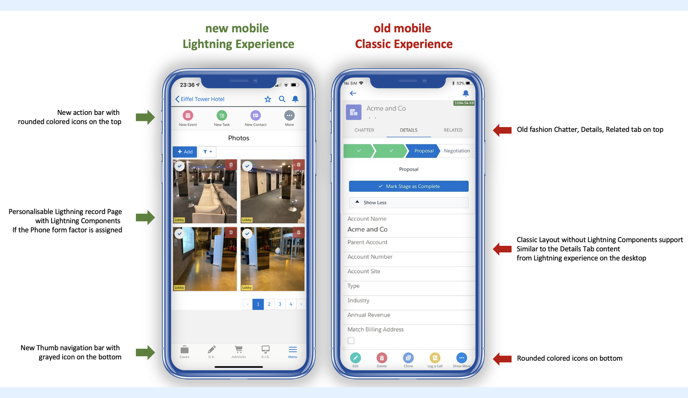
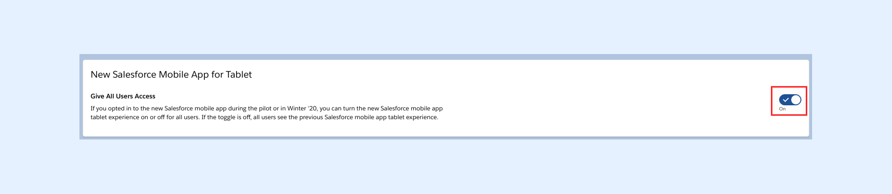

---
layout:
  width: default
  title:
    visible: true
  description:
    visible: true
  tableOfContents:
    visible: true
  outline:
    visible: true
  pagination:
    visible: true
  metadata:
    visible: false
  tags:
    visible: true
---

# I don't see my SharinPix Lightning components on Mobile or Tablet, what should I do?

Using the new Salesforce mobile Lightning experience, SharinPix gets the same integration on Salesforce for the desktop (using a browser) and Salesforce for the mobile (using the Salesforce mobile App).

This is available on iOS iPhones and iPads as well as on Android Phones and Tablets.

## Am I using the new mobile Lightning Experience?

By default the Classic experience is available on mobile, and the Lightning Components are not showing up.

To determine if you are still using the Classic experience for mobile or if you are already using the new mobile Lightning Experience, you should check those points:

* You are in the mobile Classic Experience if
  * You have rounded coloured icons on the bottom when you open a record
  * You have Chatter/Details/Related tabs on the top such as Post, File, New Task, ...
* You are in the new mobile Lightning Exeperience if
  * You have rounded coloured on the top such as Post, File, New Task, ...
  * You have greyed icons on the bottom such as Chatter, Today, Dashboard and Menu

## What if I'm not using the new mobile Experience yet?

If you are still using **the Classic experience on mobile**, you should enable this experience for your Organization as well as to your user. You should also ensure the usage of the latest version of the Salesforce mobile App on your device.

If you are using the Classic experience on tablets and iPads, an additional configuration is required on your Organization. Here, you should also enable the **New Salesforce Mobile App for Tablet** on your Org. To do so, follow the steps below:

* From Setup, look for **New Salesforce Mobile App Quickstart** using the Quick Find search box
* Then, in the **New Salesforce Mobile App for Tablet** section, activate the option **Give All Users Access** as follows:


**Note:**

The option to enable the **New Salesforce Mobile App for Tablet** will be available on your Org only if you have **upgraded with the New Salesforce Mobile App QuickStart in Winter '20 Release**.

If you did not opt-in for this feature during Winter' 20 but, still want to access the Toggle for **New Salesforce Mobile App for Tablet** in the Setup section for **New Salesforce Mobile App Quickstart**, kindly create a case to request Salesforce Support to enable it on your Org.

&#x20;Click on the following link for more details on the above:

[https://help.salesforce.com/articleView?id=000352373\&language=en\_US\&mode=1\&type=1](https://help.salesforce.com/articleView?id=000352373\&language=en_US\&mode=1\&type=1)


Please read below some helpful resources you can find on the web to do so.


**Prerequisites:**

The example presented in this article takes place within the new Lightning Experience. In order to proceed, you are therefore required to set up the new Lightning Experience for mobile.

If the new Lightning Experience is not enabled inside your Organisation, here are some useful articles that you can refer to:

* [Lightning Experience for Salesforce Mobile App](https://trailhead.salesforce.com/en/content/learn/modules/lightning-experience-for-salesforce-mobile-app) (introductory articles)
* [Set up the Lightning Experience for Salesforce Mobile App ](https://www.asagarwal.com/lightning-experience-for-salesforce-mobile-app/)(including detailed steps)
* [Set up the Lightning Experience for Salesforce Mobile App](https://admin.salesforce.com/blog/2019/set-up-lightning-experience-on-mobile) (including video)&#x20;
* [Set up the Lightning Experience for Salesforce Mobile App on tablets and iPads](https://help.salesforce.com/articleView?id=release-notes.rn_mobile_tablet_lex.htm\&release=230\&type=5) (notes from Salesforce articles)


## What if I'm using the Lightning Experience and don't see the SharinPix components yet?

if you have screen layouts which looks like below it means that you have now the new mobile Lightning Experience and it has been correctly configured.

However getting access to the SharinPix lightning Components on the record require you to have a record page available on the "Phone" form factor.

Here you can find guidance on how to get the component on the record page and be sure to activate the phone form factor so you can access that new layout on your mobile:

[Basic Setup - Step 3c for new Salesforce Mobile App Users - Setup SharinPix for Mobile (Lightning Experience)](https://app.gitbook.com/s/2putv2B9RAZpym8daOH2/basic-setup/basic-setup-step-3c-for-new-salesforce-mobile-app-users-setup-sharinpix-for-mobile-lightning-experie)

<figure><figcaption></figcaption></figure>
