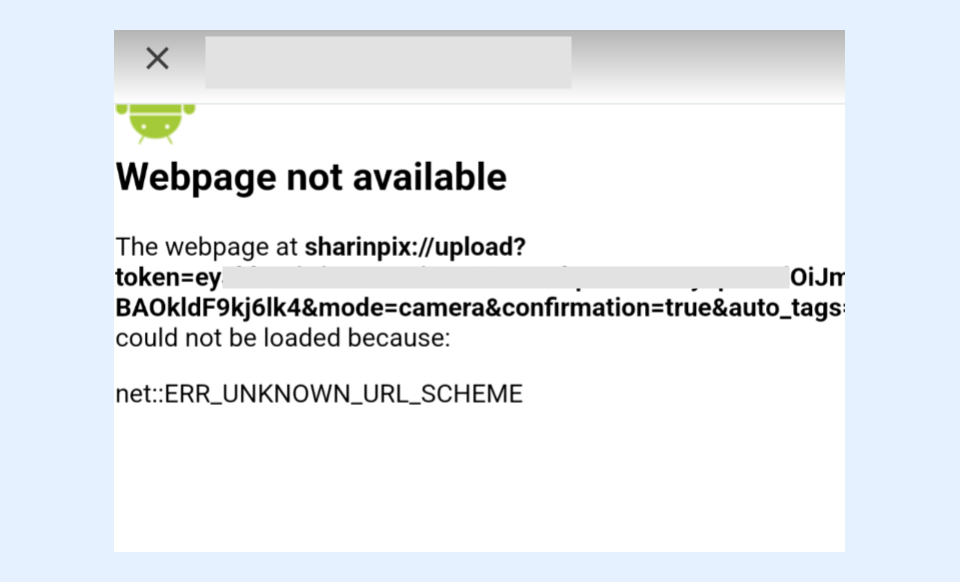

---
layout:
  width: default
  title:
    visible: true
  description:
    visible: true
  tableOfContents:
    visible: true
  outline:
    visible: true
  pagination:
    visible: true
  metadata:
    visible: false
  tags:
    visible: true
---

# I got an error message 'Webpage not available' when trying to launch the SharinPix mobile app. What should I do?

If you are encountering a 'Webpage not available' error message in a Salesforce webview as depicted above, this could be because you’re opening a SharinPix deeplink instead of a Universal Link. In some cases where a webview is used within the Salesforce app to display external web content, this behavior can be observed.

**The workaround is to use a SharinPix Universal Link instead.**

For example, the following deeplink example will not work on Salesforce webviews:

<mark style="color:red;">`sharinpix://upload?token`</mark>_<mark style="color:red;">`<Token Inserted Here>`</mark>_

It should be replaced by a Universal Link similar to one below:

<mark style="color:red;">`https://app.sharinpix.com/native_app/upload?token=`</mark>_<mark style="color:red;">`<Token Inserted Here>`</mark>_

**Tip:**

Deeplinks start with <mark style="color:red;">`sharinpix://`</mark>whereas Universal Links start with <mark style="color:red;">`https://app.sharinpix.com/native_app/`</mark>.


**Note:**

Salesforce webviews are usually opened

* Within a Community website on the Salesforce app when trying to launch the SharinPix app using a deeplink or any components used to open the SharinPix app such as the [SharinPix Mobile Launcher](https://app.gitbook.com/s/5EvYRrLbUyvRh8o1jmMG/lightning-web-component/sharinpix-mobile-launcher).
* When a custom LWC is used to open a SharinPix deeplink.

