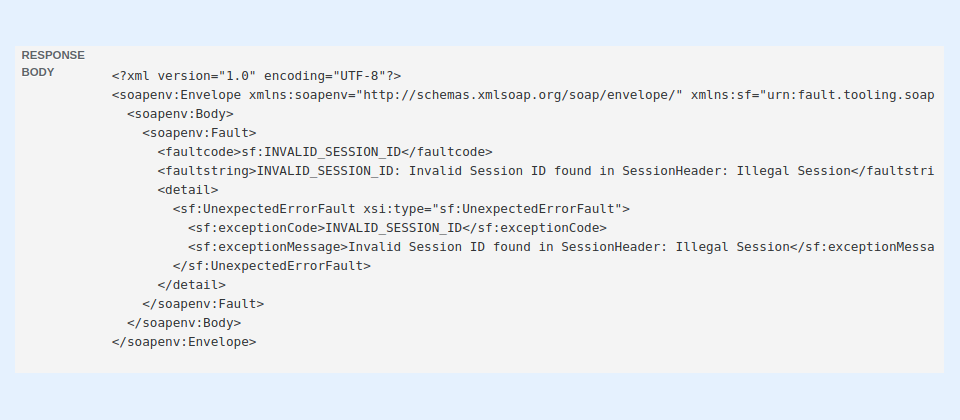

---
layout:
  width: default
  title:
    visible: true
  description:
    visible: true
  tableOfContents:
    visible: true
  outline:
    visible: true
  pagination:
    visible: true
  metadata:
    visible: false
  tags:
    visible: true
---

# I got the Webhook error "INVALID\_SESSION\_ID". What should I do?

<figure><figcaption></figcaption></figure>

If you got a Webhook error similar to the above stating: INVALID\_SESSION\_ID: Invalid Session ID found in SessionHeader: Illegal Session, this most probably means that SharinPix does not have access to your Salesforce data. Such issues usually come up when the user who previously granted SharinPix access to Salesforce has been deactivated.

Therefore, another **active user** should restore the access to Salesforce by following these steps:

* On your organization, search for **SharinPix Settings** using the App Launcher
* Then once, on the **SharinPix Settings** tab, click on the **Grant** button next to the second line, that is next to **Sharinpix - > Salesforce full API access** as demonstrated below:

<figure><figcaption></figcaption></figure>


**Note:**

In cases where, SharinPix is being configured by a third-party user having a temporary account, it is not recommended that the third-party user restores the access to Salesforce. Here, you should ensure that the grant access to Salesforce has been performed by one of the client's active users and not the third-party user in order to avoid any loss of access if ever the third-party user becomes inactive.

