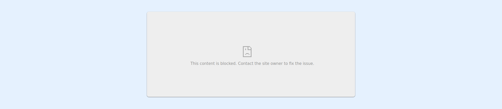
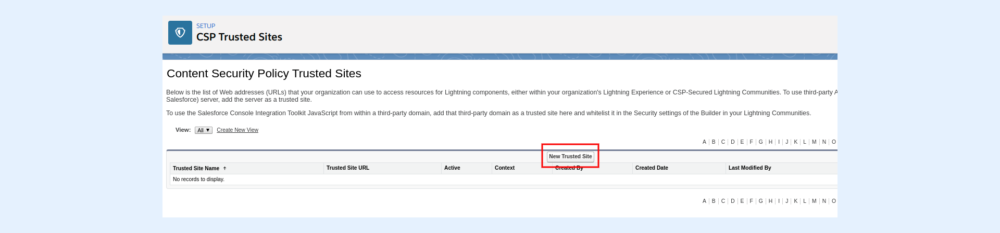
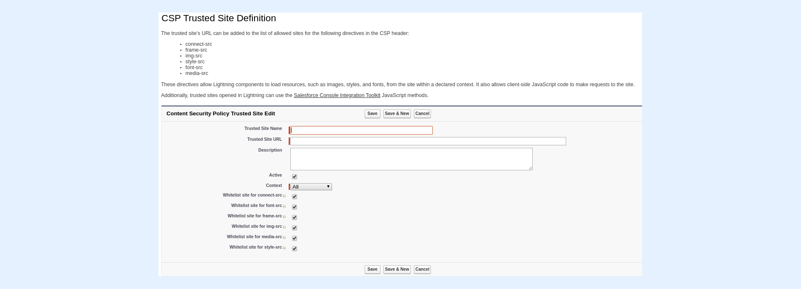
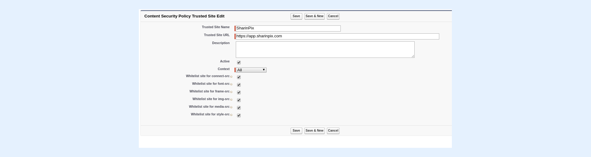

---
layout:
  width: default
  title:
    visible: true
  description:
    visible: true
  tableOfContents:
    visible: true
  outline:
    visible: true
  pagination:
    visible: true
  metadata:
    visible: false
  tags:
    visible: true
---

# My SharinPix components are blank/not rendered. What should I do?

## Why am I seeing this?

Salesforce published a release updating the Content Security Policy (CSP) directives for Lightning pages to help protect organizations against cross-site scripting and other code injection attacks. This update restricts web content display within Salesforce; web content can include the SharinPix website and its images on Salesforce record pages or fields. If no CSP Trusted URLs are configured and activated for SharinPix in the organization, errors like the above will show. Images will also appear broken on Salesforce fields.

Adding the**Trusted URLs** for SharinPix will ensure compliance with the Salesforce update and enable access to the SharinPix component.


**Information:**

For more information on this Salesforce update, please refer to this article: [Adopt Updated Content Security Policy (CSP) Directives (Release Update)](https://help.salesforce.com/s/articleView?id=release-notes.rn_security_other_updated_csp_ru.htm\&release=250\&type=5).


## Solution

To address blank SharinPix components or components not rendered on your Salesforce organization, please proceed as follows:

1. Update your SharinPix package to the latest version. For steps on how to update the SharinPix package, please refer to this documentation: [How to update SharinPix package from the AppExchange?](how-to-update-sharinpix-package-from-the-appexchange.md). The minimum version required is 1.308.
2. Once the package is updated, please ensure that the CSP Trusted Sites entries for SharinPix are activated as demonstrated below:
   * Go to **Setup**. Enter **CSP** in the **Quick Find Box**.
   * Under **Security**, select **Trusted URLs**.
   * Then, click the entry labeled **SharinPix** and ensure that the **Active** checkbox is checked.
   * To complete, click the **SharinPixProxy** entry and ensure that the **Active** checkbox is checked.

## How to manually create the Trusted URLs for SharinPix?

The following steps should only be followed if a package upgrade is not feasible on an org. A package upgrade is, however, highly recommended to stay up to date with the latest features and fixes.

To add a CSP Trusted Site for SharinPix, please proceed as follows:

1. Go to **Setup**. Enter **CSP** in the **Quick Find Box**.
2. Under **Security**, select **Trusted URLs**.
3. Then, click on **New Trusted Site** as shown below:

You will be directed to the page below:

4\. In the field, **Trusted Site Name** , enter **SharinPix**

5\. In the field **Trusted Site URL** , enter **https://app.sharinpix.com**

6\. Ensure that all checkboxes are checked.

7\. Then, click on **Save**

8\. **Next, repeat steps 3 to 6 to create new trusted sites using the following SharinPix endpoint URL as the Trusted Site URL:** _<mark style="color:red;">**https://p.sharinpix.com**</mark>_
