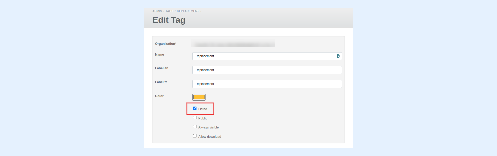

---
layout:
  width: default
  title:
    visible: true
  description:
    visible: true
  tableOfContents:
    visible: true
  outline:
    visible: true
  pagination:
    visible: true
  metadata:
    visible: false
  tags:
    visible: true
---

# Tags applied to the image do not show up in the Tags field on the SharinPix Image record. What should I do ?

If the tag applied to an image does not show up in the **Tags** field of the corresponding SharinPix Image record, this might be due to the tag applied to the image being marked as **unlisted**.

Unlisted tags are 'unavailable tags' and cannot be applied properly to images or cannot even be used on SharinPix components. Therefore, if you tag an image with an unlisted tag, the tag will not be applied to the same correctly and therefore, will not be available in the Tags field on the SharinPix Image record.

To resolve the above issue, that is to mark the tag as listed so that it can be used on the component, follow the steps below:

* Access the [SharinPix Global Settings](https://app.gitbook.com/s/5EvYRrLbUyvRh8o1jmMG/getting-started-with-sharinpix/overview-of-the-sharinpix-administration-dashboard) by searching for **SharinPix Settings** using the **App Launcher**
* Next, click on the **Go to administration dashboard** button. This will open the global settings
* Once on the global settings, click on **Tags** on the top menu bar
* Click on the **Unlisted** button located on the top left:

* Search for the desired tag and click on Edit

**Note:** _If you cannot see the tag in the list at this point, go back to the **Listed** section and ensure that the tag is marked as listed from there._

* Once on the Edit Tag page, check the **Listed** checkbox to mark the tag as listed:

* Click on **Update Tag** when done and apply the tag again
