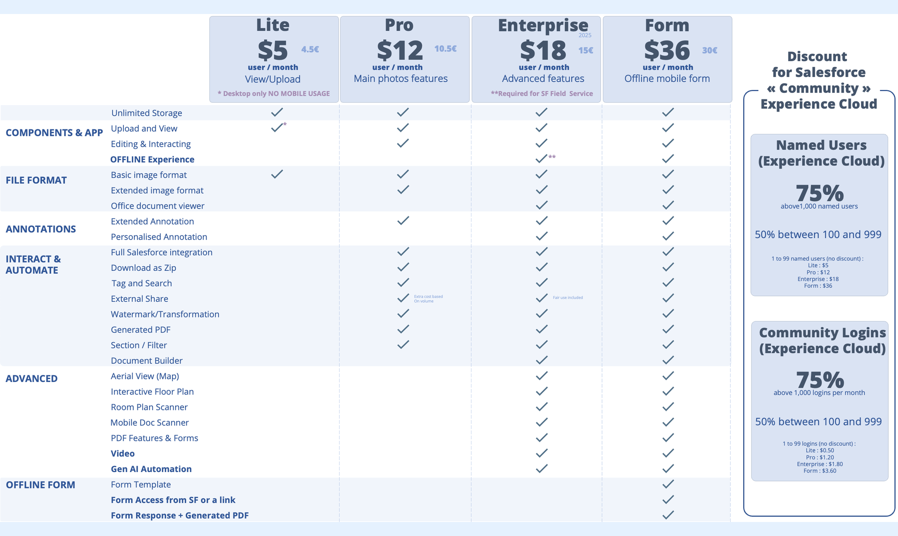

---
layout:
  width: default
  title:
    visible: true
  description:
    visible: true
  tableOfContents:
    visible: true
  outline:
    visible: true
  pagination:
    visible: true
  metadata:
    visible: false
  tags:
    visible: true
---

# What is the pricing for SharinPix?

SharinPix is coming with 4 different prices:

* A price for Salesforce users with 4 different plans :
  * LITE $5 (4.5€) - View / Upload (limited - only for desktop usage)
  * PRO $12 (10.5€) - Main Photo features (required for online mobile usage)
  * ENTERPRISE $18 (15€) - Advanced features (required for offline mobile usage)
  * FORM $36 (30€) - Offline From including ENTERPRISE Plan and PDF Generation

For Experience Cloud / Community we have specific discounts based on volumes with an adapted pricing (working with both member based or login based engagement)

check the details of each plan here :

[What is the difference between the LITE Plan, PRO Plan, ENTERPRISE Plan and FORM Plan?](what-is-the-difference-between-the-lite-plan-pro-plan-enterprise-plan-and-form-plan.md)

Non-profit get 10% discount + Free services and no minimal number of users per order.

Engagement are for 12 Months (or more) and for a minimum of 10 PRO or 10 ENTERPRISE Users.

SharinPix Starter Pack (10 ENTERPRISE Licenses) includes UNLIMITED support and helps for your first implementation or any proof of concept.

For the LITE Plan the minimum order is 20 users.

**All users with a need to access to the images need a licenses, even just to view it through the SharinPix App.**

Some features of SharinPix are also available outside of your Salesforce, such as :

* exposing images hosted by SharinPix on your website
* exposing selection of images through a shared link
* using SharinPix on your website to upload images
* using SharinPix as an extension of any third party app (form/mobile app/...) to capture images directly to Salesforce
* and many others...

Included on the ENTERPRISE you have a fair use for those usage.

You can also buy packages of external usage depending on the volume.

\
**Pricing for Assistance, Support and Services :**&#x20;

Assistance for implementation\* on PRO plan is included during the first 3 months of engagement.

Assistance for implementation\* on ENTERPRISE plan is included + one day of workshop per year per slice of 100 users.

Extra assistance when required will be billed USD1,200 per day.

Extended support is available on ENTERPRISE plan for engagement with more than 200 users and includes :

\- dedicated point of contact

\- priority on ticket management on support

\- 2 days of project or workshops per year

\- dedicated Customer success representative with yearly meeting

Extended support cost is 20% of the overall licenses yearly pricing.

Services can be required for specific requests (security audits or other specific contractual requirements, personalised features development, solution and architecture design, ...). In that case this will be billed USD1,200 per day.

_(\*) Assistance for implementation includes design validation, implementation support and review provided to customer admins employees or implementation partner employees in the way of "we answer any technical question, provide guidance and point the right documentation to unblock any situation, but we don't deliver, code or deploy". Workshops are note included (but with specific limits in ENTERPRISE) but can be engaged as an Extra assistance._

_SharinPix is also available for China customers on Salesforce on Alibaba Cloud - the specific pricing for this solution is available_[ _here_](what-is-the-pricing-for-salesforce-on-alibaba-cloud.md)

Want more details? Have some questions about our pricing?

[Contact us here!](https://sharinpix.com/contact/)
